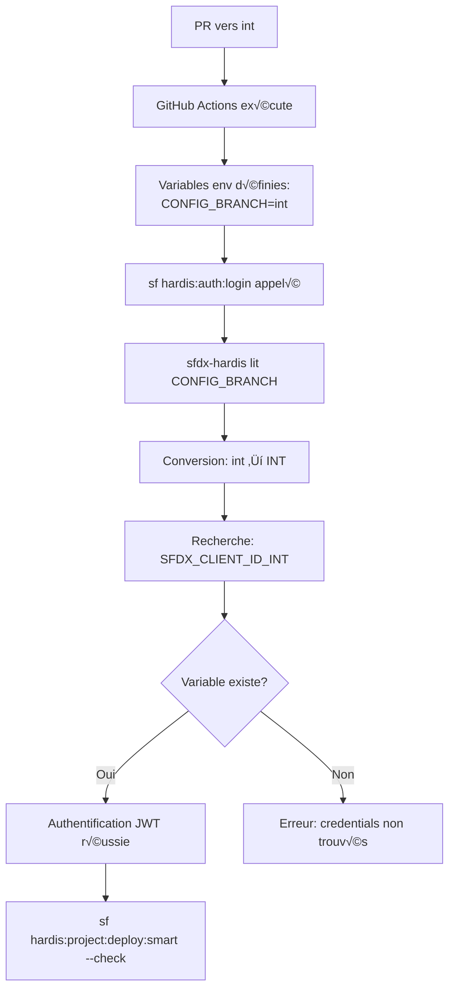
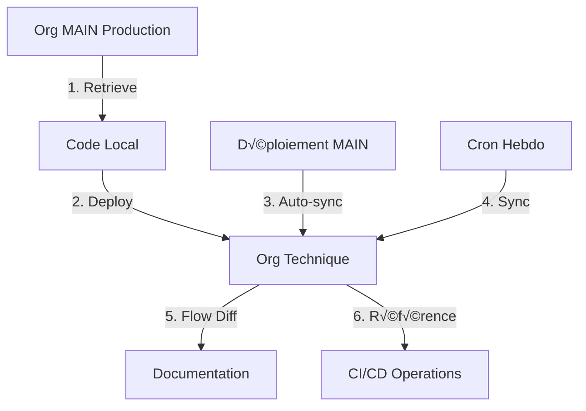
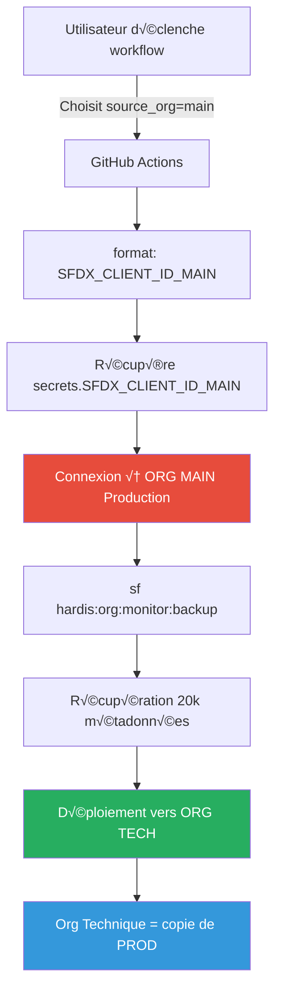
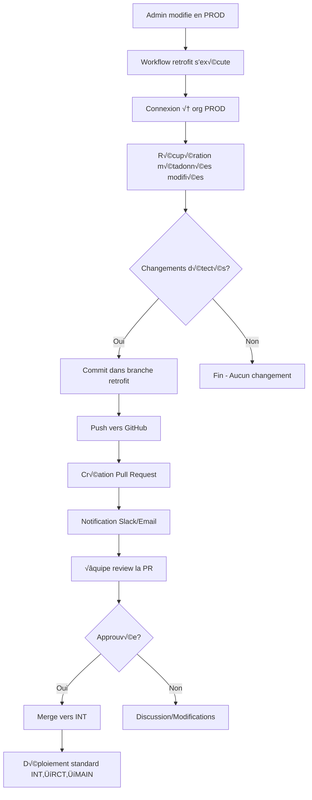

En tant qu'expert sfdx-hardis, voici comment paramétrer vos GitHub Actions pour vos trois branches majeures **int**, **rct** et **main** :

## 📋 Nombre de fichiers GitHub Actions nécessaires

Vous avez besoin de **3 fichiers** exactement dans `.github/workflows/` :

1. **check-deploy.yml** - Simulation de déploiement sur PR
2. **process-deploy.yml** - Déploiement réel sur push
3. **megalinter.yml** - Vérification qualité du code

## ⚙️ Configuration détaillée

### 1️⃣ **check-deploy.yml** (Simulation sur Pull Request)

```yaml
on:
  pull_request:
    branches:
      - int      # ‚Üê Changement ici
      - rct      # ‚Üê Changement ici
      - main     # ‚Üê Changement ici
```

**Variables d'environnement à ajouter dans le step "Login & Simulate deployment"** :

```yaml
env:
  # Credentials pour la branche INT
  SFDX_CLIENT_ID_INT: ${{ secrets.SFDX_CLIENT_ID_INT}}
  SFDX_CLIENT_KEY_INT: ${{ secrets.SFDX_CLIENT_KEY_INT}}
  
  # Credentials pour la branche RCT
  SFDX_CLIENT_ID_RCT: ${{ secrets.SFDX_CLIENT_ID_RCT}}
  SFDX_CLIENT_KEY_RCT: ${{ secrets.SFDX_CLIENT_KEY_RCT}}
  
  # Credentials pour la branche MAIN
  SFDX_CLIENT_ID_MAIN: ${{ secrets.SFDX_CLIENT_ID_MAIN}}
  SFDX_CLIENT_KEY_MAIN: ${{ secrets.SFDX_CLIENT_KEY_MAIN}}
  
  # Slack channels optionnels (par branche)
  SLACK_CHANNEL_ID_INT: ${{ secrets.SLACK_CHANNEL_ID_INT }}
  SLACK_CHANNEL_ID_RCT: ${{ secrets.SLACK_CHANNEL_ID_RCT }}
  SLACK_CHANNEL_ID_MAIN: ${{ secrets.SLACK_CHANNEL_ID_MAIN }}
```

### 2️⃣ **process-deploy.yml** (Déploiement réel sur Push)

```yaml
on:
  push:
    branches:
      - int      # ‚Üê Changement ici
      - rct      # ‚Üê Changement ici
      - main     # ‚Üê Changement ici
```

**Mêmes variables d'environnement** que check-deploy.yml dans le step "Login & Process Deployment"

### 3️⃣ **megalinter.yml** (Qualité de code)

Peut rester tel quel, ou ajuster si vous voulez cibler vos branches :

```yaml
pull_request:
  branches: [int, rct, main]  # ‚Üê Optionnel
```

## 🔑 Secrets GitHub à configurer

Dans **Settings > Secrets and variables > Actions**, créez :

| Secret | Description |
|--------|-------------|
| `SFDX_CLIENT_ID_INT` | Connected App Client ID pour org INT |
| `SFDX_CLIENT_KEY_INT` | Connected App Private Key pour org INT |
| `SFDX_CLIENT_ID_RCT` | Connected App Client ID pour org RCT |
| `SFDX_CLIENT_KEY_RCT` | Connected App Private Key pour org RCT |
| `SFDX_CLIENT_ID_MAIN` | Connected App Client ID pour org MAIN |
| `SFDX_CLIENT_KEY_MAIN` | Connected App Private Key pour org MAIN |
| `PAT` | Personal Access Token GitHub (optionnel mais recommandé) |
| `SLACK_TOKEN` | Token Slack (optionnel) |
| `SLACK_CHANNEL_ID_*` | Channels Slack par branche (optionnel) |

## 📁 Configuration .sfdx-hardis.yml

Dans votre fichier `.sfdx-hardis.yml` à la racine :

```yaml
developmentBranch: int  # ← Votre branche de développement principale
availableTargetBranches:
  - int
  - rct
  - main
```

## 🔄 Workflow de déploiement

```
Feature branch → PR vers INT → check-deploy.yml vérifie
                             ‚Üì
                          Merge → process-deploy.yml déploie sur org INT
                             ‚Üì
                    PR vers RCT → check-deploy.yml vérifie
                             ‚Üì
                          Merge → process-deploy.yml déploie sur org RCT
                             ‚Üì
                   PR vers MAIN → check-deploy.yml vérifie
                             ‚Üì
                          Merge → process-deploy.yml déploie sur org MAIN
```

## ✅ Résumé

- **3 fichiers GitHub Actions** (pas plus, pas moins)
- **6 secrets minimum** (CLIENT_ID et CLIENT_KEY pour chaque branche)
- **Automatique** : dès qu'une PR est ouverte → simulation, dès qu'un merge est fait → déploiement réel

Besoin d'aide pour créer les Connected Apps dans Salesforce ou configurer les secrets ?

---

Voici les **3 fichiers GitHub Actions complets** adaptés à vos branches **int**, **rct** et **main** :

## 1️⃣ `.github/workflows/check-deploy.yml`

```yaml
---
# Manual updates in in job step "Login & Process Deployment" below:
# - variables for additional branches: add SFDX_CLIENT_ID / KEY variables
# - To use slack notifications, you can also define SLACK_TOKEN and SLACK_CHANNEL_ID
#   - For branch scoped messages, add SLACK_CHANNEL_ID_ + branch name (ex: SLACK_CHANNEL_ID_INT, SLACK_CHANNEL_ID_RCT)

on:
  pull_request:
    # Add your major branches names here
    branches:
      - int
      - rct
      - main
permissions: read-all
name: Simulate Deployment (sfdx-hardis)

concurrency:
  group: ${{ github.ref }}-${{ github.workflow }}
  cancel-in-progress: true

jobs:
  check_deployment:
    runs-on: ubuntu-latest
    name: Simulate Deployment to Major Org
    permissions:
      pull-requests: write
      contents: write
      issues: write
    steps:
      # Checkout repo
      - name: Checkout code
        uses: actions/checkout@v4
        with:
          persist-credentials: true
          token: ${{ secrets.PAT || secrets.GITHUB_TOKEN }}
          fetch-depth: 0 # Fetch all branches
      # Setup node
      - name: Setup Node
        uses: actions/setup-node@v4
        with:
          node-version: "20"
      # SFDX & plugins
      - name: Install SFDX and plugins
        run: |
          npm install --no-cache @salesforce/cli --global
          sf plugins install @salesforce/plugin-packaging
          echo 'y' | sf plugins install sfdx-hardis
          echo 'y' | sf plugins install sfdx-git-delta
          sf version --verbose --json
      # Login & check deploy with test classes & code coverage
      - name: Login & Simulate deployment
        env:
          SFDX_CLIENT_ID_INT: ${{ secrets.SFDX_CLIENT_ID_INT}}
          SFDX_CLIENT_KEY_INT: ${{ secrets.SFDX_CLIENT_KEY_INT}}
          SFDX_CLIENT_ID_RCT: ${{ secrets.SFDX_CLIENT_ID_RCT}}
          SFDX_CLIENT_KEY_RCT: ${{ secrets.SFDX_CLIENT_KEY_RCT}}
          SFDX_CLIENT_ID_MAIN: ${{ secrets.SFDX_CLIENT_ID_MAIN}}
          SFDX_CLIENT_KEY_MAIN: ${{ secrets.SFDX_CLIENT_KEY_MAIN}}
          SFDX_AUTH_URL_TECHNICAL_ORG: ${{ secrets.SFDX_AUTH_URL_TECHNICAL_ORG }}
          SFDX_DEPLOY_WAIT_MINUTES: ${{ vars.SFDX_DEPLOY_WAIT_MINUTES || '120' }}
          SFDX_TEST_WAIT_MINUTES: ${{ vars.SFDX_TEST_WAIT_MINUTES || '120' }}
          CI_COMMIT_REF_NAME: ${{ github.event.pull_request.base.ref }} # Defines the target branch of the PR
          ORG_ALIAS: ${{ github.event.pull_request.base.ref }} # Defines the target branch of the PR
          CONFIG_BRANCH: ${{ github.event.pull_request.base.ref }} # Defines the target branch of the PR
          GITHUB_TOKEN: ${{ secrets.GITHUB_TOKEN }}
          SLACK_TOKEN: ${{ secrets.SLACK_TOKEN }}
          SLACK_CHANNEL_ID: ${{ secrets.SLACK_CHANNEL_ID }}
          SLACK_CHANNEL_ID_INT: ${{ secrets.SLACK_CHANNEL_ID_INT }}
          SLACK_CHANNEL_ID_RCT: ${{ secrets.SLACK_CHANNEL_ID_RCT }}
          SLACK_CHANNEL_ID_MAIN: ${{ secrets.SLACK_CHANNEL_ID_MAIN }}
          NOTIF_EMAIL_ADDRESS: ${{ secrets.NOTIF_EMAIL_ADDRESS }}
          JIRA_HOST: ${{ secrets.JIRA_HOST }}
          JIRA_EMAIL: ${{ secrets.JIRA_EMAIL }}
          JIRA_TOKEN: ${{ secrets.JIRA_TOKEN }}
          JIRA_PAT: ${{ secrets.JIRA_PAT }}
          JIRA_TICKET_REGEX: ${{ secrets.JIRA_TICKET_REGEX }}
          OPENAI_API_KEY: ${{ secrets.OPENAI_API_KEY }}
          FORCE_COLOR: "1"
          SFDX_DISABLE_FLOW_DIFF: false # Set to true to disable Flow doc during CI/CD
        run: |
          echo "Simulate SFDX deployment using Hardis against \"$CONFIG_BRANCH\""
          sf hardis:auth:login
          sf hardis:project:deploy:smart --check
```

## 2️⃣ `.github/workflows/process-deploy.yml`

```yaml
---
# Manual updates in in job step "Login & Process Deployment" below:
# - variables for additional branches: add SFDX_CLIENT_ID / KEY variables
# - To use slack notifications, you can also define SLACK_TOKEN and SLACK_CHANNEL_ID
#   - For branch scoped messages, add SLACK_CHANNEL_ID_ + branch name (ex: SLACK_CHANNEL_ID_INT, SLACK_CHANNEL_ID_RCT)
on:
  push:
    # Add your major branches names here
    branches:
      - int
      - rct
      - main

name: Process Deployment (sfdx-hardis)
permissions: read-all
concurrency:
  group: ${{ github.ref }}-${{ github.workflow }}
  cancel-in-progress: true

jobs:
  process_deployment:
    name: Process Deployment to Major Org
    runs-on: ubuntu-latest
    steps:
      # Git Checkout
      - name: Checkout Code
        uses: actions/checkout@v4
        with:
          persist-credentials: true
          token: ${{ secrets.PAT || secrets.GITHUB_TOKEN }}
          fetch-depth: 0
      # Setup node
      - name: Setup Node
        uses: actions/setup-node@v4
        with:
          node-version: "20"
      # SFDX & plugins
      - name: Install SFDX and plugins
        run: |
          npm install @salesforce/cli --global
          sf plugins install @salesforce/plugin-packaging
          echo 'y' | sf plugins install sfdx-hardis
          # echo 'y' | sf plugins install sfdmu # Disabled while it does not play well with @salesforce/cli
          echo 'y' | sf plugins install sfdx-git-delta
          sf version --verbose --json
      # Set env branch variable (github.ref_name seems to not work)
      - name: Set env.BRANCH
        run: echo "BRANCH=$(echo "$GITHUB_REF" | cut -d'/' -f 3)" >> "$GITHUB_ENV"
      # Login & check deploy with test classes & code coverage
      - name: Login & Process Deployment
        env:
          SFDX_CLIENT_ID_INT: ${{ secrets.SFDX_CLIENT_ID_INT}}
          SFDX_CLIENT_KEY_INT: ${{ secrets.SFDX_CLIENT_KEY_INT}}
          SFDX_CLIENT_ID_RCT: ${{ secrets.SFDX_CLIENT_ID_RCT}}
          SFDX_CLIENT_KEY_RCT: ${{ secrets.SFDX_CLIENT_KEY_RCT}}
          SFDX_CLIENT_ID_MAIN: ${{ secrets.SFDX_CLIENT_ID_MAIN}}
          SFDX_CLIENT_KEY_MAIN: ${{ secrets.SFDX_CLIENT_KEY_MAIN}}
          SFDX_AUTH_URL_TECHNICAL_ORG: ${{ secrets.SFDX_AUTH_URL_TECHNICAL_ORG }}
          SFDX_DEPLOY_WAIT_MINUTES: ${{ vars.SFDX_DEPLOY_WAIT_MINUTES || '120' }}
          SFDX_TEST_WAIT_MINUTES: ${{ vars.SFDX_TEST_WAIT_MINUTES || '120' }}
          CI_COMMIT_REF_NAME: ${{ env.BRANCH }} # Defines the target branch of the PR
          ORG_ALIAS: ${{ env.BRANCH }} # Defines the target branch of the PR
          CONFIG_BRANCH: ${{ env.BRANCH }} # Defines the target branch of the PR
          GITHUB_TOKEN: ${{ secrets.GITHUB_TOKEN }}
          SLACK_TOKEN: ${{ secrets.SLACK_TOKEN }}
          SLACK_CHANNEL_ID: ${{ secrets.SLACK_CHANNEL_ID }}
          SLACK_CHANNEL_ID_INT: ${{ secrets.SLACK_CHANNEL_ID_INT }}
          SLACK_CHANNEL_ID_RCT: ${{ secrets.SLACK_CHANNEL_ID_RCT }}
          SLACK_CHANNEL_ID_MAIN: ${{ secrets.SLACK_CHANNEL_ID_MAIN }}
          NOTIF_EMAIL_ADDRESS: ${{ secrets.NOTIF_EMAIL_ADDRESS }}
          JIRA_HOST: ${{ secrets.JIRA_HOST }}
          JIRA_EMAIL: ${{ secrets.JIRA_EMAIL }}
          JIRA_TOKEN: ${{ secrets.JIRA_TOKEN }}
          JIRA_PAT: ${{ secrets.JIRA_PAT }}
          FORCE_COLOR: "1"
        run: |
          echo "Process SFDX deployment using Hardis against \"$CONFIG_BRANCH\""
          sf hardis:auth:login
          sf hardis:project:deploy:smart
```

## 3️⃣ `.github/workflows/megalinter.yml`

```yaml
---
# Mega-Linter GitHub Action configuration file
# More info at https://megalinter.io
name: Mega-Linter
on:
  push: # Comment this line to trigger action only on pull-requests (not recommended if you don't pay for GH Actions)
  # Trigger mega-linter at every push. Action will also be visible from Pull Requests to master
  pull_request:
    branches: [int, rct, main]

env: # Comment env block if you do not want to apply fixes
  # Apply linter fixes configuration
  APPLY_FIXES: all # When active, APPLY_FIXES must also be defined as environment variable (in github/workflows/mega-linter.yml or other CI tool)
  APPLY_FIXES_EVENT: pull_request # Decide which event triggers application of fixes in a commit or a PR (pull_request, push, all)
  APPLY_FIXES_MODE: commit # If APPLY_FIXES is used, defines if the fixes are directly committed (commit) or posted in a PR (pull_request)

permissions: read-all

concurrency:
  group: ${{ github.ref }}-${{ github.workflow }}
  cancel-in-progress: true

jobs:
  build:
    name: Mega-Linter
    runs-on: ubuntu-latest
    permissions:
      contents: write
      issues: write
      pull-requests: write
    steps:
      # Git Checkout
      - name: Checkout Code
        uses: actions/checkout@v4
        with:
          token: ${{ secrets.PAT || secrets.GITHUB_TOKEN }}
          fetch-depth: 0

      # Mega-Linter
      - name: Mega-Linter
        id: ml
        # You can override Mega-Linter flavor used to have faster performances
        # More info at https://megalinter.io/latest/flavors/
        uses: oxsecurity/megalinter/flavors/salesforce@latest
        env:
          # All available variables are described in documentation
          # https://megalinter.io/latest/config-file/
          VALIDATE_ALL_CODEBASE: true # Set ${{ github.event_name == 'push' && github.ref == 'refs/heads/int' }} to validate only diff with int branch
          GITHUB_TOKEN: ${{ secrets.GITHUB_TOKEN }}
          # ADD YOUR CUSTOM ENV VARIABLES HERE TO OVERRIDE VALUES OF .mega-linter.yml AT THE ROOT OF YOUR REPOSITORY

      # Upload Mega-Linter artifacts
      - name: Archive production artifacts
        if: success() || failure()
        uses: actions/upload-artifact@v4
        with:
          name: Mega-Linter reports
          include-hidden-files: "true"
          path: |
            megalinter-reports
            mega-linter.log

      # Create pull request if applicable (for now works only on PR from same repository, not from forks)
      - name: Create Pull Request with applied fixes
        id: cpr
        if: steps.ml.outputs.has_updated_sources == 1 && (env.APPLY_FIXES_EVENT == 'all' || env.APPLY_FIXES_EVENT == github.event_name) && env.APPLY_FIXES_MODE == 'pull_request' && github.event.pull_request.head.repo.full_name == github.repository && !contains(github.event.head_commit.message, 'skip fix')
        uses: peter-evans/create-pull-request@v6
        with:
          token: ${{ secrets.PAT || secrets.GITHUB_TOKEN }}
          commit-message: "[Mega-Linter] Apply linters automatic fixes"
          title: "[Mega-Linter] Apply linters automatic fixes"
          labels: bot
      - name: Create PR output
        if: steps.ml.outputs.has_updated_sources == 1 && (env.APPLY_FIXES_EVENT == 'all' || env.APPLY_FIXES_EVENT == github.event_name) && env.APPLY_FIXES_MODE == 'pull_request' && github.event.pull_request.head.repo.full_name == github.repository && !contains(github.event.head_commit.message, 'skip fix')
        run: |
          echo "Pull Request Number - ${{ steps.cpr.outputs.pull-request-number }}"
          echo "Pull Request URL - ${{ steps.cpr.outputs.pull-request-url }}"

      # Push new commit if applicable (for now works only on PR from same repository, not from forks)
      - name: Prepare commit
        if: steps.ml.outputs.has_updated_sources == 1 && (env.APPLY_FIXES_EVENT == 'all' || env.APPLY_FIXES_EVENT == github.event_name) && env.APPLY_FIXES_MODE == 'commit' && github.ref != 'refs/heads/int' && github.event.pull_request.head.repo.full_name == github.repository && !contains(github.event.head_commit.message, 'skip fix')
        run: sudo chown -Rc $UID .git/
      - name: Commit and push applied linter fixes
        if: steps.ml.outputs.has_updated_sources == 1 && (env.APPLY_FIXES_EVENT == 'all' || env.APPLY_FIXES_EVENT == github.event_name) && env.APPLY_FIXES_MODE == 'commit' && github.ref != 'refs/heads/int' && github.event.pull_request.head.repo.full_name == github.repository && !contains(github.event.head_commit.message, 'skip fix')
        uses: stefanzweifel/git-auto-commit-action@v5
        with:
          branch: ${{ github.event.pull_request.head.ref || github.head_ref || github.ref }}
          commit_message: "[Mega-Linter] Apply linters fixes"
```

---

## 📝 Changements principaux appliqués

### Dans tous les fichiers :
- ✅ Branches changées de `integration`, `uat`, `preprod`, `main` → **`int`, `rct`, `main`**

### Dans check-deploy.yml et process-deploy.yml :
- ✅ Variables d'environnement adaptées : `SFDX_CLIENT_ID_INT`, `SFDX_CLIENT_KEY_INT`, etc.
- ✅ Slack channels adaptés : `SLACK_CHANNEL_ID_INT`, `SLACK_CHANNEL_ID_RCT`, `SLACK_CHANNEL_ID_MAIN`
- ‚úÖ Correction JIRA_PAT qui pointait vers JIRA_HOST (erreur dans l'original)

### Dans megalinter.yml :
- ✅ Branches dans pull_request changées
- ✅ Référence à 'master' changée en 'int' dans les conditions

Vous pouvez copier-coller ces 3 fichiers directement dans votre repository !

---

**Oui, c'est exactement aussi simple que ça !** 🎯

## 🔍 Mécanisme de résolution de sfdx-hardis

Voici comment `sf hardis:auth:login` résout les credentials :

### 1️⃣ **Détection du contexte de branche**

sfdx-hardis utilise ces variables (dans cet ordre de priorité) pour identifier la branche cible :

```bash
CI_COMMIT_REF_NAME ‚Üí ORG_ALIAS ‚Üí CONFIG_BRANCH ‚Üí git branch
```

### 2️⃣ **Construction du nom de variable**

Une fois la branche identifiée (par exemple `int`), sfdx-hardis :

1. **Convertit en UPPERCASE** : `int` ‚Üí `INT`
2. **Construit les noms de variables** :
   - `SFDX_CLIENT_ID_` + `INT` = `SFDX_CLIENT_ID_INT`
   - `SFDX_CLIENT_KEY_` + `INT` = `SFDX_CLIENT_KEY_INT`

### 3️⃣ **Recherche et authentification**

```javascript
// Pseudo-code simplifié du mécanisme interne
const branchName = process.env.CI_COMMIT_REF_NAME || process.env.ORG_ALIAS;
const branchNameUpper = branchName.toUpperCase();

const clientId = process.env[`SFDX_CLIENT_ID_${branchNameUpper}`];
const clientKey = process.env[`SFDX_CLIENT_KEY_${branchNameUpper}`];

if (clientId && clientKey) {
  // Authentification JWT OAuth
  sf.auth.jwt.grant({
    clientId: clientId,
    privateKey: clientKey,
    username: inferredUsername,
    instanceUrl: inferredInstanceUrl
  });
}
```

## üìä Exemple concret avec votre config

### Pour une PR vers `int` :

```yaml
env:
  CI_COMMIT_REF_NAME: int  # ← Définit la branche cible
  ORG_ALIAS: int
  CONFIG_BRANCH: int
  
  # sfdx-hardis va chercher :
  SFDX_CLIENT_ID_INT: ${{ secrets.SFDX_CLIENT_ID_INT }}     # ← Trouvé !
  SFDX_CLIENT_KEY_INT: ${{ secrets.SFDX_CLIENT_KEY_INT }}   # ← Trouvé !
```

sfdx-hardis fait automatiquement :
```
int ‚Üí INT ‚Üí SFDX_CLIENT_ID_INT ‚úÖ
```

### Pour une PR vers `rct` :

```yaml
env:
  CI_COMMIT_REF_NAME: rct
  
  # sfdx-hardis va chercher :
  SFDX_CLIENT_ID_RCT: ${{ secrets.SFDX_CLIENT_ID_RCT }}     # ← Trouvé !
  SFDX_CLIENT_KEY_RCT: ${{ secrets.SFDX_CLIENT_KEY_RCT }}   # ← Trouvé !
```

## ⚠️ Points importants

### ‚úÖ Convention de nommage stricte

```bash
# ‚úÖ CORRECT
SFDX_CLIENT_ID_INT
SFDX_CLIENT_ID_RCT
SFDX_CLIENT_ID_MAIN

# ❌ INCORRECT (ne sera pas trouvé)
SFDX_CLIENT_ID_Int
SFDX_CLIENT_ID_int
CLIENT_ID_INT
```

### 🔄 Cas particuliers de noms de branches

Si votre branche s'appelle `release-candidate` :
```bash
release-candidate ‚Üí RELEASE-CANDIDATE ‚Üí SFDX_CLIENT_ID_RELEASE-CANDIDATE
```

⚠️ Attention aux caractères spéciaux ! C'est pourquoi des noms simples comme `int`, `rct`, `main` sont recommandés.

## 🎓 Mécanisme complet étape par étape



## 📝 En résumé

**Oui, c'est vraiment aussi simple !**

```
Branche Git ‚Üí UPPERCASE ‚Üí SFDX_CLIENT_ID_{BRANCH} + SFDX_CLIENT_KEY_{BRANCH}
```

C'est une **convention par configuration** (convention over configuration) qui rend le système :
- ✅ Simple à comprendre
- ✅ Facile à maintenir
- ‚úÖ Scalable (ajout de nouvelles branches facile)
- ✅ Prévisible

**Astuce pro** : Pour déboguer, vous pouvez ajouter un step dans votre workflow :

```yaml
- name: Debug environment variables
  run: |
    echo "CONFIG_BRANCH=$CONFIG_BRANCH"
    echo "Looking for: SFDX_CLIENT_ID_${CONFIG_BRANCH^^}"
    env | grep SFDX_CLIENT_ID || echo "No SFDX_CLIENT_ID found"
```

Cela vous montrera exactement quelle variable sfdx-hardis cherche ! üîç

---


Excellente question ! La **Technical Org** (ou **Org Technique**) dans sfdx-hardis est une org Salesforce **dédiée au CI/CD** qui sert d'org de référence et d'orchestration. 🔧

## 🎯 Qu'est-ce que la Technical Org ?

C'est une **org Salesforce auxiliaire** (généralement une sandbox ou Developer Edition) utilisée par sfdx-hardis pour :

### 1️⃣ **Stockage de métadonnées de référence**
- Conservation d'une copie des métadonnées déployées
- Historique des déploiements
- État de référence pour les comparaisons

### 2️⃣ **Opérations de comparaison (Flow Diff)**
- Génération de documentation des Flows
- Comparaison de métadonnées entre versions
- Détection des changements significatifs

### 3️⃣ **Monitoring et traçabilité**
- Logs de déploiement
- Métriques de qualité
- Historique des tests

### 4️⃣ **Opérations techniques de sfdx-hardis**
- Calcul de delta entre versions
- Validation de packages
- Opérations de maintenance

## 🏗️ Type d'org recommandé

```
┌─────────────────────────────────────┐
│   TECHNICAL ORG (Optionnelle)       │
│   - Sandbox Developer                │
│   - Developer Edition                │
│   - Scratch Org persistante          │
│                                      │
│   Utilisée UNIQUEMENT par CI/CD     │
│   Ne contient PAS de données métier │
└─────────────────────────────────────┘
```

## ⚙️ Configuration

### Option 1 : Avec Technical Org (recommandé pour projets avancés)

```yaml
# Dans vos GitHub Actions
env:
  SFDX_AUTH_URL_TECHNICAL_ORG: ${{ secrets.SFDX_AUTH_URL_TECHNICAL_ORG }}
```

**Comment obtenir le SFDX_AUTH_URL** :

```bash
# 1. Se connecter à votre technical org
sf org login web --alias TechnicalOrg

# 2. Générer l'auth URL
sf org display --verbose --json --target-org TechnicalOrg

# 3. Récupérer le sfdxAuthUrl et le stocker dans GitHub Secrets
```

### Option 2 : Sans Technical Org (configuration simple)

Si vous **n'avez pas besoin** de cette org technique, vous pouvez :

1. **Ne pas définir la variable** (elle est optionnelle)
2. **Ou la laisser vide** :

```yaml
env:
  SFDX_AUTH_URL_TECHNICAL_ORG: "" # Vide = non utilisée
```

## 📋 Quand est-elle VRAIMENT nécessaire ?

| Fonctionnalité | Technical Org requise ? |
|----------------|-------------------------|
| Déploiements basiques | ❌ Non |
| Tests et code coverage | ‚ùå Non |
| Flow Diff (documentation) | ✅ **Oui** (recommandé) |
| Monitoring avancé | ✅ **Oui** |
| Historique de déploiements | ✅ **Oui** |
| Comparaisons de métadonnées | ✅ **Oui** |

## üîß Configuration dans .sfdx-hardis.yml

Si vous utilisez une Technical Org :

```yaml
# .sfdx-hardis.yml
projectName: MyProject
devHubAlias: DevHub_MyClient

# Org technique pour opérations CI/CD
technicalOrgAlias: TechnicalOrg  # Optionnel

# Active la génération de doc Flow
SFDX_DISABLE_FLOW_DIFF: false  # true si pas de technical org
```

## ⚠️ Erreur détectée dans votre check-deploy.yml

J'ai remarqué une **erreur de syntaxe** dans votre fichier :

```yaml
# ‚ùå INCORRECT dans check-deploy.yml (ligne actuelle)
SFDX_AUTH_URL_TECHNICAL_ORG: ${{ SFDX_AUTH_URL_TECHNICAL_ORG }}

# ‚úÖ CORRECT (il manque "secrets.")
SFDX_AUTH_URL_TECHNICAL_ORG: ${{ secrets.SFDX_AUTH_URL_TECHNICAL_ORG }}
```

## üí° Recommandations pour vos branches int/rct/main

### Scénario 1 : Projet simple (démarrage)
```yaml
# Ne pas définir de Technical Org
# Désactiver Flow Diff
SFDX_DISABLE_FLOW_DIFF: true
```

### Scénario 2 : Projet avec documentation Flow
```yaml
# Créer UNE seule Technical Org partagée
# Elle servira pour toutes les branches (int, rct, main)
SFDX_AUTH_URL_TECHNICAL_ORG: ${{ secrets.SFDX_AUTH_URL_TECHNICAL_ORG }}
SFDX_DISABLE_FLOW_DIFF: false
```

### Scénario 3 : Projet enterprise (optionnel)
```yaml
# Une Technical Org PAR environnement (rarement nécessaire)
SFDX_AUTH_URL_TECHNICAL_ORG_INT: ${{ secrets.SFDX_AUTH_URL_TECHNICAL_ORG_INT }}
SFDX_AUTH_URL_TECHNICAL_ORG_RCT: ${{ secrets.SFDX_AUTH_URL_TECHNICAL_ORG_RCT }}
SFDX_AUTH_URL_TECHNICAL_ORG_MAIN: ${{ secrets.SFDX_AUTH_URL_TECHNICAL_ORG_MAIN }}
```

## 🎯 Mon conseil pour vous

Pour **int, rct, main**, je recommande :

```yaml
# Configuration simple et efficace
env:
  # UNE seule Technical Org (ou aucune si vous débutez)
  SFDX_AUTH_URL_TECHNICAL_ORG: ${{ secrets.SFDX_AUTH_URL_TECHNICAL_ORG }}
  
  # Désactiver Flow Diff si vous n'en avez pas besoin
  SFDX_DISABLE_FLOW_DIFF: true  # Mettre à false si vous voulez la doc Flow
```

**Démarrez simple** : si vous n'avez pas encore de Technical Org, vous pouvez **totalement l'ignorer** pour l'instant. Vous pourrez toujours l'ajouter plus tard si vous en avez besoin ! 👍

Avez-vous besoin de la fonctionnalité Flow Diff ou d'un monitoring avancé ?

---

Ah parfait ! Maintenant je comprends votre **architecture complète**. C'est une configuration **enterprise** très bien structurée ! 🏢

## 🏗️ Architecture complète

```
┌─────────────────────────────────────────────────────────────────┐
│                    REPOSITORIES GITHUB                          │
├─────────────────────────────────────────────────────────────────┤
│                                                                 │
│  📦 REPO 1: SOURCE OF TRUTH (Livraison)                        │
│  ├─ Branches: int, rct, main                                   │
│  ├─ GitHub Actions: check-deploy.yml, process-deploy.yml       │
│  └─ Déploiements vers orgs INT/RCT/MAIN                       │
│                                                                 │
│  📊 REPO 2: MONITORING                                          │
│  ├─ Logs de déploiement                                        │
│  ├─ Métriques de qualité                                       │
│  ├─ Documentation Flow                                          │
│  └─ Rapports d'analyse                                          │
│                                                                 │
└─────────────────────────────────────────────────────────────────┘
                            ⬇️ Déploiements
┌─────────────────────────────────────────────────────────────────┐
│                    SALESFORCE ORGS                              │
├─────────────────────────────────────────────────────────────────┤
│                                                                 │
│  🔧 ORG TECHNICAL (Sandbox)                                     │
│  └─ Org auxiliaire pour sfdx-hardis (CI/CD operations)        │
│                                                                 │
│  🟦 ORG INT (Sandbox)                                           │
│  └─ Environnement d'intégration                                │
│                                                                 │
│  🟨 ORG RCT (Sandbox)                                           │
│  └─ Environnement de recette/UAT                               │
│                                                                 │
│  🟥 ORG MAIN (Production ou PreProd)                            │
│  └─ Environnement de production                                │
│                                                                 │
└─────────────────────────────────────────────────────────────────┘
```

## üîê Configuration des Secrets GitHub

### Pour le REPO 1 (Source of Truth / Livraison)

```bash
# Credentials par environnement (4 orgs)
SFDX_CLIENT_ID_INT          # Connected App INT
SFDX_CLIENT_KEY_INT         # Private Key INT

SFDX_CLIENT_ID_RCT          # Connected App RCT
SFDX_CLIENT_KEY_RCT         # Private Key RCT

SFDX_CLIENT_ID_MAIN         # Connected App MAIN
SFDX_CLIENT_KEY_MAIN        # Private Key MAIN

SFDX_AUTH_URL_TECHNICAL_ORG # Auth URL Technical Org

# Optionnels
PAT                         # GitHub Personal Access Token
SLACK_TOKEN                 # Slack Bot Token
SLACK_CHANNEL_ID_INT        # Channel Slack pour INT
SLACK_CHANNEL_ID_RCT        # Channel Slack pour RCT
SLACK_CHANNEL_ID_MAIN       # Channel Slack pour MAIN
```

### Pour le REPO 2 (Monitoring) - Si besoin

```bash
# Accès en lecture aux orgs
SFDX_AUTH_URL_INT           # Pour requêtes SOQL monitoring
SFDX_AUTH_URL_RCT
SFDX_AUTH_URL_MAIN
SFDX_AUTH_URL_TECHNICAL_ORG

# Accès au repo source of truth
MONITORING_GITHUB_TOKEN     # Pour lire les workflows du repo 1
```

## üìã GitHub Actions - REPO 1 (Source of Truth)

### Configuration complète avec Technical Org

#### `.github/workflows/check-deploy.yml`

```yaml
---
on:
  pull_request:
    branches:
      - int
      - rct
      - main
permissions: read-all
name: Simulate Deployment (sfdx-hardis)

concurrency:
  group: ${{ github.ref }}-${{ github.workflow }}
  cancel-in-progress: true

jobs:
  check_deployment:
    runs-on: ubuntu-latest
    name: Simulate Deployment to Major Org
    permissions:
      pull-requests: write
      contents: write
      issues: write
    steps:
      - name: Checkout code
        uses: actions/checkout@v4
        with:
          persist-credentials: true
          token: ${{ secrets.PAT || secrets.GITHUB_TOKEN }}
          fetch-depth: 0
      
      - name: Setup Node
        uses: actions/setup-node@v4
        with:
          node-version: "20"
      
      - name: Install SFDX and plugins
        run: |
          npm install --no-cache @salesforce/cli --global
          sf plugins install @salesforce/plugin-packaging
          echo 'y' | sf plugins install sfdx-hardis
          echo 'y' | sf plugins install sfdx-git-delta
          sf version --verbose --json
      
      - name: Login & Simulate deployment
        env:
          # Credentials pour les 3 environnements cibles
          SFDX_CLIENT_ID_INT: ${{ secrets.SFDX_CLIENT_ID_INT}}
          SFDX_CLIENT_KEY_INT: ${{ secrets.SFDX_CLIENT_KEY_INT}}
          SFDX_CLIENT_ID_RCT: ${{ secrets.SFDX_CLIENT_ID_RCT}}
          SFDX_CLIENT_KEY_RCT: ${{ secrets.SFDX_CLIENT_KEY_RCT}}
          SFDX_CLIENT_ID_MAIN: ${{ secrets.SFDX_CLIENT_ID_MAIN}}
          SFDX_CLIENT_KEY_MAIN: ${{ secrets.SFDX_CLIENT_KEY_MAIN}}
          
          # Org technique pour opérations sfdx-hardis
          SFDX_AUTH_URL_TECHNICAL_ORG: ${{ secrets.SFDX_AUTH_URL_TECHNICAL_ORG }}
          
          # Timeouts
          SFDX_DEPLOY_WAIT_MINUTES: ${{ vars.SFDX_DEPLOY_WAIT_MINUTES || '120' }}
          SFDX_TEST_WAIT_MINUTES: ${{ vars.SFDX_TEST_WAIT_MINUTES || '120' }}
          
          # Configuration de branche
          CI_COMMIT_REF_NAME: ${{ github.event.pull_request.base.ref }}
          ORG_ALIAS: ${{ github.event.pull_request.base.ref }}
          CONFIG_BRANCH: ${{ github.event.pull_request.base.ref }}
          
          # GitHub & Notifications
          GITHUB_TOKEN: ${{ secrets.GITHUB_TOKEN }}
          SLACK_TOKEN: ${{ secrets.SLACK_TOKEN }}
          SLACK_CHANNEL_ID: ${{ secrets.SLACK_CHANNEL_ID }}
          SLACK_CHANNEL_ID_INT: ${{ secrets.SLACK_CHANNEL_ID_INT }}
          SLACK_CHANNEL_ID_RCT: ${{ secrets.SLACK_CHANNEL_ID_RCT }}
          SLACK_CHANNEL_ID_MAIN: ${{ secrets.SLACK_CHANNEL_ID_MAIN }}
          
          # Flow documentation (nécessite Technical Org)
          SFDX_DISABLE_FLOW_DIFF: false
          FORCE_COLOR: "1"
        run: |
          echo "Simulate SFDX deployment using Hardis against \"$CONFIG_BRANCH\""
          sf hardis:auth:login
          sf hardis:project:deploy:smart --check
```

#### `.github/workflows/process-deploy.yml`

```yaml
---
on:
  push:
    branches:
      - int
      - rct
      - main

name: Process Deployment (sfdx-hardis)
permissions: read-all
concurrency:
  group: ${{ github.ref }}-${{ github.workflow }}
  cancel-in-progress: true

jobs:
  process_deployment:
    name: Process Deployment to Major Org
    runs-on: ubuntu-latest
    steps:
      - name: Checkout Code
        uses: actions/checkout@v4
        with:
          persist-credentials: true
          token: ${{ secrets.PAT || secrets.GITHUB_TOKEN }}
          fetch-depth: 0
      
      - name: Setup Node
        uses: actions/setup-node@v4
        with:
          node-version: "20"
      
      - name: Install SFDX and plugins
        run: |
          npm install @salesforce/cli --global
          sf plugins install @salesforce/plugin-packaging
          echo 'y' | sf plugins install sfdx-hardis
          echo 'y' | sf plugins install sfdx-git-delta
          sf version --verbose --json
      
      - name: Set env.BRANCH
        run: echo "BRANCH=$(echo "$GITHUB_REF" | cut -d'/' -f 3)" >> "$GITHUB_ENV"
      
      - name: Login & Process Deployment
        env:
          # Credentials pour les 3 environnements cibles
          SFDX_CLIENT_ID_INT: ${{ secrets.SFDX_CLIENT_ID_INT}}
          SFDX_CLIENT_KEY_INT: ${{ secrets.SFDX_CLIENT_KEY_INT}}
          SFDX_CLIENT_ID_RCT: ${{ secrets.SFDX_CLIENT_ID_RCT}}
          SFDX_CLIENT_KEY_RCT: ${{ secrets.SFDX_CLIENT_KEY_RCT}}
          SFDX_CLIENT_ID_MAIN: ${{ secrets.SFDX_CLIENT_ID_MAIN}}
          SFDX_CLIENT_KEY_MAIN: ${{ secrets.SFDX_CLIENT_KEY_MAIN}}
          
          # Org technique pour opérations sfdx-hardis
          SFDX_AUTH_URL_TECHNICAL_ORG: ${{ secrets.SFDX_AUTH_URL_TECHNICAL_ORG }}
          
          # Timeouts
          SFDX_DEPLOY_WAIT_MINUTES: ${{ vars.SFDX_DEPLOY_WAIT_MINUTES || '120' }}
          SFDX_TEST_WAIT_MINUTES: ${{ vars.SFDX_TEST_WAIT_MINUTES || '120' }}
          
          # Configuration de branche
          CI_COMMIT_REF_NAME: ${{ env.BRANCH }}
          ORG_ALIAS: ${{ env.BRANCH }}
          CONFIG_BRANCH: ${{ env.BRANCH }}
          
          # GitHub & Notifications
          GITHUB_TOKEN: ${{ secrets.GITHUB_TOKEN }}
          SLACK_TOKEN: ${{ secrets.SLACK_TOKEN }}
          SLACK_CHANNEL_ID: ${{ secrets.SLACK_CHANNEL_ID }}
          SLACK_CHANNEL_ID_INT: ${{ secrets.SLACK_CHANNEL_ID_INT }}
          SLACK_CHANNEL_ID_RCT: ${{ secrets.SLACK_CHANNEL_ID_RCT }}
          SLACK_CHANNEL_ID_MAIN: ${{ secrets.SLACK_CHANNEL_ID_MAIN }}
          
          # Flow documentation
          SFDX_DISABLE_FLOW_DIFF: false
          FORCE_COLOR: "1"
        run: |
          echo "Process SFDX deployment using Hardis against \"$CONFIG_BRANCH\""
          sf hardis:auth:login
          sf hardis:project:deploy:smart
      
      # Optionnel : Push des logs vers repo monitoring
      - name: Push deployment logs to monitoring repo
        if: always()
        run: |
          # Script pour envoyer les logs vers le repo monitoring
          echo "Deployment completed for branch ${{ env.BRANCH }}"
```

## 🎯 Rôle de la Technical Org dans votre architecture

### 1️⃣ **Génération de documentation Flow**
```yaml
SFDX_DISABLE_FLOW_DIFF: false  # ← Active grâce à Technical Org
```

La Technical Org permet de :
- Comparer les versions de Flow
- Générer la documentation automatique
- Tracker les changements dans les Flows

### 2️⃣ **Stockage des métadonnées de référence**
- Garde une copie "propre" des métadonnées
- Utilisée pour les comparaisons de delta
- Ne contient PAS de données métier

### 3️⃣ **Opérations auxiliaires sfdx-hardis**
- Validation de packages
- Calcul de différences
- Génération de rapports

## üìä Configuration `.sfdx-hardis.yml`

```yaml
# À la racine du REPO 1 (Source of Truth)
projectName: MyProject
devHubAlias: DevHub_MyClient

# Branche principale de développement
developmentBranch: int

# Branches autorisées pour déploiement
availableTargetBranches:
  - int
  - rct
  - main

# Types d'org autorisés
allowedOrgTypes:
  - sandbox
  - production

# Alias de l'org technique (optionnel, car défini en env var)
# technicalOrgAlias: TechnicalOrg

# Configuration Flow Diff (nécessite Technical Org)
SFDX_DISABLE_FLOW_DIFF: false

# Auto-nettoyage
autoCleanTypes:
  - destructivechanges
  - minimizeProfiles
  - listViewsMine

# Packages installés sur toutes les orgs
installedPackages:
  - Id: 0A37Z000000AtDYSA0
    SubscriberPackageId: 033i0000000LVMYAA4
    SubscriberPackageName: Marketing Cloud
    installOnScratchOrgs: true
    installDuringDeployments: true
```

## 🔄 Flow de déploiement complet

```
Developer ‚Üí Feature Branch
              ‚Üì
         PR vers INT
              ‚Üì
    check-deploy.yml s'exécute
         (Technical Org utilisée pour Flow Diff)
              ‚Üì
         Merge dans INT
              ‚Üì
    process-deploy.yml s'exécute
         ├─ Déploie vers ORG INT
         └─ Logs → REPO MONITORING
              ‚Üì
         PR vers RCT
              ‚Üì
    check-deploy.yml s'exécute
              ‚Üì
         Merge dans RCT
              ‚Üì
    process-deploy.yml s'exécute
         ├─ Déploie vers ORG RCT
         └─ Logs → REPO MONITORING
              ‚Üì
         PR vers MAIN
              ‚Üì
    check-deploy.yml s'exécute
              ‚Üì
         Merge dans MAIN
              ‚Üì
    process-deploy.yml s'exécute
         ├─ Déploie vers ORG MAIN (PROD)
         └─ Logs → REPO MONITORING
```

## 🎯 Résumé de votre configuration

| Composant | Quantité | Description |
|-----------|----------|-------------|
| **Repos GitHub** | 2 | Source of Truth + Monitoring |
| **Orgs Salesforce** | 4 | INT + RCT + MAIN + Technical |
| **GitHub Actions** | 3 | check-deploy + process-deploy + megalinter |
| **Branches principales** | 3 | int, rct, main |
| **Secrets GitHub** | 7+ | 3 √ó (CLIENT_ID + KEY) + TECHNICAL_ORG |

Voulez-vous que je détaille également la configuration du **repo monitoring** (workflows pour collecte de métriques, analyse de logs, etc.) ? 📊

---

# 📊 Configuration complète du REPO MONITORING

Voici une configuration détaillée pour votre repository de monitoring qui va collecter, analyser et visualiser les données de vos déploiements sfdx-hardis.

## 🏗️ Structure du Repo Monitoring

```
monitoring-repo/
├── .github/
│   └── workflows/
│       ├── collect-deployment-metrics.yml
│       ├── generate-reports.yml
│       ├── health-check.yml
│       └── analyze-code-quality.yml
├── scripts/
│   ├── collect-logs.js
│   ├── analyze-deployments.py
│   ├── generate-dashboard.js
│   └── send-alerts.js
├── data/
│   ├── deployments/
│   │   ├── int/
│   │   ├── rct/
│   │   └── main/
│   └── metrics/
├── reports/
│   ├── daily/
│   ├── weekly/
│   └── monthly/
├── dashboards/
│   ├── deployment-status.html
│   ├── code-quality.html
│   └── test-coverage.html
└── README.md
```

## 1️⃣ Collecte des métriques de déploiement

### `.github/workflows/collect-deployment-metrics.yml`

```yaml
---
name: Collect Deployment Metrics

on:
  # Déclenchement périodique
  schedule:
    - cron: '*/15 * * * *'  # Toutes les 15 minutes
  
  # Déclenchement manuel
  workflow_dispatch:
    inputs:
      environment:
        description: 'Environment to collect (int, rct, main, all)'
        required: false
        default: 'all'

permissions:
  contents: write
  actions: read

jobs:
  collect_metrics:
    runs-on: ubuntu-latest
    name: Collect deployment data from all environments
    
    steps:
      - name: Checkout monitoring repo
        uses: actions/checkout@v4
        with:
          token: ${{ secrets.MONITORING_PAT }}
          fetch-depth: 0
      
      - name: Setup Node
        uses: actions/setup-node@v4
        with:
          node-version: "20"
      
      - name: Install dependencies
        run: |
          npm install @salesforce/cli --global
          npm install @octokit/rest axios dayjs --save
      
      - name: Authenticate to Salesforce orgs
        env:
          SFDX_AUTH_URL_INT: ${{ secrets.SFDX_AUTH_URL_INT }}
          SFDX_AUTH_URL_RCT: ${{ secrets.SFDX_AUTH_URL_RCT }}
          SFDX_AUTH_URL_MAIN: ${{ secrets.SFDX_AUTH_URL_MAIN }}
          SFDX_AUTH_URL_TECHNICAL_ORG: ${{ secrets.SFDX_AUTH_URL_TECHNICAL_ORG }}
        run: |
          echo "$SFDX_AUTH_URL_INT" > ./authfile_int.txt
          sf org login sfdx-url --sfdx-url-file ./authfile_int.txt --alias INT
          
          echo "$SFDX_AUTH_URL_RCT" > ./authfile_rct.txt
          sf org login sfdx-url --sfdx-url-file ./authfile_rct.txt --alias RCT
          
          echo "$SFDX_AUTH_URL_MAIN" > ./authfile_main.txt
          sf org login sfdx-url --sfdx-url-file ./authfile_main.txt --alias MAIN
          
          echo "$SFDX_AUTH_URL_TECHNICAL_ORG" > ./authfile_tech.txt
          sf org login sfdx-url --sfdx-url-file ./authfile_tech.txt --alias TECH
          
          rm -f ./authfile_*.txt
      
      - name: Collect deployment history from GitHub Actions
        env:
          GITHUB_TOKEN: ${{ secrets.MONITORING_PAT }}
          SOURCE_REPO: ${{ vars.SOURCE_REPO_OWNER }}/${{ vars.SOURCE_REPO_NAME }}
        run: |
          node scripts/collect-github-workflows.js
      
      - name: Query Salesforce deployment records
        env:
          ENVIRONMENTS: ${{ github.event.inputs.environment || 'all' }}
        run: |
          node scripts/query-sf-deployments.js
      
      - name: Collect code quality metrics
        run: |
          node scripts/collect-quality-metrics.js
      
      - name: Generate metrics summary
        run: |
          node scripts/generate-metrics-summary.js
      
      - name: Commit and push metrics
        run: |
          git config user.name "Monitoring Bot"
          git config user.email "monitoring-bot@company.com"
          git add data/
          git diff --staged --quiet || git commit -m "üìä Update metrics $(date +'%Y-%m-%d %H:%M')"
          git push
```

## 2️⃣ Génération de rapports

### `.github/workflows/generate-reports.yml`

```yaml
---
name: Generate Deployment Reports

on:
  schedule:
    - cron: '0 8 * * 1'  # Tous les lundis à 8h
  workflow_dispatch:
    inputs:
      report_type:
        description: 'Type of report (daily, weekly, monthly)'
        required: true
        default: 'weekly'
        type: choice
        options:
          - daily
          - weekly
          - monthly

permissions:
  contents: write
  pages: write

jobs:
  generate_reports:
    runs-on: ubuntu-latest
    name: Generate and publish reports
    
    steps:
      - name: Checkout code
        uses: actions/checkout@v4
        with:
          token: ${{ secrets.MONITORING_PAT }}
          fetch-depth: 0
      
      - name: Setup Python
        uses: actions/setup-python@v5
        with:
          python-version: '3.11'
      
      - name: Install Python dependencies
        run: |
          pip install pandas matplotlib seaborn jinja2 pytz
      
      - name: Generate deployment analysis
        env:
          REPORT_TYPE: ${{ github.event.inputs.report_type || 'weekly' }}
        run: |
          python scripts/analyze-deployments.py --type $REPORT_TYPE
      
      - name: Generate HTML dashboard
        run: |
          node scripts/generate-dashboard.js
      
      - name: Calculate KPIs
        run: |
          python scripts/calculate-kpis.py
      
      - name: Commit reports
        run: |
          git config user.name "Report Bot"
          git config user.email "report-bot@company.com"
          git add reports/ dashboards/
          git diff --staged --quiet || git commit -m "üìà Generate reports $(date +'%Y-%m-%d')"
          git push
      
      - name: Send Slack notification with summary
        if: always()
        env:
          SLACK_WEBHOOK_URL: ${{ secrets.SLACK_WEBHOOK_URL }}
        run: |
          node scripts/send-report-notification.js
```

## 3️⃣ Health Check des environnements

### `.github/workflows/health-check.yml`

```yaml
---
name: Environment Health Check

on:
  schedule:
    - cron: '0 */4 * * *'  # Toutes les 4 heures
  workflow_dispatch:

permissions: read-all

jobs:
  health_check:
    runs-on: ubuntu-latest
    strategy:
      matrix:
        environment: [int, rct, main]
    
    steps:
      - name: Checkout code
        uses: actions/checkout@v4
      
      - name: Setup Node
        uses: actions/setup-node@v4
        with:
          node-version: "20"
      
      - name: Install SFDX
        run: |
          npm install @salesforce/cli --global
      
      - name: Authenticate to ${{ matrix.environment }}
        env:
          SFDX_AUTH_URL: ${{ secrets[format('SFDX_AUTH_URL_{0}', upper(matrix.environment))] }}
        run: |
          echo "$SFDX_AUTH_URL" > ./authfile.txt
          sf org login sfdx-url --sfdx-url-file ./authfile.txt --alias ${{ matrix.environment }}
          rm -f ./authfile.txt
      
      - name: Run health checks
        id: health
        run: |
          # Vérifier l'org
          sf org display --target-org ${{ matrix.environment }} --json > org_info.json
          
          # Vérifier les limites
          sf data query --query "SELECT Id, Name FROM Organization LIMIT 1" \
            --target-org ${{ matrix.environment }} --json > limits_info.json
          
          # Vérifier les erreurs récentes
          sf data query --query "SELECT COUNT() FROM ApexLog WHERE CreatedDate = TODAY" \
            --target-org ${{ matrix.environment }} --json > logs_count.json
      
      - name: Analyze health status
        run: |
          node scripts/analyze-health.js ${{ matrix.environment }}
      
      - name: Send alert if issues detected
        if: failure()
        env:
          SLACK_WEBHOOK_URL: ${{ secrets.SLACK_WEBHOOK_URL }}
          ENVIRONMENT: ${{ matrix.environment }}
        run: |
          curl -X POST $SLACK_WEBHOOK_URL \
            -H 'Content-Type: application/json' \
            -d "{\"text\":\"üö® Health check failed for $ENVIRONMENT environment\"}"
```

## 4️⃣ Analyse de qualité du code

### `.github/workflows/analyze-code-quality.yml`

```yaml
---
name: Code Quality Analysis

on:
  schedule:
    - cron: '0 2 * * *'  # Tous les jours à 2h
  workflow_dispatch:

permissions:
  contents: write

jobs:
  analyze_quality:
    runs-on: ubuntu-latest
    
    steps:
      - name: Checkout monitoring repo
        uses: actions/checkout@v4
        with:
          token: ${{ secrets.MONITORING_PAT }}
      
      - name: Checkout source repo
        uses: actions/checkout@v4
        with:
          repository: ${{ vars.SOURCE_REPO_OWNER }}/${{ vars.SOURCE_REPO_NAME }}
          token: ${{ secrets.MONITORING_PAT }}
          path: source-repo
      
      - name: Setup Node
        uses: actions/setup-node@v4
        with:
          node-version: "20"
      
      - name: Install analysis tools
        run: |
          npm install @salesforce/cli --global
          npm install -g @salesforce/sfdx-scanner
      
      - name: Run PMD analysis
        working-directory: source-repo
        run: |
          sf scanner run --target "force-app" \
            --format json \
            --outfile ../data/metrics/pmd-results.json \
            --engine pmd || true
      
      - name: Run ESLint analysis
        working-directory: source-repo
        run: |
          npm install
          npm run lint -- --format json --output-file ../data/metrics/eslint-results.json || true
      
      - name: Analyze test coverage trends
        env:
          GITHUB_TOKEN: ${{ secrets.MONITORING_PAT }}
          SOURCE_REPO: ${{ vars.SOURCE_REPO_OWNER }}/${{ vars.SOURCE_REPO_NAME }}
        run: |
          node scripts/analyze-test-coverage.js
      
      - name: Generate quality report
        run: |
          node scripts/generate-quality-report.js
      
      - name: Commit quality data
        run: |
          git config user.name "Quality Bot"
          git config user.email "quality-bot@company.com"
          git add data/metrics/
          git diff --staged --quiet || git commit -m "üîç Update quality metrics $(date +'%Y-%m-%d')"
          git push
```

## üìù Scripts de collecte et analyse

### `scripts/collect-github-workflows.js`

```javascript
const { Octokit } = require('@octokit/rest');
const fs = require('fs').promises;
const path = require('path');

const octokit = new Octokit({
  auth: process.env.GITHUB_TOKEN
});

const [owner, repo] = process.env.SOURCE_REPO.split('/');

async function collectWorkflowRuns() {
  const environments = ['int', 'rct', 'main'];
  const data = {};

  for (const env of environments) {
    console.log(`üì• Collecting workflow runs for ${env}...`);
    
    // Récupérer les dernières exécutions
    const { data: runs } = await octokit.actions.listWorkflowRunsForRepo({
      owner,
      repo,
      branch: env,
      per_page: 50,
      status: 'completed'
    });

    // Extraire les métriques
    data[env] = runs.workflow_runs.map(run => ({
      id: run.id,
      name: run.name,
      status: run.status,
      conclusion: run.conclusion,
      created_at: run.created_at,
      updated_at: run.updated_at,
      duration_seconds: Math.floor(
        (new Date(run.updated_at) - new Date(run.created_at)) / 1000
      ),
      run_number: run.run_number,
      head_commit: {
        message: run.head_commit.message,
        author: run.head_commit.author.name
      }
    }));
  }

  // Sauvegarder les données
  const timestamp = new Date().toISOString();
  const outputPath = path.join('data', 'deployments', `workflow-runs-${timestamp}.json`);
  
  await fs.mkdir(path.dirname(outputPath), { recursive: true });
  await fs.writeFile(outputPath, JSON.stringify(data, null, 2));
  
  console.log(`‚úÖ Saved workflow data to ${outputPath}`);
}

collectWorkflowRuns().catch(console.error);
```

### `scripts/query-sf-deployments.js`

```javascript
const { execSync } = require('child_process');
const fs = require('fs').promises;
const path = require('path');

async function queryDeployments() {
  const environments = process.env.ENVIRONMENTS === 'all' 
    ? ['int', 'rct', 'main'] 
    : [process.env.ENVIRONMENTS];

  for (const env of environments) {
    console.log(`üìä Querying deployment data from ${env.toUpperCase()}...`);
    
    try {
      // Requête SOQL pour récupérer les déploiements
      const query = `
        SELECT Id, Status, StartDate, CompletedDate, 
               CreatedBy.Name, CreatedDate,
               (SELECT ComponentType, FileName, FullName 
                FROM DeployDetails)
        FROM DeployRequest 
        WHERE CreatedDate = LAST_N_DAYS:7
        ORDER BY CreatedDate DESC
      `.replace(/\s+/g, ' ').trim();

      const result = execSync(
        `sf data query --query "${query}" --target-org ${env.toUpperCase()} --json`,
        { encoding: 'utf-8' }
      );

      const data = JSON.parse(result);
      
      // Sauvegarder les résultats
      const timestamp = new Date().toISOString();
      const outputPath = path.join('data', 'deployments', env, `deployments-${timestamp}.json`);
      
      await fs.mkdir(path.dirname(outputPath), { recursive: true });
      await fs.writeFile(outputPath, JSON.stringify(data, null, 2));
      
      console.log(`‚úÖ Saved ${env} deployment data`);
    } catch (error) {
      console.error(`‚ùå Error querying ${env}:`, error.message);
    }
  }
}

queryDeployments().catch(console.error);
```

### `scripts/analyze-deployments.py`

```python
import pandas as pd
import json
import glob
import os
from datetime import datetime, timedelta
import matplotlib.pyplot as plt
import seaborn as sns

def analyze_deployments(report_type='weekly'):
    print(f"üìä Generating {report_type} deployment analysis...")
    
    # Charger toutes les données de déploiement
    all_deployments = []
    
    for env in ['int', 'rct', 'main']:
        pattern = f'data/deployments/{env}/*.json'
        files = glob.glob(pattern)
        
        for file in files:
            with open(file, 'r') as f:
                data = json.load(f)
                if env in data:
                    for deployment in data[env]:
                        deployment['environment'] = env
                        all_deployments.append(deployment)
    
    if not all_deployments:
        print("⚠️  No deployment data found")
        return
    
    df = pd.DataFrame(all_deployments)
    df['created_at'] = pd.to_datetime(df['created_at'])
    df['updated_at'] = pd.to_datetime(df['updated_at'])
    
    # Filtrer selon le type de rapport
    now = datetime.now()
    if report_type == 'daily':
        df = df[df['created_at'] >= now - timedelta(days=1)]
    elif report_type == 'weekly':
        df = df[df['created_at'] >= now - timedelta(weeks=1)]
    elif report_type == 'monthly':
        df = df[df['created_at'] >= now - timedelta(days=30)]
    
    # Calculer les métriques
    metrics = {
        'total_deployments': len(df),
        'successful_deployments': len(df[df['conclusion'] == 'success']),
        'failed_deployments': len(df[df['conclusion'] == 'failure']),
        'average_duration_minutes': df['duration_seconds'].mean() / 60,
        'by_environment': df.groupby('environment')['conclusion'].value_counts().to_dict(),
        'by_day': df.groupby(df['created_at'].dt.date).size().to_dict()
    }
    
    # Sauvegarder les métriques
    output_dir = f'reports/{report_type}'
    os.makedirs(output_dir, exist_ok=True)
    
    with open(f'{output_dir}/metrics-{now.strftime("%Y%m%d")}.json', 'w') as f:
        json.dump(metrics, f, indent=2, default=str)
    
    # Générer des graphiques
    generate_charts(df, output_dir)
    
    print(f"‚úÖ Analysis complete. Success rate: {metrics['successful_deployments']/metrics['total_deployments']*100:.1f}%")

def generate_charts(df, output_dir):
    sns.set_style('whitegrid')
    
    # Graphique 1: Déploiements par environnement
    plt.figure(figsize=(10, 6))
    env_counts = df.groupby(['environment', 'conclusion']).size().unstack(fill_value=0)
    env_counts.plot(kind='bar', stacked=True)
    plt.title('Deployments by Environment')
    plt.xlabel('Environment')
    plt.ylabel('Number of Deployments')
    plt.legend(title='Status')
    plt.tight_layout()
    plt.savefig(f'{output_dir}/deployments-by-env.png')
    plt.close()
    
    # Graphique 2: Durée des déploiements
    plt.figure(figsize=(10, 6))
    df.boxplot(column='duration_seconds', by='environment')
    plt.title('Deployment Duration by Environment')
    plt.suptitle('')
    plt.xlabel('Environment')
    plt.ylabel('Duration (seconds)')
    plt.tight_layout()
    plt.savefig(f'{output_dir}/deployment-duration.png')
    plt.close()
    
    print("üìà Charts generated")

if __name__ == '__main__':
    import argparse
    parser = argparse.ArgumentParser()
    parser.add_argument('--type', choices=['daily', 'weekly', 'monthly'], default='weekly')
    args = parser.parse_args()
    
    analyze_deployments(args.type)
```

### `scripts/generate-dashboard.js`

```javascript
const fs = require('fs').promises;
const path = require('path');

async function generateDashboard() {
  console.log('üìä Generating HTML dashboard...');
  
  // Charger les dernières métriques
  const metricsPath = 'reports/weekly';
  const files = await fs.readdir(metricsPath);
  const latestMetrics = files
    .filter(f => f.startsWith('metrics-'))
    .sort()
    .reverse()[0];
  
  const metrics = JSON.parse(
    await fs.readFile(path.join(metricsPath, latestMetrics), 'utf-8')
  );
  
  const successRate = (metrics.successful_deployments / metrics.total_deployments * 100).toFixed(1);
  const failureRate = (metrics.failed_deployments / metrics.total_deployments * 100).toFixed(1);
  
  const html = `
<!DOCTYPE html>
<html lang="en">
<head>
    <meta charset="UTF-8">
    <meta name="viewport" content="width=device-width, initial-scale=1.0">
    <title>Salesforce Deployment Dashboard</title>
    <style>
        * { margin: 0; padding: 0; box-sizing: border-box; }
        body {
            font-family: 'Segoe UI', Tahoma, Geneva, Verdana, sans-serif;
            background: #f5f7fa;
            padding: 20px;
        }
        .container { max-width: 1400px; margin: 0 auto; }
        h1 {
            color: #2c3e50;
            margin-bottom: 30px;
            font-size: 2.5em;
        }
        .metrics-grid {
            display: grid;
            grid-template-columns: repeat(auto-fit, minmax(250px, 1fr));
            gap: 20px;
            margin-bottom: 40px;
        }
        .metric-card {
            background: white;
            padding: 25px;
            border-radius: 10px;
            box-shadow: 0 2px 10px rgba(0,0,0,0.1);
        }
        .metric-value {
            font-size: 3em;
            font-weight: bold;
            color: #3498db;
        }
        .metric-label {
            color: #7f8c8d;
            font-size: 1.1em;
            margin-top: 10px;
        }
        .success { color: #27ae60; }
        .failure { color: #e74c3c; }
        .charts {
            display: grid;
            grid-template-columns: repeat(auto-fit, minmax(500px, 1fr));
            gap: 20px;
        }
        .chart-card {
            background: white;
            padding: 20px;
            border-radius: 10px;
            box-shadow: 0 2px 10px rgba(0,0,0,0.1);
        }
        .chart-card img {
            width: 100%;
            height: auto;
        }
        .updated {
            text-align: center;
            color: #95a5a6;
            margin-top: 30px;
        }
    </style>
</head>
<body>
    <div class="container">
        <h1>üöÄ Salesforce Deployment Dashboard</h1>
        
        <div class="metrics-grid">
            <div class="metric-card">
                <div class="metric-value">${metrics.total_deployments}</div>
                <div class="metric-label">Total Deployments</div>
            </div>
            
            <div class="metric-card">
                <div class="metric-value success">${successRate}%</div>
                <div class="metric-label">Success Rate</div>
            </div>
            
            <div class="metric-card">
                <div class="metric-value failure">${failureRate}%</div>
                <div class="metric-label">Failure Rate</div>
            </div>
            
            <div class="metric-card">
                <div class="metric-value">${metrics.average_duration_minutes.toFixed(1)}</div>
                <div class="metric-label">Avg Duration (min)</div>
            </div>
        </div>
        
        <div class="charts">
            <div class="chart-card">
                <h2>Deployments by Environment</h2>
                
            </div>
            
            <div class="chart-card">
                <h2>Deployment Duration</h2>
                
            </div>
        </div>
        
        <div class="updated">
            Last updated: ${new Date().toLocaleString()}
        </div>
    </div>
</body>
</html>
  `;
  
  await fs.writeFile('dashboards/deployment-status.html', html);
  console.log('‚úÖ Dashboard generated at dashboards/deployment-status.html');
}

generateDashboard().catch(console.error);
```

## 🔐 Secrets nécessaires pour le Repo Monitoring

Dans **Settings > Secrets and variables > Actions** du repo monitoring :

```bash
# Accès aux orgs Salesforce (auth URLs)
SFDX_AUTH_URL_INT
SFDX_AUTH_URL_RCT
SFDX_AUTH_URL_MAIN
SFDX_AUTH_URL_TECHNICAL_ORG

# Accès au repo source of truth
MONITORING_PAT                # Personal Access Token avec accès au repo source

# Notifications
SLACK_WEBHOOK_URL            # Webhook Slack pour alertes
SLACK_CHANNEL_ID             # Channel par défaut

# Configuration
SOURCE_REPO_OWNER            # Ex: "mycompany"
SOURCE_REPO_NAME             # Ex: "salesforce-source"
```

## 📊 Variables à configurer

Dans **Settings > Secrets and variables > Actions > Variables** :

```bash
SOURCE_REPO_OWNER=mycompany
SOURCE_REPO_NAME=salesforce-source
SFDX_DEPLOY_WAIT_MINUTES=120
SFDX_TEST_WAIT_MINUTES=120
```

## 🎯 Utilisation pratique

### Workflow automatique
```
Toutes les 15 min → Collecte des métriques
Tous les jours 2h → Analyse qualité du code
Toutes les 4h    ‚Üí Health check des orgs
Tous les lundis  → Génération des rapports hebdomadaires
```

### Déclenchement manuel
```bash
# Collecter les métriques maintenant
gh workflow run collect-deployment-metrics.yml

# Générer un rapport mensuel
gh workflow run generate-reports.yml -f report_type=monthly

# Vérifier la santé de l'environnement INT
gh workflow run health-check.yml
```

### Consulter le dashboard
```
1. Ouvrir: https://github.com/votre-org/monitoring-repo/blob/main/dashboards/deployment-status.html
2. Ou activer GitHub Pages pour un accès direct
```

## 📈 KPIs trackés

| Métrique | Description | Alerte si |
|----------|-------------|-----------|
| **Deployment Success Rate** | % de déploiements réussis | < 90% |
| **Average Duration** | Temps moyen de déploiement | > 60 min |
| **Failed Deployments** | Nombre d'échecs | > 3 par semaine |
| **Test Coverage** | Couverture de tests Apex | < 75% |
| **Code Quality Score** | Score PMD/ESLint | < 3/5 |
| **Deployment Frequency** | Déploiements par semaine | Tracking |
| **Mean Time to Recovery** | Temps de résolution incidents | > 4h |

## üîî Configuration Slack (optionnelle)

Pour recevoir des notifications Slack, créez un webhook :

1. Aller sur https://api.slack.com/apps
2. Créer une app "Salesforce Monitoring"
3. Activer "Incoming Webhooks"
4. Créer un webhook pour votre channel
5. Ajouter l'URL dans `SLACK_WEBHOOK_URL`

Exemple de notification :
```json
{
  "text": "üìä Weekly Deployment Report",
  "blocks": [
    {
      "type": "header",
      "text": {
        "type": "plain_text",
        "text": "üöÄ Salesforce Deployments - Week 43"
      }
    },
    {
      "type": "section",
      "fields": [
        {
          "type": "mrkdwn",
          "text": "*Total:* 15 deployments"
        },
        {
          "type": "mrkdwn",
          "text": "*Success Rate:* 93.3%"
        }
      ]
    }
  ]
}
```

Voilà ! Vous avez maintenant un **système de monitoring complet** qui collecte, analyse et visualise toutes vos métriques de déploiement sfdx-hardis. 🎉

Voulez-vous que je détaille un aspect particulier (alerting, intégration Jira, dashboards avancés) ?

---

# üîß Initialisation de l'Org Technique

Excellente question ! Voici comment initialiser et maintenir votre **org technique** avec sfdx-hardis.

## üìã Commandes sfdx-hardis pour l'org technique

### Commandes clés :
```bash
# Récupérer toutes les métadonnées depuis une org source
sf hardis:org:retrieve:sources:metadata

# Déployer toutes les métadonnées vers l'org technique
sf hardis:project:deploy:sources:metadata

# Ou déploiement intelligent (recommandé)
sf hardis:project:deploy:smart
```

## 🚀 Initialisation manuelle (première fois)

### Étape 1 : Connexion à l'org technique

```bash
# Créer ou se connecter à l'org technique (sandbox dédiée)
sf org login web --alias TechnicalOrg --instance-url https://test.salesforce.com

# Vérifier la connexion
sf org display --target-org TechnicalOrg
```

### Étape 2 : Générer le SFDX Auth URL

```bash
# Générer l'auth URL pour l'org technique
sf org display --target-org TechnicalOrg --verbose --json | jq -r '.result.sfdxAuthUrl'

# Ou via cette commande alternative
sf force:org:display --target-org TechnicalOrg --verbose | grep "Sfdx Auth Url"

# Stocker ce SFDX_AUTH_URL dans vos GitHub Secrets
```

### Étape 3 : Récupérer les métadonnées depuis MAIN (production)

```bash
# Se connecter à l'org MAIN (production)
sf org login web --alias MAIN --instance-url https://login.salesforce.com

# Récupérer toutes les métadonnées
sf hardis:org:retrieve:sources:metadata \
  --target-org MAIN \
  --folder force-app

# Alternative : récupération sélective
sf project retrieve start \
  --target-org MAIN \
  --manifest manifest/package.xml
```

### Étape 4 : Déployer dans l'org technique

```bash
# Déployer toutes les métadonnées dans l'org technique
sf hardis:project:deploy:sources:metadata \
  --target-org TechnicalOrg

# Ou déploiement intelligent (vérifie les dépendances)
sf hardis:project:deploy:smart \
  --target-org TechnicalOrg
```

### Étape 5 : Configurer les packages

```bash
# Si vous avez des packages managés à installer
sf package install \
  --package 04t... \
  --target-org TechnicalOrg \
  --wait 30 \
  --no-prompt
```

## 🤖 GitHub Action pour l'initialisation

### `.github/workflows/init-technical-org.yml`

```yaml
---
name: Initialize Technical Org

on:
  workflow_dispatch:
    inputs:
      source_org:
        description: 'Source org to retrieve metadata from (int, rct, main)'
        required: true
        default: 'main'
        type: choice
        options:
          - int
          - rct
          - main
      force_deploy:
        description: 'Force deployment (ignore conflicts)'
        required: false
        type: boolean
        default: false

permissions: read-all

jobs:
  initialize_technical_org:
    runs-on: ubuntu-latest
    name: Initialize Technical Org from ${{ github.event.inputs.source_org }}
    
    steps:
      - name: Checkout code
        uses: actions/checkout@v4
        with:
          token: ${{ secrets.PAT || secrets.GITHUB_TOKEN }}
          fetch-depth: 0
      
      - name: Setup Node
        uses: actions/setup-node@v4
        with:
          node-version: "20"
      
      - name: Install SFDX and plugins
        run: |
          npm install --no-cache @salesforce/cli --global
          sf plugins install @salesforce/plugin-packaging
          echo 'y' | sf plugins install sfdx-hardis
          echo 'y' | sf plugins install sfdx-git-delta
          sf version --verbose --json
      
      - name: Authenticate to Source Org (${{ github.event.inputs.source_org }})
        env:
          SFDX_CLIENT_ID: ${{ secrets[format('SFDX_CLIENT_ID_{0}', upper(github.event.inputs.source_org))] }}
          SFDX_CLIENT_KEY: ${{ secrets[format('SFDX_CLIENT_KEY_{0}', upper(github.event.inputs.source_org))] }}
        run: |
          # Authentification via JWT
          echo "$SFDX_CLIENT_KEY" > ./server.key
          sf org login jwt \
            --client-id "$SFDX_CLIENT_ID" \
            --jwt-key-file ./server.key \
            --username "auto-discover" \
            --alias SOURCE_ORG
          rm -f ./server.key
      
      - name: Authenticate to Technical Org
        env:
          SFDX_AUTH_URL_TECHNICAL_ORG: ${{ secrets.SFDX_AUTH_URL_TECHNICAL_ORG }}
        run: |
          echo "$SFDX_AUTH_URL_TECHNICAL_ORG" > ./authfile_tech.txt
          sf org login sfdx-url \
            --sfdx-url-file ./authfile_tech.txt \
            --alias TECH
          rm -f ./authfile_tech.txt
      
      - name: Display org information
        run: |
          echo "üìä Source Org Information:"
          sf org display --target-org SOURCE_ORG
          
          echo ""
          echo "üîß Technical Org Information:"
          sf org display --target-org TECH
      
      - name: Retrieve all metadata from source org
        run: |
          echo "üì• Retrieving metadata from ${{ github.event.inputs.source_org }}..."
          
          # Créer un manifest complet si non existant
          if [ ! -f "manifest/package.xml" ]; then
            sf project generate manifest \
              --source-dir force-app \
              --name package \
              --output-dir manifest
          fi
          
          # Récupérer les métadonnées
          sf hardis:org:retrieve:sources:metadata \
            --target-org SOURCE_ORG \
            || echo "⚠️ Some metadata might not be retrievable"
      
      - name: Install managed packages in Technical Org
        env:
          INSTALL_PACKAGES: ${{ vars.INSTALL_PACKAGES_TECHNICAL_ORG || 'true' }}
        run: |
          if [ "$INSTALL_PACKAGES" = "true" ]; then
            echo "📦 Installing managed packages..."
            
            # Lire les packages depuis .sfdx-hardis.yml
            sf hardis:package:install \
              --target-org TECH \
              || echo "⚠️ Some packages might already be installed"
          fi
      
      - name: Deploy metadata to Technical Org
        env:
          FORCE_DEPLOY: ${{ github.event.inputs.force_deploy }}
        run: |
          echo "üöÄ Deploying metadata to Technical Org..."
          
          if [ "$FORCE_DEPLOY" = "true" ]; then
            # Déploiement forcé
            sf project deploy start \
              --target-org TECH \
              --ignore-conflicts \
              --ignore-warnings \
              --wait 60 \
              || echo "⚠️ Some components failed to deploy"
          else
            # Déploiement intelligent avec sfdx-hardis
            sf hardis:project:deploy:smart \
              --target-org TECH \
              || echo "⚠️ Some components failed to deploy"
          fi
      
      - name: Configure Technical Org settings
        run: |
          echo "⚙️ Configuring Technical Org settings..."
          
          # Exemple : activer des features
          sf data create record \
            --sobject Organization \
            --values "Name='Technical Org for CI/CD'" \
            --target-org TECH \
            || echo "⚠️ Could not update org settings"
      
      - name: Verify deployment
        run: |
          echo "‚úÖ Verifying deployment..."
          
          # Compter les métadonnées déployées
          sf data query \
            --query "SELECT COUNT() FROM ApexClass" \
            --target-org TECH
          
          sf data query \
            --query "SELECT COUNT() FROM ApexTrigger" \
            --target-org TECH
          
          sf data query \
            --query "SELECT COUNT() FROM CustomObject" \
            --target-org TECH
      
      - name: Generate initialization report
        if: always()
        run: |
          echo "üìä Technical Org Initialization Report" > init-report.md
          echo "=======================================" >> init-report.md
          echo "" >> init-report.md
          echo "**Source Org:** ${{ github.event.inputs.source_org }}" >> init-report.md
          echo "**Date:** $(date)" >> init-report.md
          echo "**Status:** ${{ job.status }}" >> init-report.md
          echo "" >> init-report.md
          
          # Afficher le rapport
          cat init-report.md
      
      - name: Send Slack notification
        if: always()
        env:
          SLACK_WEBHOOK_URL: ${{ secrets.SLACK_WEBHOOK_URL }}
        run: |
          if [ -n "$SLACK_WEBHOOK_URL" ]; then
            STATUS_EMOJI="‚úÖ"
            if [ "${{ job.status }}" != "success" ]; then
              STATUS_EMOJI="‚ùå"
            fi
            
            curl -X POST $SLACK_WEBHOOK_URL \
              -H 'Content-Type: application/json' \
              -d "{
                \"text\": \"$STATUS_EMOJI Technical Org initialization from ${{ github.event.inputs.source_org }} completed with status: ${{ job.status }}\"
              }"
          fi
```

## 🔄 GitHub Action pour la synchronisation régulière

### `.github/workflows/sync-technical-org.yml`

```yaml
---
name: Sync Technical Org

on:
  # Synchronisation automatique après chaque déploiement en MAIN
  workflow_run:
    workflows: ["Process Deployment (sfdx-hardis)"]
    branches: [main]
    types:
      - completed
  
  # Synchronisation planifiée (hebdomadaire)
  schedule:
    - cron: '0 2 * * 0'  # Tous les dimanches à 2h
  
  # Déclenchement manuel
  workflow_dispatch:
    inputs:
      sync_mode:
        description: 'Sync mode (full, incremental)'
        required: true
        default: 'incremental'
        type: choice
        options:
          - full
          - incremental

permissions: read-all

jobs:
  sync_technical_org:
    runs-on: ubuntu-latest
    name: Sync Technical Org with MAIN
    
    # Ne s'exécute que si le workflow précédent a réussi
    if: ${{ github.event.workflow_run.conclusion == 'success' || github.event_name != 'workflow_run' }}
    
    steps:
      - name: Checkout code
        uses: actions/checkout@v4
        with:
          token: ${{ secrets.PAT || secrets.GITHUB_TOKEN }}
          fetch-depth: 0
          ref: main  # Toujours synchroniser depuis MAIN
      
      - name: Setup Node
        uses: actions/setup-node@v4
        with:
          node-version: "20"
      
      - name: Install SFDX and plugins
        run: |
          npm install --no-cache @salesforce/cli --global
          sf plugins install @salesforce/plugin-packaging
          echo 'y' | sf plugins install sfdx-hardis
          echo 'y' | sf plugins install sfdx-git-delta
          sf version --verbose --json
      
      - name: Authenticate to MAIN org
        env:
          SFDX_CLIENT_ID_MAIN: ${{ secrets.SFDX_CLIENT_ID_MAIN }}
          SFDX_CLIENT_KEY_MAIN: ${{ secrets.SFDX_CLIENT_KEY_MAIN }}
        run: |
          echo "$SFDX_CLIENT_KEY_MAIN" > ./server.key
          sf org login jwt \
            --client-id "$SFDX_CLIENT_ID_MAIN" \
            --jwt-key-file ./server.key \
            --username "auto-discover" \
            --alias MAIN
          rm -f ./server.key
      
      - name: Authenticate to Technical Org
        env:
          SFDX_AUTH_URL_TECHNICAL_ORG: ${{ secrets.SFDX_AUTH_URL_TECHNICAL_ORG }}
        run: |
          echo "$SFDX_AUTH_URL_TECHNICAL_ORG" > ./authfile_tech.txt
          sf org login sfdx-url \
            --sfdx-url-file ./authfile_tech.txt \
            --alias TECH
          rm -f ./authfile_tech.txt
      
      - name: Detect changes (incremental mode)
        if: github.event.inputs.sync_mode != 'full'
        run: |
          echo "üîç Detecting changed components..."
          
          # Utiliser sfdx-git-delta pour détecter les changements
          sf sgd:source:delta \
            --to HEAD \
            --from HEAD~10 \
            --output changed-components \
            --generate-delta \
            || echo "⚠️ No changes detected or error occurred"
          
          # Vérifier si des changements existent
          if [ -d "changed-components" ] && [ "$(ls -A changed-components)" ]; then
            echo "CHANGES_DETECTED=true" >> $GITHUB_ENV
          else
            echo "CHANGES_DETECTED=false" >> $GITHUB_ENV
          fi
      
      - name: Retrieve metadata from MAIN
        if: github.event.inputs.sync_mode == 'full' || env.CHANGES_DETECTED == 'true'
        run: |
          SYNC_MODE="${{ github.event.inputs.sync_mode || 'incremental' }}"
          
          if [ "$SYNC_MODE" = "full" ]; then
            echo "üì• Full retrieval from MAIN..."
            sf hardis:org:retrieve:sources:metadata \
              --target-org MAIN
          else
            echo "üì• Incremental retrieval from MAIN..."
            # Récupérer uniquement les composants modifiés
            if [ -f "changed-components/package/package.xml" ]; then
              sf project retrieve start \
                --manifest changed-components/package/package.xml \
                --target-org MAIN
            fi
          fi
      
      - name: Deploy to Technical Org
        if: github.event.inputs.sync_mode == 'full' || env.CHANGES_DETECTED == 'true'
        env:
          SFDX_DEPLOY_WAIT_MINUTES: "60"
        run: |
          SYNC_MODE="${{ github.event.inputs.sync_mode || 'incremental' }}"
          
          echo "üöÄ Deploying to Technical Org (mode: $SYNC_MODE)..."
          
          if [ "$SYNC_MODE" = "full" ]; then
            # Déploiement complet
            sf hardis:project:deploy:smart \
              --target-org TECH \
              --check-only false
          else
            # Déploiement incrémental
            if [ -f "changed-components/package/package.xml" ]; then
              sf project deploy start \
                --manifest changed-components/package/package.xml \
                --target-org TECH \
                --wait 60
            fi
          fi
      
      - name: Verify synchronization
        if: always()
        run: |
          echo "‚úÖ Verification of Technical Org state..."
          
          # Comparer les métadonnées
          echo "Apex Classes in MAIN:"
          sf data query \
            --query "SELECT COUNT() FROM ApexClass" \
            --target-org MAIN
          
          echo "Apex Classes in TECH:"
          sf data query \
            --query "SELECT COUNT() FROM ApexClass" \
            --target-org TECH
      
      - name: Create sync report
        if: always()
        run: |
          echo "üìä Technical Org Synchronization Report" > sync-report.md
          echo "========================================" >> sync-report.md
          echo "" >> sync-report.md
          echo "**Sync Mode:** ${{ github.event.inputs.sync_mode || 'incremental' }}" >> sync-report.md
          echo "**Date:** $(date)" >> sync-report.md
          echo "**Status:** ${{ job.status }}" >> sync-report.md
          echo "**Changes Detected:** ${CHANGES_DETECTED:-N/A}" >> sync-report.md
          
          cat sync-report.md
      
      - name: Send notification
        if: always()
        env:
          SLACK_WEBHOOK_URL: ${{ secrets.SLACK_WEBHOOK_URL }}
        run: |
          if [ -n "$SLACK_WEBHOOK_URL" ]; then
            STATUS_EMOJI="‚úÖ"
            if [ "${{ job.status }}" != "success" ]; then
              STATUS_EMOJI="⚠️"
            fi
            
            curl -X POST $SLACK_WEBHOOK_URL \
              -H 'Content-Type: application/json' \
              -d "{
                \"text\": \"$STATUS_EMOJI Technical Org sync completed: ${{ job.status }}\"
              }"
          fi
```

## üìù Script d'initialisation local (alternative)

### `scripts/init-technical-org.sh`

```bash
#!/bin/bash

set -e

echo "üîß Technical Org Initialization Script"
echo "======================================"

# Variables
SOURCE_ORG="${1:-MAIN}"
TECHNICAL_ORG="TechnicalOrg"

echo ""
echo "üìã Configuration:"
echo "  Source Org: $SOURCE_ORG"
echo "  Technical Org: $TECHNICAL_ORG"
echo ""

# Vérifier les connexions
echo "üîç Verifying org connections..."
sf org list

# Étape 1: Récupération des métadonnées
echo ""
echo "üì• Step 1: Retrieving metadata from $SOURCE_ORG..."
sf hardis:org:retrieve:sources:metadata \
  --target-org "$SOURCE_ORG" \
  || { echo "‚ùå Failed to retrieve metadata"; exit 1; }

# Étape 2: Installation des packages
echo ""
echo "📦 Step 2: Installing managed packages..."
if [ -f ".sfdx-hardis.yml" ]; then
  sf hardis:package:install \
    --target-org "$TECHNICAL_ORG" \
    || echo "⚠️ Some packages might already be installed"
fi

# Étape 3: Déploiement
echo ""
echo "üöÄ Step 3: Deploying metadata to $TECHNICAL_ORG..."
sf hardis:project:deploy:smart \
  --target-org "$TECHNICAL_ORG" \
  --check-only false \
  || { echo "‚ùå Deployment failed"; exit 1; }

# Étape 4: Vérification
echo ""
echo "‚úÖ Step 4: Verifying deployment..."
sf data query \
  --query "SELECT COUNT() FROM ApexClass" \
  --target-org "$TECHNICAL_ORG"

sf data query \
  --query "SELECT COUNT() FROM ApexTrigger" \
  --target-org "$TECHNICAL_ORG"

echo ""
echo "üéâ Technical Org initialized successfully!"
echo ""
echo "üìä To generate the SFDX Auth URL for GitHub Secrets:"
echo "sf org display --target-org $TECHNICAL_ORG --verbose --json | jq -r '.result.sfdxAuthUrl'"
```

## 🎯 Procédure complète d'initialisation

### 1. **Première initialisation (manuel)**

```bash
# 1. Se connecter à MAIN et Technical Org
sf org login web --alias MAIN
sf org login web --alias TechnicalOrg

# 2. Exécuter le script d'initialisation
chmod +x scripts/init-technical-org.sh
./scripts/init-technical-org.sh MAIN

# 3. Générer l'auth URL
sf org display --target-org TechnicalOrg --verbose --json | jq -r '.result.sfdxAuthUrl'

# 4. Stocker dans GitHub Secrets
# ‚Üí SFDX_AUTH_URL_TECHNICAL_ORG
```

### 2. **Initialisation via GitHub Actions**

```bash
# Déclencher le workflow d'initialisation
gh workflow run init-technical-org.yml \
  --ref main \
  -f source_org=main \
  -f force_deploy=false
```

### 3. **Maintenance régulière**

La synchronisation se fait automatiquement :
- ✅ Après chaque déploiement en MAIN
- ✅ Tous les dimanches à 2h (planifié)
- üîß Manuellement si besoin

## ⚠️ Points importants

### Configuration `.sfdx-hardis.yml`

```yaml
# Définir l'org technique (optionnel)
technicalOrgAlias: TechnicalOrg

# Activer Flow Diff (nécessite Technical Org)
SFDX_DISABLE_FLOW_DIFF: false

# Packages à installer sur l'org technique
installedPackages:
  - Id: 04t...
    SubscriberPackageName: Marketing Cloud
    installOnScratchOrgs: true
    installDuringDeployments: true
```

### Permissions nécessaires

L'utilisateur connecté à l'org technique doit avoir :
- ‚úÖ Modify All Data
- ‚úÖ Customize Application
- ‚úÖ Manage Packages (si installation de packages)

## 📊 Résumé



Voilà ! Votre org technique est maintenant initialisée et synchronisée automatiquement avec MAIN. 🎉

Avez-vous besoin de précisions sur une étape particulière ?

---

Excellente observation ! La documentation est effectivement un peu ambiguë, mais voici comment **sfdx-hardis gère le chunking automatiquement** et comment l'optimiser pour 20,000 artefacts.

## üîç Clarification sur le chunking

### Mode filtered (défaut) - **Recommandé**
```bash
sf hardis:org:monitor:backup
```
- ‚úÖ **Pas de limite** : filtre automatiquement les namespaces
- ✅ **Pas de chunking nécessaire** : récupère seulement vos métadonnées custom
- ‚úÖ **Plus rapide** et stable

### Mode full - **Avec chunking automatique**
```bash
sf hardis:org:monitor:backup --full
```
- ⚠️ Limite Salesforce : **10,000 fichiers par appel**
- ‚úÖ **Chunking automatique** par sfdx-hardis
- 📦 Taille par défaut : **3,000 métadonnées/chunk**
- Pour 20,000 artefacts : ~7 appels API

### Pour 20,000 artefacts - **Configuration optimale**

```bash
# Approche conservatrice (recommandée pour la stabilité)
sf hardis:org:monitor:backup \
  --full \
  --exclude-namespaces \
  --full-apply-filters \
  --max-by-chunk 1000
```

Cela donnera : **20,000 / 1,000 = 20 appels** (plus lent mais plus stable)

## 🎯 Recommandations selon la taille

| Nombre d'artefacts | Mode | Chunk size | Durée estimée |
|-------------------|------|------------|---------------|
| < 10,000 | `filtered` (défaut) | N/A | 5-10 min |
| 10,000 - 20,000 | `--full --max-by-chunk 3000` | 3000 | 15-25 min |
| 20,000 - 50,000 | `--full --max-by-chunk 1000` | 1000 | 30-60 min |
| > 50,000 | `--full --max-by-chunk 500` | 500 | 60-120 min |

## 🔧 GitHub Actions mises à jour

### `.github/workflows/init-technical-org.yml` (version optimisée)

```yaml
---
name: Initialize Technical Org

on:
  workflow_dispatch:
    inputs:
      source_org:
        description: 'Source org to retrieve metadata from'
        required: true
        default: 'main'
        type: choice
        options:
          - int
          - rct
          - main
      backup_mode:
        description: 'Backup mode'
        required: true
        default: 'filtered'
        type: choice
        options:
          - filtered
          - full
      chunk_size:
        description: 'Chunk size for full mode (recommended: 1000 for 20k+ items)'
        required: false
        default: '1000'

permissions: read-all

jobs:
  initialize_technical_org:
    runs-on: ubuntu-latest
    name: Initialize Technical Org
    timeout-minutes: 120  # 2 heures max pour les gros volumes
    
    steps:
      - name: Checkout code
        uses: actions/checkout@v4
        with:
          token: ${{ secrets.PAT || secrets.GITHUB_TOKEN }}
          fetch-depth: 0  # Important pour Flow history
      
      - name: Setup Node
        uses: actions/setup-node@v4
        with:
          node-version: "20"
      
      - name: Install SFDX and plugins
        run: |
          npm install --no-cache @salesforce/cli --global
          sf plugins install @salesforce/plugin-packaging
          echo 'y' | sf plugins install sfdx-hardis
          echo 'y' | sf plugins install sfdx-git-delta
          sf version --verbose --json
      
      - name: Authenticate to Source Org
        env:
          SFDX_CLIENT_ID: ${{ secrets[format('SFDX_CLIENT_ID_{0}', upper(github.event.inputs.source_org))] }}
          SFDX_CLIENT_KEY: ${{ secrets[format('SFDX_CLIENT_KEY_{0}', upper(github.event.inputs.source_org))] }}
        run: |
          echo "$SFDX_CLIENT_KEY" > ./server.key
          sf org login jwt \
            --client-id "$SFDX_CLIENT_ID" \
            --jwt-key-file ./server.key \
            --username "auto-discover" \
            --alias SOURCE_ORG
          rm -f ./server.key
      
      - name: Authenticate to Technical Org
        env:
          SFDX_AUTH_URL_TECHNICAL_ORG: ${{ secrets.SFDX_AUTH_URL_TECHNICAL_ORG }}
        run: |
          echo "$SFDX_AUTH_URL_TECHNICAL_ORG" > ./authfile_tech.txt
          sf org login sfdx-url \
            --sfdx-url-file ./authfile_tech.txt \
            --alias TECH
          rm -f ./authfile_tech.txt
      
      - name: Display org information
        run: |
          echo "üìä Source Org:"
          sf org display --target-org SOURCE_ORG
          echo ""
          echo "üîß Technical Org:"
          sf org display --target-org TECH
      
      - name: Count metadata items in source org
        id: count
        run: |
          echo "üìä Counting metadata in ${{ github.event.inputs.source_org }}..."
          
          # Compter les métadonnées principales
          APEX_COUNT=$(sf data query --query "SELECT COUNT() FROM ApexClass" --target-org SOURCE_ORG --json | jq -r '.result.totalSize')
          FLOW_COUNT=$(sf data query --query "SELECT COUNT() FROM FlowDefinitionView" --target-org SOURCE_ORG --json | jq -r '.result.totalSize')
          CUSTOM_OBJ_COUNT=$(sf data query --query "SELECT COUNT() FROM CustomObject WHERE NamespacePrefix = null" --target-org SOURCE_ORG --json | jq -r '.result.totalSize')
          
          TOTAL_ESTIMATED=$((APEX_COUNT + FLOW_COUNT + CUSTOM_OBJ_COUNT))
          
          echo "APEX_COUNT=$APEX_COUNT" >> $GITHUB_OUTPUT
          echo "FLOW_COUNT=$FLOW_COUNT" >> $GITHUB_OUTPUT
          echo "TOTAL_ESTIMATED=$TOTAL_ESTIMATED" >> $GITHUB_OUTPUT
          
          echo "üìà Estimated metadata count:"
          echo "  - Apex Classes: $APEX_COUNT"
          echo "  - Flows: $FLOW_COUNT"
          echo "  - Custom Objects: $CUSTOM_OBJ_COUNT"
          echo "  - Total (estimated): $TOTAL_ESTIMATED"
      
      - name: Backup metadata from Source Org (filtered mode)
        if: github.event.inputs.backup_mode == 'filtered'
        env:
          MONITORING_BACKUP_SKIP_METADATA_TYPES: Translation,Report,Dashboard,Document
        run: |
          echo "üì• Backing up metadata (filtered mode - recommended)..."
          
          sf hardis:org:monitor:backup \
            --target-org SOURCE_ORG \
            --skip-doc \
            || { echo "‚ùå Backup failed"; exit 1; }
      
      - name: Backup metadata from Source Org (full mode with chunking)
        if: github.event.inputs.backup_mode == 'full'
        env:
          CHUNK_SIZE: ${{ github.event.inputs.chunk_size }}
          MONITORING_BACKUP_SKIP_METADATA_TYPES: Translation,Report,Dashboard,Document
        run: |
          echo "üì• Backing up metadata (full mode with chunks of $CHUNK_SIZE)..."
          echo "⚠️  This may take 30-60 minutes for large orgs..."
          
          sf hardis:org:monitor:backup \
            --target-org SOURCE_ORG \
            --full \
            --exclude-namespaces \
            --full-apply-filters \
            --max-by-chunk "$CHUNK_SIZE" \
            --skip-doc \
            || { echo "‚ùå Backup failed"; exit 1; }
      
      - name: Install managed packages in Technical Org
        run: |
          echo "📦 Installing managed packages..."
          
          if [ -f ".sfdx-hardis.yml" ]; then
            sf hardis:package:install \
              --target-org TECH \
              || echo "⚠️ Some packages might already be installed"
          fi
      
      - name: Deploy metadata to Technical Org
        env:
          SFDX_DEPLOY_WAIT_MINUTES: "90"
          SFDX_TEST_WAIT_MINUTES: "90"
        run: |
          echo "üöÄ Deploying to Technical Org..."
          
          # Utiliser hardis:project:deploy:smart pour un déploiement intelligent
          sf hardis:project:deploy:smart \
            --target-org TECH \
            || { echo "⚠️ Some components failed to deploy"; exit 1; }
      
      - name: Verify deployment
        if: always()
        run: |
          echo "‚úÖ Verifying Technical Org content..."
          
          TECH_APEX=$(sf data query --query "SELECT COUNT() FROM ApexClass" --target-org TECH --json | jq -r '.result.totalSize')
          TECH_FLOW=$(sf data query --query "SELECT COUNT() FROM FlowDefinitionView" --target-org TECH --json | jq -r '.result.totalSize')
          
          echo "üìä Technical Org content:"
          echo "  - Apex Classes: $TECH_APEX (Source had: ${{ steps.count.outputs.APEX_COUNT }})"
          echo "  - Flows: $TECH_FLOW (Source had: ${{ steps.count.outputs.FLOW_COUNT }})"
          
          # Alerte si différence importante
          if [ $TECH_APEX -lt $((${{ steps.count.outputs.APEX_COUNT }} * 80 / 100)) ]; then
            echo "⚠️  Warning: Technical Org has significantly fewer Apex classes than source"
          fi
      
      - name: Generate documentation
        if: success()
        env:
          SFDX_DISABLE_FLOW_DIFF: false
        run: |
          echo "üìö Generating documentation with Flow history..."
          
          sf hardis:doc:project:generate \
            --target-org TECH \
            || echo "⚠️ Documentation generation had issues"
      
      - name: Send notification
        if: always()
        env:
          SLACK_WEBHOOK_URL: ${{ secrets.SLACK_WEBHOOK_URL }}
          JOB_STATUS: ${{ job.status }}
        run: |
          if [ -n "$SLACK_WEBHOOK_URL" ]; then
            STATUS_EMOJI="‚úÖ"
            STATUS_COLOR="good"
            
            if [ "$JOB_STATUS" != "success" ]; then
              STATUS_EMOJI="‚ùå"
              STATUS_COLOR="danger"
            fi
            
            curl -X POST $SLACK_WEBHOOK_URL \
              -H 'Content-Type: application/json' \
              -d "{
                \"attachments\": [{
                  \"color\": \"$STATUS_COLOR\",
                  \"title\": \"$STATUS_EMOJI Technical Org Initialization\",
                  \"fields\": [
                    {
                      \"title\": \"Source Org\",
                      \"value\": \"${{ github.event.inputs.source_org }}\",
                      \"short\": true
                    },
                    {
                      \"title\": \"Mode\",
                      \"value\": \"${{ github.event.inputs.backup_mode }}\",
                      \"short\": true
                    },
                    {
                      \"title\": \"Status\",
                      \"value\": \"$JOB_STATUS\",
                      \"short\": true
                    },
                    {
                      \"title\": \"Metadata Count\",
                      \"value\": \"~${{ steps.count.outputs.TOTAL_ESTIMATED }} items\",
                      \"short\": true
                    }
                  ]
                }]
              }"
          fi
```

### `.github/workflows/sync-technical-org.yml` (avec chunking adaptatif)

```yaml
---
name: Sync Technical Org

on:
  workflow_run:
    workflows: ["Process Deployment (sfdx-hardis)"]
    branches: [main]
    types: [completed]
  
  schedule:
    - cron: '0 2 * * 0'  # Dimanches à 2h
  
  workflow_dispatch:
    inputs:
      sync_mode:
        description: 'Sync mode'
        required: true
        default: 'incremental'
        type: choice
        options:
          - incremental
          - full_filtered
          - full_complete

permissions: read-all

jobs:
  sync_technical_org:
    runs-on: ubuntu-latest
    name: Sync Technical Org with MAIN
    timeout-minutes: 90
    
    if: ${{ github.event.workflow_run.conclusion == 'success' || github.event_name != 'workflow_run' }}
    
    steps:
      - name: Checkout code
        uses: actions/checkout@v4
        with:
          token: ${{ secrets.PAT || secrets.GITHUB_TOKEN }}
          fetch-depth: 0  # Important pour Flow history
          ref: main
      
      - name: Setup Node
        uses: actions/setup-node@v4
        with:
          node-version: "20"
      
      - name: Install SFDX and plugins
        run: |
          npm install --no-cache @salesforce/cli --global
          sf plugins install @salesforce/plugin-packaging
          echo 'y' | sf plugins install sfdx-hardis
          echo 'y' | sf plugins install sfdx-git-delta
          sf version --verbose --json
      
      - name: Authenticate to MAIN org
        env:
          SFDX_CLIENT_ID_MAIN: ${{ secrets.SFDX_CLIENT_ID_MAIN }}
          SFDX_CLIENT_KEY_MAIN: ${{ secrets.SFDX_CLIENT_KEY_MAIN }}
        run: |
          echo "$SFDX_CLIENT_KEY_MAIN" > ./server.key
          sf org login jwt \
            --client-id "$SFDX_CLIENT_ID_MAIN" \
            --jwt-key-file ./server.key \
            --username "auto-discover" \
            --alias MAIN
          rm -f ./server.key
      
      - name: Authenticate to Technical Org
        env:
          SFDX_AUTH_URL_TECHNICAL_ORG: ${{ secrets.SFDX_AUTH_URL_TECHNICAL_ORG }}
        run: |
          echo "$SFDX_AUTH_URL_TECHNICAL_ORG" > ./authfile_tech.txt
          sf org login sfdx-url \
            --sfdx-url-file ./authfile_tech.txt \
            --alias TECH
          rm -f ./authfile_tech.txt
      
      - name: Sync metadata (incremental)
        if: github.event.inputs.sync_mode == 'incremental' || github.event.inputs.sync_mode == ''
        env:
          MONITORING_BACKUP_SKIP_METADATA_TYPES: Translation,Report,Dashboard
        run: |
          echo "🔄 Incremental sync (filtered mode)..."
          
          # Backup depuis MAIN (mode filtered = rapide)
          sf hardis:org:monitor:backup \
            --target-org MAIN \
            --skip-doc
          
          # Déploiement intelligent vers TECH
          sf hardis:project:deploy:smart \
            --target-org TECH
      
      - name: Sync metadata (full filtered)
        if: github.event.inputs.sync_mode == 'full_filtered'
        env:
          MONITORING_BACKUP_SKIP_METADATA_TYPES: Translation,Report,Dashboard,Document
        run: |
          echo "🔄 Full sync with filters (recommended for 20k+ items)..."
          
          # Backup avec chunking automatique + filtres
          sf hardis:org:monitor:backup \
            --target-org MAIN \
            --full \
            --exclude-namespaces \
            --full-apply-filters \
            --max-by-chunk 1000 \
            --skip-doc
          
          # Déploiement
          sf hardis:project:deploy:smart \
            --target-org TECH
      
      - name: Sync metadata (full complete)
        if: github.event.inputs.sync_mode == 'full_complete'
        run: |
          echo "🔄 Complete sync (slow but comprehensive)..."
          echo "⚠️  May take 60+ minutes..."
          
          # Backup TOUT avec chunks de 500 (très conservateur)
          sf hardis:org:monitor:backup \
            --target-org MAIN \
            --full \
            --max-by-chunk 500 \
            --skip-doc
          
          # Déploiement
          sf hardis:project:deploy:smart \
            --target-org TECH
      
      - name: Generate Flow documentation
        if: success()
        env:
          SFDX_DISABLE_FLOW_DIFF: false
        run: |
          echo "üìö Generating Flow documentation..."
          
          sf hardis:doc:project:generate \
            --target-org TECH \
            || echo "⚠️ Doc generation issues (non-blocking)"
      
      - name: Send notification
        if: always()
        env:
          SLACK_WEBHOOK_URL: ${{ secrets.SLACK_WEBHOOK_URL }}
        run: |
          if [ -n "$SLACK_WEBHOOK_URL" ]; then
            MODE="${{ github.event.inputs.sync_mode || 'incremental' }}"
            STATUS="${{ job.status }}"
            
            if [ "$STATUS" = "success" ]; then
              EMOJI="‚úÖ"
            else
              EMOJI="⚠️"
            fi
            
            curl -X POST $SLACK_WEBHOOK_URL \
              -H 'Content-Type: application/json' \
              -d "{\"text\":\"$EMOJI Technical Org sync ($MODE): $STATUS\"}"
          fi
```

## 📝 Fichier de configuration pour filtrer les métadonnées

### `manifest/package-skip-items.xml`

Créez ce fichier pour exclure certaines métadonnées du backup :

```xml
<?xml version="1.0" encoding="UTF-8"?>
<Package xmlns="http://soap.sforce.com/2006/04/metadata">
    <!-- Skip all translations -->
    <types>
        <members>*</members>
        <name>Translation</name>
    </types>
    
    <!-- Skip reports (can be huge) -->
    <types>
        <members>*</members>
        <name>Report</name>
    </types>
    
    <!-- Skip dashboards -->
    <types>
        <members>*</members>
        <name>Dashboard</name>
    </types>
    
    <!-- Skip documents -->
    <types>
        <members>*</members>
        <name>Document</name>
    </types>
    
    <!-- Skip specific namespace items -->
    <types>
        <members>pi__*</members>
        <name>CustomObject</name>
    </types>
    
    <!-- Skip email templates with namespace -->
    <types>
        <members>*__dlm</members>
        <name>EmailTemplate</name>
    </types>
</Package>
```

## 🎯 Recommandation finale pour 20,000 artefacts

### Approche en 3 phases

```bash
# Phase 1: Test avec mode filtered (rapide)
sf hardis:org:monitor:backup --target-org MAIN

# Phase 2: Si besoin de tout, utiliser full avec filtres
sf hardis:org:monitor:backup \
  --target-org MAIN \
  --full \
  --exclude-namespaces \
  --full-apply-filters \
  --max-by-chunk 1000

# Phase 3: Si erreurs, réduire la taille des chunks
sf hardis:org:monitor:backup \
  --full \
  --exclude-namespaces \
  --full-apply-filters \
  --max-by-chunk 500 \
  --start-chunk 1  # Pour reprendre à un chunk spécifique si échec
```

## 📊 Résumé

| Caractéristique | Valeur |
|----------------|--------|
| **Chunking** | ‚úÖ Automatique par sfdx-hardis |
| **Limite SF** | 10,000 fichiers/appel |
| **Chunk défaut** | 3,000 métadonnées |
| **Chunk recommandé (20k items)** | **1,000** métadonnées |
| **Chunk ultra-safe** | 500 métadonnées |
| **Mode recommandé** | **filtered** (exclus namespaces automatiquement) |

Le chunking est **bien géré automatiquement**, mais avec 20,000 artefacts, je recommande de spécifier explicitement `--max-by-chunk 1000` pour plus de stabilité ! 🚀

---

Excellente question ! Cette syntaxe GitHub Actions est **dynamique** et détermine **quelle org sera utilisée comme source** pour récupérer les métadonnées.

## 🔍 Décryptage de la syntaxe

```yaml
env:
  SFDX_CLIENT_ID: ${{ secrets[format('SFDX_CLIENT_ID_{0}', upper(github.event.inputs.source_org))] }}
  SFDX_CLIENT_KEY: ${{ secrets[format('SFDX_CLIENT_KEY_{0}', upper(github.event.inputs.source_org))] }}
```

### Étape par étape :

1. **`github.event.inputs.source_org`** 
   - Valeur choisie par l'utilisateur lors du déclenchement manuel
   - Options : `int`, `rct`, ou `main`

2. **`upper(...)`** 
   - Convertit en MAJUSCULES
   - `int` ‚Üí `INT`, `rct` ‚Üí `RCT`, `main` ‚Üí `MAIN`

3. **`format('SFDX_CLIENT_ID_{0}', ...)`** 
   - Construit le nom de la variable
   - `INT` ‚Üí `SFDX_CLIENT_ID_INT`
   - `RCT` ‚Üí `SFDX_CLIENT_ID_RCT`
   - `MAIN` ‚Üí `SFDX_CLIENT_ID_MAIN`

4. **`secrets[...]`** 
   - Récupère le secret GitHub correspondant

## üìä Exemples concrets

### Scénario 1 : Initialisation depuis MAIN (recommandé)

```bash
gh workflow run init-technical-org.yml \
  --ref main \
  -f source_org=main \
  -f backup_mode=filtered
```

**Résultat :**
```yaml
SFDX_CLIENT_ID: ${{ secrets.SFDX_CLIENT_ID_MAIN }}
SFDX_CLIENT_KEY: ${{ secrets.SFDX_CLIENT_KEY_MAIN }}
```
→ Récupère les métadonnées depuis **ORG MAIN (Production)**

---

### Scénario 2 : Initialisation depuis RCT

```bash
gh workflow run init-technical-org.yml \
  --ref main \
  -f source_org=rct \
  -f backup_mode=filtered
```

**Résultat :**
```yaml
SFDX_CLIENT_ID: ${{ secrets.SFDX_CLIENT_ID_RCT }}
SFDX_CLIENT_KEY: ${{ secrets.SFDX_CLIENT_KEY_RCT }}
```
→ Récupère les métadonnées depuis **ORG RCT (Recette)**

---

### Scénario 3 : Initialisation depuis INT

```bash
gh workflow run init-technical-org.yml \
  --ref main \
  -f source_org=int \
  -f backup_mode=filtered
```

**Résultat :**
```yaml
SFDX_CLIENT_ID: ${{ secrets.SFDX_CLIENT_ID_INT }}
SFDX_CLIENT_KEY: ${{ secrets.SFDX_CLIENT_KEY_INT }}
```
→ Récupère les métadonnées depuis **ORG INT (Intégration)**

## 🎯 Quelle org choisir pour l'initialisation ?

```
┌─────────────────────────────────────────────────────────┐
│          RECOMMANDATION : MAIN (Production)             │
├─────────────────────────────────────────────────────────┤
│                                                         │
│  ✅ Avantages :                                         │
│    • Source de vérité (code déployé en prod)          │
│    • Métadonnées les plus stables                     │
│    • Configuration validée et testée                   │
│    • État "golden master" de référence                │
│                                                         │
│  💡 L'org technique doit refléter la PRODUCTION        │
│                                                         │
└─────────────────────────────────────────────────────────┘
```

### Cas d'usage par org source

| Org Source | Quand l'utiliser | Avantages | Inconvénients |
|------------|------------------|-----------|---------------|
| **MAIN** | ✅ **Par défaut** | Source de vérité, stable, validé | - |
| **RCT** | Tests pre-prod | Métadonnées avant prod | Moins stable que MAIN |
| **INT** | Développement | Métadonnées en cours | Instable, features non finalisées |

## 🔧 Workflow d'initialisation détaillé

### Interface GitHub Actions

Lorsque vous déclenchez manuellement le workflow dans GitHub :

```
Actions ‚Üí init-technical-org ‚Üí Run workflow

┌──────────────────────────────────────────────┐
│ Run workflow                                 │
├──────────────────────────────────────────────┤
│                                              │
│ Branch: main                    [▼]          │
│                                              │
│ Source org to retrieve metadata from:        │
│ ○ int                                        │
│ ○ rct                                        │
│ ● main  ← RECOMMANDÉ                         │
│                                              │
│ Backup mode:                                 │
│ ● filtered  ← RECOMMANDÉ                     │
│ ○ full                                       │
│                                              │
│ Chunk size: 1000                             │
│                                              │
│         [Run workflow]                       │
│                                              │
└──────────────────────────────────────────────┘
```

## üìù Configuration `.sfdx-hardis.yml` correspondante

```yaml
# .sfdx-hardis.yml
projectName: MyProject

# Org technique (référence)
# Elle doit refléter l'état de PRODUCTION (MAIN)
technicalOrgAlias: TechnicalOrg

# Branche de développement
developmentBranch: int

# Branches de déploiement
availableTargetBranches:
  - int    # Développement/Intégration
  - rct    # Recette/UAT
  - main   # Production (source pour Technical Org)
```

## 🔄 Flux complet d'initialisation



## üí° Recommandations pratiques

### 1. **Initialisation initiale** (première fois)
```bash
# Depuis MAIN (production) - RECOMMANDÉ
gh workflow run init-technical-org.yml \
  -f source_org=main \
  -f backup_mode=filtered \
  -f chunk_size=1000
```

### 2. **Synchronisation régulière** (automatique)
Le workflow `sync-technical-org.yml` se synchronise **toujours depuis MAIN** :
```yaml
# sync-technical-org.yml
steps:
  - name: Checkout code
    with:
      ref: main  # ‚Üê Toujours depuis main
```

### 3. **Re-initialisation complète** (si corruption)
```bash
# Depuis MAIN avec mode full (tout réinstaller)
gh workflow run init-technical-org.yml \
  -f source_org=main \
  -f backup_mode=full \
  -f chunk_size=1000
```

## ⚠️ Cas spéciaux

### Tester une nouvelle fonctionnalité en cours de dev

Si vous voulez tester la génération de doc Flow pour une feature en développement dans INT :

```bash
# Initialisation temporaire depuis INT
gh workflow run init-technical-org.yml \
  -f source_org=int \
  -f backup_mode=filtered

# ⚠️ ATTENTION : Cela crée une Technical Org avec du code non-validé !
```

### Valider avant mise en production

Si vous voulez valider la doc Flow avant déploiement MAIN :

```bash
# Initialisation depuis RCT
gh workflow run init-technical-org.yml \
  -f source_org=rct \
  -f backup_mode=filtered

# Valider la génération de doc
# Puis re-initialiser depuis MAIN après validation
```

## 🎯 Résumé

| Question | Réponse |
|----------|---------|
| **Quelle org pour init ?** | **MAIN (production)** - c'est la source de vérité |
| **Peut-on changer ?** | ‚úÖ Oui, via `source_org` input |
| **Comment ?** | Syntaxe dynamique GitHub Actions : `secrets[format('..._{0}', upper(input))]` |
| **Synchronisation régulière ?** | Toujours depuis **MAIN** (automatique) |
| **Test de feature INT ?** | Possible mais déconseillé (org technique = référence stable) |

**En résumé** : La syntaxe permet de **choisir n'importe quelle org source** (int, rct, main), mais la **meilleure pratique** est d'utiliser **MAIN (production)** car l'org technique doit être une **copie de référence stable** ! 🎯

Voulez-vous que je crée une version simplifiée du workflow qui force toujours MAIN comme source ?

---

Parfait ! Voici un fichier **`.sfdx-hardis.yml`** complet et optimal pour votre configuration avec **int, rct, main** et l'org technique.

## 📄 `config/.sfdx-hardis.yml` - Configuration complète

```yaml
# ============================================================================
# SFDX-HARDIS Configuration File
# ============================================================================
# Project: [YOUR_PROJECT_NAME]
# Architecture: 3 major branches (int, rct, main) + Technical Org
# Repository: Source of Truth + Monitoring
# Metadata volume: ~20,000 artifacts
# ============================================================================

# ============================================================================
# PROJECT IDENTIFICATION
# ============================================================================
projectName: MyProject
description: Salesforce DevOps project with sfdx-hardis

# ============================================================================
# ORG CONFIGURATION
# ============================================================================

# DevHub configuration
devHubAlias: DevHub_MyClient
devHubUsername: devhub.admin@myclient.com

# Technical Org (used for monitoring, Flow diff, documentation)
technicalOrgAlias: TechnicalOrg

# Development branch (primary integration branch)
developmentBranch: int

# Available target branches for deployments
availableTargetBranches:
  - int       # Integration/Development environment
  - rct       # Recette/UAT environment  
  - main      # Production environment

# Allowed org types for deployments
allowedOrgTypes:
  - sandbox
  - production

# ============================================================================
# CI/CD & DEPLOYMENT SETTINGS
# ============================================================================

# Install packages during check deployments (validation)
installPackagesDuringCheckDeploy: true

# Auto-retrieve metadata when pulling from version control
autoRetrieveWhenPull:
  - CustomApplication:MyClientApp
  - CustomApplication:MyClientConnectApplication
  - CustomMetadata
  - PermissionSet

# Deployment wait times (minutes)
# Can be overridden by env vars: SFDX_DEPLOY_WAIT_MINUTES, SFDX_TEST_WAIT_MINUTES
deploymentWaitMinutes: 120
testWaitMinutes: 120

# ============================================================================
# MANAGED PACKAGES
# ============================================================================
installedPackages:
  # Marketing Cloud
  - Id: 0A37Z000000AtDYSA0
    SubscriberPackageId: 033i0000000LVMYAA4
    SubscriberPackageName: Marketing Cloud
    SubscriberPackageNamespace: et4ae5
    SubscriberPackageVersionId: 04t6S000001UjutQAC
    SubscriberPackageVersionName: Marketing Cloud
    SubscriberPackageVersionNumber: 238.3.0.2
    installOnScratchOrgs: true
    installDuringDeployments: true
    installationkey: YOUR_INSTALLATION_KEY  # If required

  # Declarative Lookup Rollup Summaries
  - Id: 0A35r0000009F9CCAU
    SubscriberPackageId: 033b0000000Pf2AAAS
    SubscriberPackageName: Declarative Lookup Rollup Summaries Tool
    SubscriberPackageNamespace: dlrs
    SubscriberPackageVersionId: 04t5p000001BmLvAAK
    SubscriberPackageVersionName: Release
    SubscriberPackageVersionNumber: 2.15.0.9
    installOnScratchOrgs: true
    installDuringDeployments: true

  # Add your other managed packages here
  # - Id: ...

# ============================================================================
# METADATA FILTERING & CLEANUP
# ============================================================================

# Auto-clean types during retrieve/backup operations
autoCleanTypes:
  - destructivechanges    # Remove destructive changes files
  - datadotcom            # Remove data.com related metadata
  - minimizeProfiles      # Minimize profile metadata
  - listViewsMine         # Convert "Mine" list views to user-specific

# Automatically remove these user permissions from profiles
autoRemoveUserPermissions:
  - EnableCommunityAppLauncher
  - FieldServiceAccess
  - OmnichannelInventorySync
  - SendExternalEmailAvailable
  - UseOmnichannelInventoryAPIs
  - ViewDataLeakageEvents
  - ViewMLModels
  - ViewPlatformEvents
  - WorkCalibrationUser

# List views to automatically set to "Mine" visibility
listViewsToSetToMine:
  - force-app/main/default/objects/Account/listViews/MyActiveAccounts.listView-meta.xml
  - force-app/main/default/objects/Opportunity/listViews/MyCurrentOpportunities.listView-meta.xml
  - force-app/main/default/objects/Case/listViews/MyCases.listView-meta.xml

# Metadata types to skip during monitoring backup
# (can also be set via env var: MONITORING_BACKUP_SKIP_METADATA_TYPES)
monitoringBackupSkipMetadataTypes:
  - Translation
  - Report
  - Dashboard
  - Document
  - StaticResource  # Add if you have large static resources

# ============================================================================
# PERMISSIONS & INITIALIZATION
# ============================================================================

# Permission sets to assign after scratch org creation or deployment
initPermissionSets:
  - AdminDefault
  - ApiUserPS
  - MarketingCloudConnectedApp

# ============================================================================
# PRE/POST DEPLOYMENT COMMANDS
# ============================================================================

# Commands to run BEFORE deployment
commandsPreDeploy:
  - id: disableKnowledgeUser
    label: Remove KnowledgeUser permission before deployment
    command: sf data update record --sobject User --where "UserPermissionsKnowledgeUser='true'" --values "UserPermissionsKnowledgeUser='false'" --json
    context: all
    
  - id: enableKnowledgeForDeployUser
    label: Assign KnowledgeUser to deployment user
    command: sf data update record --sobject User --where "Username='deploy.github@myclient.com'" --values "UserPermissionsKnowledgeUser='true'" --json
    context: all

  # Add your pre-deployment commands here
  # Example: Data cleanup, feature flag management, etc.

# Commands to run AFTER deployment
commandsPostDeploy:
  - id: restoreKnowledgeUser
    label: Restore KnowledgeUser to original user
    command: sf data update record --sobject User --where "Username='admin-user@myclient.com'" --values "UserPermissionsKnowledgeUser='true'" --json
    skipIfError: false
    context: all
    
  - id: refreshFlexipages
    label: Refresh Lightning pages cache
    command: sf data query --query "SELECT Id FROM FlexiPage LIMIT 1" --json
    skipIfError: true
    context: process-deployment-only
    
  - id: runDataMigration
    label: Execute one-time data migration (if needed)
    command: sf sfdmu:run --sourceusername csvfile --targetusername TARGET_ORG
    skipIfError: true
    context: process-deployment-only
    runOnlyOnceByOrg: true  # Execute only once per org

  # Add your post-deployment commands here
  # Example: Cache warming, data seeding, notifications, etc.

# ============================================================================
# CODE QUALITY & TESTING
# ============================================================================

# Apex test configuration
apexTests:
  # Test classes to always run (even in quick deployments)
  alwaysRunTests:
    - TestDataFactory
    - TestUtilities
  
  # Minimum code coverage required (%)
  minCoverageRequired: 75
  
  # Test level for deployments (default: RunLocalTests)
  # Options: NoTestRun, RunSpecifiedTests, RunLocalTests, RunAllTestsInOrg
  testLevel: RunLocalTests

# PMD (Static code analysis) configuration
pmdConfig:
  enabled: true
  rulesets:
    - category/apex/design.xml
    - category/apex/bestpractices.xml
    - category/apex/errorprone.xml
    - category/apex/performance.xml
    - category/apex/security.xml

# ============================================================================
# DOCUMENTATION GENERATION
# ============================================================================

# Flow documentation settings
flowDocumentation:
  enabled: true  # Generate Flow visual documentation
  includeHistory: true  # Include Flow version history
  languages:
    - en
    - fr  # Add your supported languages

# Project documentation
projectDocumentation:
  enabled: true
  outputFormat: html
  includeMetadataTypes:
    - ApexClass
    - ApexTrigger
    - Flow
    - CustomObject
    - PermissionSet
    - Profile

# Deploy documentation to Salesforce org as static resource
# (set via env var: SFDX_HARDIS_DOC_DEPLOY_TO_ORG="true")
deployDocToOrg: false

# Deploy documentation to Cloudflare Pages
# (set via env var: SFDX_HARDIS_DOC_DEPLOY_TO_CLOUDFLARE="true")
deployDocToCloudflare: false

# ============================================================================
# NOTIFICATIONS
# ============================================================================

# Notification settings (configured via env vars)
# SLACK_TOKEN, SLACK_CHANNEL_ID, SLACK_CHANNEL_ID_INT, etc.
# MS_TEAMS_WEBHOOK_URL
# NOTIF_EMAIL_ADDRESS, NOTIF_EMAIL_ADDRESS_INT, etc.

notificationSettings:
  # Enable notifications
  enabled: true
  
  # Notify on deployment success
  notifyOnSuccess: true
  
  # Notify on deployment failure
  notifyOnFailure: true
  
  # Include deployment metrics in notifications
  includeMetrics: true

# ============================================================================
# JIRA INTEGRATION
# ============================================================================

# JIRA ticket detection in commit messages
jiraIntegration:
  enabled: true
  # Ticket regex (can be overridden by env var: JIRA_TICKET_REGEX)
  ticketRegex: "(?<=[^a-zA-Z0-9_-]|^)([A-Z]{2,10}-\\d{1,6})(?=[^a-zA-Z0-9_-]|$)"
  # JIRA credentials via env vars: JIRA_HOST, JIRA_EMAIL, JIRA_TOKEN/JIRA_PAT

# ============================================================================
# SCRATCH ORG CONFIGURATION
# ============================================================================

# Scratch org definition file
scratchOrgDefinitionFile: config/project-scratch-def.json

# Default scratch org duration (days)
scratchOrgDuration: 30

# Scratch org settings
scratchOrgSettings:
  # Enable source tracking
  sourceTracking: true
  
  # Push source on creation
  pushOnCreate: true
  
  # Install packages on creation
  installPackagesOnCreate: true
  
  # Assign permission sets on creation
  assignPermissionSetsOnCreate: true

# ============================================================================
# MONITORING CONFIGURATION
# ============================================================================

monitoring:
  # Enable monitoring features
  enabled: true
  
  # Backup mode (filtered recommended for 20k+ artifacts)
  backupMode: filtered  # Options: filtered, full
  
  # Chunk size for full backup mode (for 20k+ artifacts, use 1000)
  maxBackupChunkSize: 1000
  
  # Exclude namespaced metadata from backup
  excludeNamespaces: true
  
  # Apply filters even in full mode
  applyFiltersInFullMode: true
  
  # Health check frequency
  healthCheckEnabled: true
  healthCheckInterval: 4h  # Every 4 hours

# ============================================================================
# BRANCH-SPECIFIC OVERRIDES
# ============================================================================

# Branch-specific configurations
# Create separate files: config/branches/.sfdx-hardis-int.yml, etc.
branchSpecificConfig:
  int:
    # INT environment can have specific settings
    configFile: config/branches/.sfdx-hardis-int.yml
  rct:
    configFile: config/branches/.sfdx-hardis-rct.yml
  main:
    configFile: config/branches/.sfdx-hardis-main.yml

# ============================================================================
# ADVANCED SETTINGS
# ============================================================================

# Git configuration
gitConfiguration:
  # Auto-update .gitignore and .forceignore
  autoUpdateIgnoreFiles: true
  
  # Fetch depth for Flow history (0 = unlimited)
  fetchDepth: 0

# API settings
apiConfiguration:
  # Salesforce API version
  apiVersion: "62.0"
  
  # Bulk API v2 settings
  bulkApiV2:
    pollInterval: 5000   # milliseconds
    pollTimeout: 60000   # milliseconds

# XML formatting
xmlFormatting:
  # Indentation (4 spaces recommended)
  indent: "    "
  
  # Sort XML elements
  sortElements: true

# Performance optimization
performance:
  # Disable Flow Diff in CI/CD if causing performance issues
  # (can be overridden by env var: SFDX_DISABLE_FLOW_DIFF)
  disableFlowDiff: false
  
  # Ignore splitting package.xml during deployment
  # (can be overridden by env var: SFDX_HARDIS_DEPLOY_IGNORE_SPLIT_PACKAGES)
  ignoreSplitPackages: true

# Debug settings
debug:
  # Enable debug mode
  # (can be overridden by env var: DEBUG, DEBUG_DEPLOY)
  enabled: false
  
  # Enable deployment debug
  deploymentDebug: false

# ============================================================================
# METADATA TYPES CONFIGURATION
# ============================================================================

# Metadata types that don't impact deployments
# (can be overridden by env var: NOT_IMPACTING_METADATA_TYPES)
notImpactingMetadataTypes:
  - Document
  - EmailTemplate
  - Report
  - Dashboard
  - StaticResource

# ============================================================================
# CUSTOM SETTINGS
# ============================================================================

# Add your organization-specific custom settings here
customSettings:
  # Example: Feature flags, client-specific configurations, etc.
  enableNewFeatureX: false
  clientSpecificSetting: value

# ============================================================================
# END OF CONFIGURATION
# ============================================================================
```

## 📋 Fichiers complémentaires branch-specific

### `config/branches/.sfdx-hardis-int.yml`

```yaml
# INT environment specific overrides
projectName: MyProject - INT

# INT-specific settings
deploymentWaitMinutes: 60  # Shorter timeout for INT
testWaitMinutes: 60

# INT-specific post-deployment commands
commandsPostDeploy:
  - id: seedTestData
    label: Seed test data in INT environment
    command: sf sfdmu:run --sourceusername csvfile --targetusername TARGET_ORG
    skipIfError: true
    context: process-deployment-only

# INT-specific notification channel
# (use SLACK_CHANNEL_ID_INT env var)
```

### `config/branches/.sfdx-hardis-rct.yml`

```yaml
# RCT environment specific overrides
projectName: MyProject - RCT

# RCT-specific settings
deploymentWaitMinutes: 90
testWaitMinutes: 90
testLevel: RunLocalTests

# RCT-specific validation
apexTests:
  minCoverageRequired: 80  # Higher coverage required for RCT
```

### `config/branches/.sfdx-hardis-main.yml`

```yaml
# MAIN (Production) environment specific overrides
projectName: MyProject - PRODUCTION

# Production-specific settings
deploymentWaitMinutes: 120
testWaitMinutes: 120
testLevel: RunLocalTests

# Production-specific quality gates
apexTests:
  minCoverageRequired: 85  # Highest coverage for production

# Production-specific post-deployment
commandsPostDeploy:
  - id: notifyStakeholders
    label: Send production deployment notification
    command: echo "Production deployment completed"
    skipIfError: false
    context: process-deployment-only
    
  - id: warmCache
    label: Warm up production cache
    command: sf data query --query "SELECT COUNT() FROM Account" --json
    skipIfError: true
    context: process-deployment-only
```

## 📄 `manifest/package-skip-items.xml`

Fichier pour exclure des métadonnées du backup :

```xml
<?xml version="1.0" encoding="UTF-8"?>
<Package xmlns="http://soap.sforce.com/2006/04/metadata">
    <!-- Skip translations (can be very large) -->
    <types>
        <members>*</members>
        <name>Translation</name>
    </types>
    
    <!-- Skip reports and dashboards -->
    <types>
        <members>*</members>
        <name>Report</name>
    </types>
    <types>
        <members>*</members>
        <name>Dashboard</name>
    </types>
    
    <!-- Skip documents -->
    <types>
        <members>*</members>
        <name>Document</name>
    </types>
    
    <!-- Skip large static resources -->
    <types>
        <members>LargeStaticResource</members>
        <name>StaticResource</name>
    </types>
    
    <!-- Skip namespaced custom objects (Marketing Cloud example) -->
    <types>
        <members>et4ae5__*</members>
        <name>CustomObject</name>
    </types>
    
    <!-- Skip specific email templates -->
    <types>
        <members>unfiled$public/*</members>
        <name>EmailTemplate</name>
    </types>
</Package>
```

## 🎯 Variables d'environnement à définir

### GitHub Secrets à configurer

```bash
# ============================================================================
# SALESFORCE CREDENTIALS (Connected Apps)
# ============================================================================
SFDX_CLIENT_ID_INT
SFDX_CLIENT_KEY_INT
SFDX_CLIENT_ID_RCT
SFDX_CLIENT_KEY_RCT
SFDX_CLIENT_ID_MAIN
SFDX_CLIENT_KEY_MAIN

# Technical Org (Auth URL)
SFDX_AUTH_URL_TECHNICAL_ORG

# DevHub (if using scratch orgs)
SFDX_AUTH_URL_DEV_HUB

# ============================================================================
# GITHUB
# ============================================================================
PAT  # Personal Access Token with repo access
GITHUB_TOKEN  # Automatically provided by GitHub Actions

# ============================================================================
# NOTIFICATIONS
# ============================================================================
# Slack
SLACK_TOKEN
SLACK_CHANNEL_ID
SLACK_CHANNEL_ID_INT
SLACK_CHANNEL_ID_RCT
SLACK_CHANNEL_ID_MAIN

# Email
NOTIF_EMAIL_ADDRESS
NOTIF_EMAIL_ADDRESS_INT
NOTIF_EMAIL_ADDRESS_RCT
NOTIF_EMAIL_ADDRESS_MAIN

# MS Teams (optional)
MS_TEAMS_WEBHOOK_URL

# ============================================================================
# JIRA INTEGRATION
# ============================================================================
JIRA_HOST
JIRA_EMAIL
JIRA_TOKEN  # or JIRA_PAT
JIRA_TICKET_REGEX  # Optional, defaults to pattern in config

# ============================================================================
# MONITORING (for monitoring repo)
# ============================================================================
MONITORING_PAT  # PAT for monitoring repo to access source repo
SOURCE_REPO_OWNER
SOURCE_REPO_NAME

# ============================================================================
# AI INTEGRATION (optional)
# ============================================================================
OPENAI_API_KEY  # For deployment error analysis
```

### GitHub Variables à configurer

```bash
SFDX_DEPLOY_WAIT_MINUTES=120
SFDX_TEST_WAIT_MINUTES=120
INSTALL_PACKAGES_TECHNICAL_ORG=true
SOURCE_REPO_OWNER=mycompany
SOURCE_REPO_NAME=salesforce-source
```

## üìä Structure de fichiers finale

```
your-salesforce-project/
├── .github/
│   └── workflows/
│       ├── check-deploy.yml
│       ├── process-deploy.yml
│       ├── megalinter.yml
│       ├── init-technical-org.yml
│       └── sync-technical-org.yml
├── config/
│   ├── .sfdx-hardis.yml                    ← Fichier principal
│   └── branches/
│       ├── .sfdx-hardis-int.yml            ← Overrides INT
│       ├── .sfdx-hardis-rct.yml            ← Overrides RCT
│       └── .sfdx-hardis-main.yml           ← Overrides MAIN
├── manifest/
│   ├── package.xml
│   └── package-skip-items.xml              ← Exclusions backup
├── force-app/
│   └── main/
│       └── default/
├── .gitignore
├── .forceignore
├── sfdx-project.json
└── README.md
```

## 🎯 Points clés de cette configuration

| Aspect | Configuration |
|--------|---------------|
| **Branches** | int (dev), rct (UAT), main (prod) |
| **Orgs** | 4 orgs (INT, RCT, MAIN, Technical) |
| **Packages** | Auto-install configured |
| **Cleanup** | Auto-cleanup 20k+ artifacts |
| **Testing** | 75%+ coverage required |
| **Documentation** | Flow Diff enabled via Technical Org |
| **Monitoring** | Filtered mode, chunk 1000 |
| **Notifications** | Slack/Email per branch |
| **Pre/Post Deploy** | Commands with context control |
| **Branch Overrides** | Separate configs per environment |

Cette configuration est **production-ready** et évolutive ! 🚀

Voulez-vous que j'ajoute des sections spécifiques (sfdmu data migration, scratch org settings, custom metadata handling) ?

---

Excellente question ! Le **Custom Metadata handling** avec sfdx-hardis offre des fonctionnalités puissantes pour gérer les **Custom Metadata Types (CMT)** différemment selon les environnements. Voici tout ce qui est possible :

## 🎯 Custom Metadata Handling dans sfdx-hardis

### Pourquoi c'est important ?

Les **Custom Metadata Types** sont utilisés pour :
- Configuration applicative (paramètres, feature flags, URLs, etc.)
- Remplacer les Custom Settings (best practice Salesforce)
- Avoir des **valeurs différentes par environnement** (INT, RCT, MAIN)

## üìã Configuration dans `.sfdx-hardis.yml`

### Section complète Custom Metadata

```yaml
# ============================================================================
# CUSTOM METADATA HANDLING
# ============================================================================

# Auto-retrieve Custom Metadata when pulling from git
autoRetrieveWhenPull:
  - CustomMetadata  # Retrieve ALL Custom Metadata Types
  - CustomMetadata:MyApp__APIConfiguration__mdt.*  # Specific CMT
  - CustomMetadata:MyApp__FeatureFlag__mdt.*
  - CustomMetadata:MyApp__Integration__mdt.*

# Custom Metadata deployment strategy
customMetadataDeployment:
  # Deploy all Custom Metadata by default
  deployAll: true
  
  # Environment-specific Custom Metadata records
  # These will be deployed ONLY to their target environment
  environmentSpecific:
    # INT environment specific records
    int:
      - MyApp__APIConfiguration__mdt.INT_External_API
      - MyApp__Integration__mdt.INT_Webhook_URL
      - MyApp__FeatureFlag__mdt.INT_Beta_Features
      
    # RCT environment specific records
    rct:
      - MyApp__APIConfiguration__mdt.RCT_External_API
      - MyApp__Integration__mdt.RCT_Webhook_URL
      - MyApp__FeatureFlag__mdt.RCT_QA_Mode
      
    # MAIN (Production) environment specific records
    main:
      - MyApp__APIConfiguration__mdt.MAIN_External_API
      - MyApp__Integration__mdt.MAIN_Webhook_URL
      - MyApp__FeatureFlag__mdt.MAIN_Production_Mode

  # Shared records (deployed to ALL environments)
  shared:
    - MyApp__Constants__mdt.*
    - MyApp__Labels__mdt.*
    
  # Records to NEVER deploy automatically
  exclude:
    - MyApp__Sensitive__mdt.*  # Managed manually
    - MyApp__DevOnly__mdt.*

# Custom Metadata transformation rules
customMetadataTransformations:
  # Replace values based on target environment
  - metadataType: MyApp__APIConfiguration__mdt
    field: MyApp__Endpoint__c
    rules:
      int: "https://api-int.example.com"
      rct: "https://api-rct.example.com"
      main: "https://api.example.com"
      
  - metadataType: MyApp__Integration__mdt
    field: MyApp__APIKey__c
    rules:
      # Use environment variables for sensitive data
      int: "${INT_API_KEY}"
      rct: "${RCT_API_KEY}"
      main: "${MAIN_API_KEY}"
      
  - metadataType: MyApp__FeatureFlag__mdt
    field: MyApp__IsEnabled__c
    rules:
      int: true   # Always enabled in INT
      rct: true   # Enabled in RCT for testing
      main: false # Disabled in production by default

# Custom Metadata validation
customMetadataValidation:
  # Ensure required CMT records exist before deployment
  requiredRecords:
    - MyApp__APIConfiguration__mdt.Default
    - MyApp__Integration__mdt.MainWebhook
    
  # Validate field values
  fieldValidations:
    - metadataType: MyApp__APIConfiguration__mdt
      field: MyApp__Timeout__c
      minValue: 1000
      maxValue: 60000
      
    - metadataType: MyApp__FeatureFlag__mdt
      field: MyApp__Environment__c
      allowedValues: [INT, RCT, MAIN]
```

## üîß Structure des Custom Metadata Types

### Exemple de structure de fichiers

```
force-app/main/default/
├── customMetadata/
│   ├── MyApp__APIConfiguration__mdt/
│   │   ├── MyApp__APIConfiguration__mdt.Default.md-meta.xml
│   │   ├── MyApp__APIConfiguration__mdt.INT_External_API.md-meta.xml
│   │   ├── MyApp__APIConfiguration__mdt.RCT_External_API.md-meta.xml
│   │   └── MyApp__APIConfiguration__mdt.MAIN_External_API.md-meta.xml
│   │
│   ├── MyApp__FeatureFlag__mdt/
│   │   ├── MyApp__FeatureFlag__mdt.NewDashboard.md-meta.xml
│   │   ├── MyApp__FeatureFlag__mdt.BetaFeatures.md-meta.xml
│   │   └── MyApp__FeatureFlag__mdt.AIAssistant.md-meta.xml
│   │
│   └── MyApp__Integration__mdt/
│       ├── MyApp__Integration__mdt.MainWebhook.md-meta.xml
│       ├── MyApp__Integration__mdt.INT_Webhook_URL.md-meta.xml
│       ├── MyApp__Integration__mdt.RCT_Webhook_URL.md-meta.xml
│       └── MyApp__Integration__mdt.MAIN_Webhook_URL.md-meta.xml
│
└── objects/
    ├── MyApp__APIConfiguration__mdt/
    │   └── MyApp__APIConfiguration__mdt.object-meta.xml
    ├── MyApp__FeatureFlag__mdt/
    │   └── MyApp__FeatureFlag__mdt.object-meta.xml
    └── MyApp__Integration__mdt/
        └── MyApp__Integration__mdt.object-meta.xml
```

## üìù Exemples de Custom Metadata Records

### 1. API Configuration (différent par environnement)

#### `MyApp__APIConfiguration__mdt.INT_External_API.md-meta.xml`

```xml
<?xml version="1.0" encoding="UTF-8"?>
<CustomMetadata xmlns="http://soap.sforce.com/2006/04/metadata">
    <label>INT External API</label>
    <protected>false</protected>
    <values>
        <field>MyApp__Endpoint__c</field>
        <value xsi:type="xsd:string">https://api-int.myclient.com/v1</value>
    </values>
    <values>
        <field>MyApp__Timeout__c</field>
        <value xsi:type="xsd:double">30000</value>
    </values>
    <values>
        <field>MyApp__RetryAttempts__c</field>
        <value xsi:type="xsd:double">3</value>
    </values>
    <values>
        <field>MyApp__Environment__c</field>
        <value xsi:type="xsd:string">INT</value>
    </values>
    <values>
        <field>MyApp__IsActive__c</field>
        <value xsi:type="xsd:boolean">true</value>
    </values>
</CustomMetadata>
```

#### `MyApp__APIConfiguration__mdt.MAIN_External_API.md-meta.xml`

```xml
<?xml version="1.0" encoding="UTF-8"?>
<CustomMetadata xmlns="http://soap.sforce.com/2006/04/metadata">
    <label>MAIN External API</label>
    <protected>false</protected>
    <values>
        <field>MyApp__Endpoint__c</field>
        <value xsi:type="xsd:string">https://api.myclient.com/v1</value>
    </values>
    <values>
        <field>MyApp__Timeout__c</field>
        <value xsi:type="xsd:double">60000</value>
    </values>
    <values>
        <field>MyApp__RetryAttempts__c</field>
        <value xsi:type="xsd:double">5</value>
    </values>
    <values>
        <field>MyApp__Environment__c</field>
        <value xsi:type="xsd:string">MAIN</value>
    </values>
    <values>
        <field>MyApp__IsActive__c</field>
        <value xsi:type="xsd:boolean">true</value>
    </values>
</CustomMetadata>
```

### 2. Feature Flags (activation par environnement)

#### `MyApp__FeatureFlag__mdt.BetaFeatures.md-meta.xml`

```xml
<?xml version="1.0" encoding="UTF-8"?>
<CustomMetadata xmlns="http://soap.sforce.com/2006/04/metadata">
    <label>Beta Features</label>
    <protected>false</protected>
    <values>
        <field>MyApp__FeatureName__c</field>
        <value xsi:type="xsd:string">BetaFeatures</value>
    </values>
    <values>
        <field>MyApp__IsEnabledINT__c</field>
        <value xsi:type="xsd:boolean">true</value>
    </values>
    <values>
        <field>MyApp__IsEnabledRCT__c</field>
        <value xsi:type="xsd:boolean">true</value>
    </values>
    <values>
        <field>MyApp__IsEnabledMAIN__c</field>
        <value xsi:type="xsd:boolean">false</value>
    </values>
    <values>
        <field>MyApp__Description__c</field>
        <value xsi:type="xsd:string">Enable beta features for testing</value>
    </values>
</CustomMetadata>
```

## üöÄ Commandes sfdx-hardis pour Custom Metadata

### Récupération des Custom Metadata

```bash
# Récupérer TOUS les Custom Metadata Types
sf hardis:org:retrieve:sources:metadata \
  --metadata-types CustomMetadata \
  --target-org MAIN

# Récupérer un type spécifique
sf hardis:org:retrieve:sources:metadata \
  --metadata-types "CustomMetadata:MyApp__APIConfiguration__mdt.*" \
  --target-org MAIN

# Récupérer plusieurs types spécifiques
sf hardis:org:retrieve:sources:metadata \
  --metadata-types "CustomMetadata:MyApp__APIConfiguration__mdt.*,CustomMetadata:MyApp__FeatureFlag__mdt.*" \
  --target-org MAIN
```

### Déploiement sélectif par environnement

```bash
# Déployer uniquement les CMT pour INT
sf hardis:project:deploy:smart \
  --target-org INT \
  --metadata-filter "CustomMetadata:*INT*"

# Déployer uniquement les CMT pour MAIN
sf hardis:project:deploy:smart \
  --target-org MAIN \
  --metadata-filter "CustomMetadata:*MAIN*"
```

## 🔄 GitHub Actions avec Custom Metadata handling

### Workflow avec déploiement sélectif de CMT

```yaml
---
name: Deploy Custom Metadata by Environment

on:
  workflow_dispatch:
    inputs:
      environment:
        description: 'Target environment'
        required: true
        type: choice
        options:
          - int
          - rct
          - main
      metadata_type:
        description: 'Custom Metadata Type to deploy'
        required: false
        default: 'all'

jobs:
  deploy_custom_metadata:
    runs-on: ubuntu-latest
    name: Deploy Custom Metadata to ${{ github.event.inputs.environment }}
    
    steps:
      - name: Checkout code
        uses: actions/checkout@v4
      
      - name: Setup Node
        uses: actions/setup-node@v4
        with:
          node-version: "20"
      
      - name: Install SFDX and plugins
        run: |
          npm install --no-cache @salesforce/cli --global
          echo 'y' | sf plugins install sfdx-hardis
      
      - name: Authenticate to target org
        env:
          SFDX_CLIENT_ID: ${{ secrets[format('SFDX_CLIENT_ID_{0}', upper(github.event.inputs.environment))] }}
          SFDX_CLIENT_KEY: ${{ secrets[format('SFDX_CLIENT_KEY_{0}', upper(github.event.inputs.environment))] }}
        run: |
          echo "$SFDX_CLIENT_KEY" > ./server.key
          sf org login jwt \
            --client-id "$SFDX_CLIENT_ID" \
            --jwt-key-file ./server.key \
            --username "auto-discover" \
            --alias TARGET_ORG
          rm -f ./server.key
      
      - name: Deploy Custom Metadata (all)
        if: github.event.inputs.metadata_type == 'all'
        run: |
          ENV="${{ github.event.inputs.environment }}"
          echo "üöÄ Deploying ALL Custom Metadata to $ENV..."
          
          # Déployer tous les CMT avec filtrage par environnement
          sf project deploy start \
            --metadata "CustomMetadata" \
            --target-org TARGET_ORG \
            --wait 30
      
      - name: Deploy Custom Metadata (environment-specific)
        if: github.event.inputs.metadata_type != 'all'
        run: |
          ENV="${{ github.event.inputs.environment }}"
          TYPE="${{ github.event.inputs.metadata_type }}"
          
          echo "üöÄ Deploying $TYPE Custom Metadata records for $ENV..."
          
          # Déployer uniquement les records contenant le nom de l'environnement
          sf project deploy start \
            --metadata "CustomMetadata:${TYPE}.*${ENV^^}*" \
            --target-org TARGET_ORG \
            --wait 30
      
      - name: Verify deployment
        run: |
          echo "‚úÖ Verifying Custom Metadata deployment..."
          
          # Compter les CMT déployés
          sf data query \
            --query "SELECT COUNT() FROM CustomMetadata" \
            --target-org TARGET_ORG
```

## 🎯 Pre/Post Deployment Commands pour Custom Metadata

### Dans `.sfdx-hardis.yml`

```yaml
commandsPreDeploy:
  # Backup current Custom Metadata before deployment
  - id: backupCustomMetadata
    label: Backup existing Custom Metadata records
    command: sf data query --query "SELECT DeveloperName, MasterLabel FROM CustomMetadata WHERE NamespacePrefix = null" --result-format csv --target-org TARGET_ORG > backup-cmt.csv
    skipIfError: true
    context: all

commandsPostDeploy:
  # Verify Custom Metadata after deployment
  - id: verifyCustomMetadata
    label: Verify Custom Metadata deployment
    command: sf data query --query "SELECT COUNT() FROM CustomMetadata WHERE NamespacePrefix = null" --target-org TARGET_ORG
    skipIfError: false
    context: all
    
  # Activate environment-specific feature flags
  - id: activateFeatureFlags
    label: Activate feature flags for current environment
    command: sf apex run --file scripts/apex/activate-feature-flags.apex --target-org TARGET_ORG
    skipIfError: true
    context: process-deployment-only
```

## 📊 Script Apex pour gérer les Custom Metadata dynamiquement

### `scripts/apex/activate-feature-flags.apex`

```apex
// Get current environment from Org
String currentEnv = [SELECT IsSandbox FROM Organization LIMIT 1].IsSandbox ? 'INT' : 'MAIN';

// Query all feature flags
List<MyApp__FeatureFlag__mdt> flags = [
    SELECT DeveloperName, 
           MyApp__IsEnabledINT__c, 
           MyApp__IsEnabledRCT__c, 
           MyApp__IsEnabledMAIN__c
    FROM MyApp__FeatureFlag__mdt
];

// Log active features for current environment
for (MyApp__FeatureFlag__mdt flag : flags) {
    Boolean isActive = false;
    
    if (currentEnv == 'INT') {
        isActive = flag.MyApp__IsEnabledINT__c;
    } else if (currentEnv == 'RCT') {
        isActive = flag.MyApp__IsEnabledRCT__c;
    } else if (currentEnv == 'MAIN') {
        isActive = flag.MyApp__IsEnabledMAIN__c;
    }
    
    System.debug('Feature: ' + flag.DeveloperName + ' - Active: ' + isActive);
}
```

## üé® Utility Class Apex pour Custom Metadata

### `force-app/main/default/classes/CustomMetadataUtils.cls`

```apex
public class CustomMetadataUtils {
    
    /**
     * Get API Configuration for current environment
     */
    public static MyApp__APIConfiguration__mdt getAPIConfig() {
        String environment = getEnvironment();
        
        List<MyApp__APIConfiguration__mdt> configs = [
            SELECT MyApp__Endpoint__c, 
                   MyApp__Timeout__c, 
                   MyApp__RetryAttempts__c,
                   MyApp__IsActive__c
            FROM MyApp__APIConfiguration__mdt
            WHERE MyApp__Environment__c = :environment
              AND MyApp__IsActive__c = true
            LIMIT 1
        ];
        
        return configs.isEmpty() ? null : configs[0];
    }
    
    /**
     * Check if a feature flag is enabled
     */
    public static Boolean isFeatureEnabled(String featureName) {
        String environment = getEnvironment();
        
        List<MyApp__FeatureFlag__mdt> flags = [
            SELECT MyApp__IsEnabledINT__c, 
                   MyApp__IsEnabledRCT__c, 
                   MyApp__IsEnabledMAIN__c
            FROM MyApp__FeatureFlag__mdt
            WHERE MyApp__FeatureName__c = :featureName
            LIMIT 1
        ];
        
        if (flags.isEmpty()) {
            return false;
        }
        
        MyApp__FeatureFlag__mdt flag = flags[0];
        
        switch on environment {
            when 'INT' {
                return flag.MyApp__IsEnabledINT__c;
            }
            when 'RCT' {
                return flag.MyApp__IsEnabledRCT__c;
            }
            when 'MAIN' {
                return flag.MyApp__IsEnabledMAIN__c;
            }
            when else {
                return false;
            }
        }
    }
    
    /**
     * Get current environment name
     */
    private static String getEnvironment() {
        Organization org = [SELECT IsSandbox, Name FROM Organization LIMIT 1];
        
        if (!org.IsSandbox) {
            return 'MAIN';
        }
        
        // Détecter INT vs RCT basé sur le nom de l'org ou custom setting
        if (org.Name.containsIgnoreCase('INT') || org.Name.containsIgnoreCase('Integration')) {
            return 'INT';
        } else if (org.Name.containsIgnoreCase('RCT') || org.Name.containsIgnoreCase('UAT')) {
            return 'RCT';
        }
        
        return 'INT'; // Default to INT for sandboxes
    }
    
    /**
     * Get all active integrations for current environment
     */
    public static List<MyApp__Integration__mdt> getActiveIntegrations() {
        String environment = getEnvironment();
        
        return [
            SELECT DeveloperName,
                   MyApp__EndpointURL__c,
                   MyApp__APIKey__c,
                   MyApp__IsActive__c
            FROM MyApp__Integration__mdt
            WHERE MyApp__Environment__c = :environment
              AND MyApp__IsActive__c = true
        ];
    }
}
```

## üìã Best Practices Custom Metadata

### 1. **Convention de nommage**

```
{Environment}_{Purpose}
```

Exemples :
- `INT_External_API`
- `RCT_External_API`
- `MAIN_External_API`
- `INT_Webhook_URL`
- `MAIN_Webhook_URL`

### 2. **Structure des CMT**

```apex
// Bon: Un seul record avec des champs par environnement
MyApp__FeatureFlag__mdt:
  - DeveloperName: NewDashboard
  - IsEnabledINT__c: true
  - IsEnabledRCT__c: true
  - IsEnabledMAIN__c: false

// Ou: Un record par environnement
MyApp__APIConfiguration__mdt:
  - DeveloperName: INT_External_API
    Environment__c: INT
    Endpoint__c: https://api-int.example.com
  
  - DeveloperName: MAIN_External_API
    Environment__c: MAIN
    Endpoint__c: https://api.example.com
```

### 3. **Gestion des secrets**

⚠️ **Ne jamais stocker des secrets directement dans les CMT !**

```yaml
# ‚ùå MAUVAIS
<values>
    <field>MyApp__APIKey__c</field>
    <value xsi:type="xsd:string">sk_live_123456789</value>
</values>

# ‚úÖ BON - Utiliser Named Credentials ou Protected Custom Settings
<values>
    <field>MyApp__NamedCredential__c</field>
    <value xsi:type="xsd:string">MyApp_External_API</value>
</values>
```

## 🎯 Résumé des possibilités

| Fonctionnalité | Description | Bénéfice |
|----------------|-------------|----------|
| **Auto-retrieve** | Récupération automatique des CMT | Sync automatique |
| **Environment-specific** | Records différents par environnement | Config par env |
| **Transformations** | Modification des valeurs selon l'env | Flexibilité |
| **Validation** | Vérification avant déploiement | Sécurité |
| **Déploiement sélectif** | Déployer seulement certains CMT | Contrôle fin |
| **Pre/Post commands** | Actions avant/après déploiement | Automatisation |
| **Apex utilities** | Classes helper pour lire les CMT | Maintenabilité |

Voilà ! Avec cette configuration, vous pouvez gérer vos Custom Metadata de manière **professionnelle et évolutive** à travers vos 3 environnements (int, rct, main) ! 🚀

Voulez-vous des exemples spécifiques pour d'autres use cases (intégrations externes, migration de Custom Settings vers CMT, etc.) ?

---

Excellente question ! Oui, **auto-clean** et **rétro-fit** nécessitent des paramétrages spécifiques. Voici tout ce qu'il faut savoir :

## 🧹 AUTO-CLEAN (Nettoyage automatique des métadonnées)

### Qu'est-ce que l'auto-clean ?

L'auto-clean **nettoie et optimise automatiquement** les métadonnées lors de leur récupération depuis Salesforce :
- Supprime les destructive changes
- Minimise les Profiles
- Nettoie les ListView
- Supprime les métadonnées non nécessaires

### Configuration complète dans `.sfdx-hardis.yml`

```yaml
# ============================================================================
# AUTO-CLEAN CONFIGURATION
# ============================================================================

# Types de nettoyage automatique à appliquer
autoCleanTypes:
  - destructivechanges    # Supprime les destructiveChanges générés
  - datadotcom            # Supprime les métadonnées Data.com
  - minimizeProfiles      # Minimise les profiles (ne garde que les différences)
  - listViewsMine         # Convertit les ListView "Mine" en user-specific
  - flexipages            # Nettoie les FlexiPages
  - personAccountFields   # Nettoie les champs Person Account
  - dashboards            # Nettoie les Dashboards
  - standardObjects       # Nettoie les objets standard

# Configuration détaillée du nettoyage des Profiles
profileCleaning:
  # Minimiser les profiles (recommandé pour éviter les conflits)
  minimizeProfiles: true
  
  # Permissions à toujours retirer des profiles
  removePermissions:
    - EnableCommunityAppLauncher
    - FieldServiceAccess
    - OmnichannelInventorySync
    - SendExternalEmailAvailable
    - UseOmnichannelInventoryAPIs
    - ViewDataLeakageEvents
    - ViewMLModels
    - ViewPlatformEvents
    - WorkCalibrationUser
    - ManageDataCategories
    - ManageKnowledge
    - CustomizeApplication  # Si géré par Permission Sets
  
  # Supprimer les accès aux Custom Applications (géré par Permission Sets)
  removeApplicationVisibilities: true
  
  # Supprimer les accès aux Tabs (géré par Permission Sets)
  removeTabVisibilities: true
  
  # Supprimer les accès aux Classes Apex (géré par Permission Sets)
  removeApexClassAccesses: true
  
  # Supprimer les accès aux Pages Visualforce (géré par Permission Sets)
  removeApexPageAccesses: true

# Configuration du nettoyage des ListView
listViewCleaning:
  # ListView à forcer en visibilité "Mine"
  listViewsToSetToMine:
    - force-app/main/default/objects/Account/listViews/MyAccounts.listView-meta.xml
    - force-app/main/default/objects/Opportunity/listViews/MyOpportunities.listView-meta.xml
    - force-app/main/default/objects/Case/listViews/MyCases.listView-meta.xml
    - force-app/main/default/objects/Lead/listViews/MyLeads.listView-meta.xml
    - force-app/main/default/objects/Contact/listViews/MyContacts.listView-meta.xml
  
  # Supprimer les ListView système non utilisées
  removeSystemListViews: true

# Configuration du nettoyage des FlexiPages
flexipageCleaning:
  # Supprimer les FlexiPages inactive
  removeInactivePages: false
  
  # Nettoyer les composants obsolètes
  cleanObsoleteComponents: true

# Nettoyage des objets standard
standardObjectCleaning:
  # Supprimer les champs standard non utilisés
  removeUnusedFields: false
  
  # Nettoyer les ListView standard
  cleanStandardListViews: true
  
  # Nettoyer les Record Types standard
  cleanStandardRecordTypes: false

# Nettoyage des métadonnées Data.com (obsolète)
datacomCleaning:
  # Supprimer toutes les métadonnées Data.com
  removeAll: true

# Nettoyage des destructive changes
destructiveChangesCleaning:
  # Supprimer les fichiers destructiveChanges après déploiement
  removeAfterDeploy: true
  
  # Backup avant suppression
  backupBeforeRemove: true
  
  # Dossier de backup
  backupFolder: .sfdx-hardis/backup/destructive-changes
```

### Auto-clean par type de métadonnée

```yaml
# Nettoyage spécifique par type de métadonnée
metadataTypeCleaning:
  # Profiles
  Profile:
    enabled: true
    minimize: true
    removeUnusedPermissions: true
    
  # Permission Sets (généralement pas de nettoyage)
  PermissionSet:
    enabled: false
    
  # ListView
  ListView:
    enabled: true
    convertMineToUserSpecific: true
    removeSystemViews: true
    
  # Dashboards
  Dashboard:
    enabled: true
    removeUnusedComponents: true
    
  # Reports
  Report:
    enabled: false  # Ne pas nettoyer les reports
    
  # FlexiPages
  FlexiPage:
    enabled: true
    cleanInactive: false
    cleanComponents: true
    
  # Email Templates
  EmailTemplate:
    enabled: false
    
  # Workflows (obsolète, remplacé par Flow)
  Workflow:
    enabled: true
    warnIfPresent: true
```

### Commandes pour déclencher l'auto-clean

```bash
# Nettoyage manuel avec tous les types activés
sf hardis:work:save --auto-clean

# Nettoyage avec types spécifiques
sf hardis:work:save --auto-clean-types "destructivechanges,minimizeProfiles,listViewsMine"

# Lors d'une récupération de métadonnées
sf hardis:org:retrieve:sources:metadata --auto-clean

# Lors d'un backup monitoring
sf hardis:org:monitor:backup --auto-clean
```

### Variables d'environnement pour auto-clean

```yaml
# Dans GitHub Actions
env:
  # Activer l'auto-clean
  SFDX_HARDIS_AUTO_CLEAN: "true"
  
  # Types de nettoyage spécifiques
  SFDX_HARDIS_AUTO_CLEAN_TYPES: "destructivechanges,minimizeProfiles,listViewsMine"
  
  # Désactiver le nettoyage des profiles
  SFDX_HARDIS_MINIMIZE_PROFILES: "false"
  
  # Permissions à retirer automatiquement
  SFDX_HARDIS_REMOVE_USER_PERMISSIONS: "EnableCommunityAppLauncher,FieldServiceAccess"
```

## 🔄 RÉTRO-FIT (Mise à jour automatique des fichiers)

### Qu'est-ce que le rétro-fit ?

Le rétro-fit **met à jour automatiquement** les fichiers de configuration du projet :
- `.gitignore`
- `.forceignore`
- `sfdx-project.json`
- `package.xml`

### Configuration complète dans `.sfdx-hardis.yml`

```yaml
# ============================================================================
# CONFIGURE CONFIGURATION (Auto-update)
# ============================================================================

# Activation du rétro-fit automatique
retroFit:
  # Activer la mise à jour automatique des fichiers
  enabled: true
  
  # Activer uniquement hors CI (recommandé)
  enabledInCIOnly: false
  
  # Fichiers à mettre à jour automatiquement
  updateFiles:
    - .gitignore
    - .forceignore
    - sfdx-project.json
    - .prettierrc
    - .eslintrc.json

# Configuration .gitignore
gitignoreConfig:
  # Mise à jour automatique du .gitignore
  autoUpdate: true
  
  # Patterns à toujours ajouter
  alwaysInclude:
    - "**/*.dup"
    - "**/.sfdx"
    - "**/node_modules"
    - "**/.vscode/settings.json"
    - "**/coverage"
    - "**/.nyc_output"
    - "**/reports"
    - "**/.DS_Store"
    - "**/Thumbs.db"
    - "**/*.log"
    - "**/.sf"
    - "**/.salesforce"
    - "**/authfile*.txt"
    - "**/server.key"
    - "**/*.jar"
    - "**/.scannerwork"
    - "**/.apex-logs"
    
  # Patterns spécifiques au projet
  customPatterns:
    - "**/custom-data/"
    - "**/temp/"
    - "**/.sfdx-hardis/backup/"

# Configuration .forceignore
forceignoreConfig:
  # Mise à jour automatique du .forceignore
  autoUpdate: true
  
  # Patterns à toujours ignorer
  alwaysInclude:
    # Package.xml
    - "**package.xml"
    - "**package-lock.json"
    
    # LWC
    - "**/__tests__/**"
    - "**/.eslintrc.json"
    
    # Profiles (si minimizés)
    - "**profiles/*.xml"
    
    # Managed packages
    - "**/installedPackages/**"
    
    # Settings
    - "**/settings/**"
    
    # Org specific
    - "**/appMenus/**"
    - "**/remoteSiteSettings/**"
    - "**/navigationMenus/**"
    
  # Patterns de métadonnées à ignorer
  metadataPatterns:
    # Objets standard non modifiables
    - "**objects/Account/**"
    - "**objects/Contact/**"
    - "**objects/Lead/**"
    - "**objects/Opportunity/**"
    # Sauf si personnalisés
    # Commentez les lignes ci-dessus si vous avez des customisations
    
    # Email templates système
    - "**emailTemplates/unfiled$public/**"
    
    # Reports et dashboards (si nombreux)
    - "**reports/**"
    - "**dashboards/**"
    
    # Translations (si volumineuses)
    - "**translations/**"
    
    # Documents
    - "**documents/**"
    
  # Namespace packages à ignorer
  ignoredNamespaces:
    - "et4ae5"  # Marketing Cloud
    - "pi"      # Pardot
    - "dlrs"    # Declarative Lookup Rollup
    # Ajoutez vos namespaces ici

# Configuration sfdx-project.json
sfdxProjectConfig:
  # Mise à jour automatique
  autoUpdate: true
  
  # API version à maintenir
  sourceApiVersion: "62.0"
  
  # Packages à toujours inclure
  packageDirectories:
    - path: force-app
      default: true
    - path: force-app-utils
      default: false

# Configuration des outils de qualité
qualityToolsConfig:
  # Prettier
  prettier:
    autoUpdate: true
    configFile: .prettierrc
    
  # ESLint
  eslint:
    autoUpdate: true
    configFile: .eslintrc.json
    
  # PMD
  pmd:
    autoUpdate: true
    configFile: .pmd/ruleset.xml
```

### Variables d'environnement pour configure

```yaml
# Dans GitHub Actions ou .env
env:
  # Activer la mise à jour automatique (seulement hors CI par défaut)
  AUTO_UPDATE: "true"
  
  # Forcer la mise à jour même en CI
  SFDX_HARDIS_AUTO_UPDATE_IN_CI: "true"
  
  # Désactiver complètement le rétro-fit
  SFDX_HARDIS_DISABLE_AUTO_UPDATE: "false"
  
  # Fichiers spécifiques à mettre à jour
  SFDX_HARDIS_AUTO_UPDATE_FILES: ".gitignore,.forceignore"
```

### Commandes pour déclencher le configure

```bash
# Mise à jour automatique de tous les fichiers
sf hardis:project:configure

# Mise à jour du .gitignore seulement
sf hardis:project:configure --update-gitignore

# Mise à jour du .forceignore seulement
sf hardis:project:configure --update-forceignore

# Mise à jour avec vérification
sf hardis:project:configure --check-only

# Forcer la mise à jour (écrase les changements locaux)
sf hardis:project:configure --force
```

## 🎯 Intégration dans GitHub Actions

### `.github/workflows/auto-clean-retrofix.yml`

```yaml
---
name: Auto-Clean & Retro-Fit

on:
  schedule:
    - cron: '0 3 * * 1'  # Tous les lundis à 3h
  workflow_dispatch:
    inputs:
      clean_type:
        description: 'Type of cleaning'
        required: true
        default: 'full'
        type: choice
        options:
          - full
          - profiles
          - listviews
          - retrofix

permissions:
  contents: write
  pull-requests: write

jobs:
  auto_clean_retrofix:
    runs-on: ubuntu-latest
    name: Auto-Clean & Update Config Files
    
    steps:
      - name: Checkout code
        uses: actions/checkout@v4
        with:
          token: ${{ secrets.PAT || secrets.GITHUB_TOKEN }}
          fetch-depth: 0
      
      - name: Setup Node
        uses: actions/setup-node@v4
        with:
          node-version: "20"
      
      - name: Install SFDX and plugins
        run: |
          npm install --no-cache @salesforce/cli --global
          echo 'y' | sf plugins install sfdx-hardis
      
      - name: Run auto-clean (full)
        if: github.event.inputs.clean_type == 'full' || github.event.inputs.clean_type == ''
        env:
          SFDX_HARDIS_AUTO_CLEAN: "true"
          SFDX_HARDIS_AUTO_CLEAN_TYPES: "destructivechanges,minimizeProfiles,listViewsMine,flexipages,standardObjects"
        run: |
          echo "üßπ Running full auto-clean..."
          
          # Nettoyer tous les types
          sf hardis:work:save --auto-clean
      
      - name: Run auto-clean (profiles only)
        if: github.event.inputs.clean_type == 'profiles'
        env:
          SFDX_HARDIS_MINIMIZE_PROFILES: "true"
        run: |
          echo "üßπ Cleaning profiles..."
          
          sf hardis:work:save --auto-clean-types "minimizeProfiles"
      
      - name: Run auto-clean (listviews only)
        if: github.event.inputs.clean_type == 'listviews'
        run: |
          echo "üßπ Cleaning list views..."
          
          sf hardis:work:save --auto-clean-types "listViewsMine"
      
      - name: Run rétro-fit
        env:
          AUTO_UPDATE: "true"
          SFDX_HARDIS_AUTO_UPDATE_IN_CI: "true"
        run: |
          echo "🔄 Updating configuration files..."
          
          # Mettre à jour .gitignore, .forceignore, etc.
          sf hardis:project:configure
      
      - name: Check for changes
        id: git_status
        run: |
          git status --porcelain
          if [[ -n $(git status --porcelain) ]]; then
            echo "changes=true" >> $GITHUB_OUTPUT
          else
            echo "changes=false" >> $GITHUB_OUTPUT
          fi
      
      - name: Create Pull Request
        if: steps.git_status.outputs.changes == 'true'
        uses: peter-evans/create-pull-request@v6
        with:
          token: ${{ secrets.PAT || secrets.GITHUB_TOKEN }}
          commit-message: |
            🧹 Auto-clean and rétro-fit
            
            - Auto-clean: ${{ github.event.inputs.clean_type || 'full' }}
            - Updated configuration files
            - Cleaned metadata
          branch: auto-clean/scheduled-cleanup
          delete-branch: true
          title: "üßπ Automated metadata cleanup and config update"
          body: |
            ## Automated Cleanup Report
            
            **Clean Type:** ${{ github.event.inputs.clean_type || 'full' }}
            **Date:** ${{ github.run_id }}
            
            ### Changes Applied:
            - ‚úÖ Auto-clean of metadata
            - ‚úÖ Updated .gitignore
            - ‚úÖ Updated .forceignore
            - ‚úÖ Minimized profiles
            - ‚úÖ Cleaned list views
            
            This PR was automatically generated by the auto-clean workflow.
          labels: |
            automated
            cleanup
            maintenance
```

## 📋 Fichiers générés/mis à jour

### `.gitignore` (exemple après rétro-fit)

```gitignore
# Salesforce cache
**/.sf
**/.sfdx
**/.salesforce

# LWC Jest
**/lwc/**/__tests__/**
**/.localdevserver

# Node
**/node_modules
**/npm-debug.log
**/package-lock.json

# Logs
**/*.log
**/.apex-logs

# OS Files
**/.DS_Store
**/Thumbs.db

# Auth files
**/authfile*.txt
**/server.key

# IDEs
**/.vscode/settings.json
**/.idea

# Test coverage
**/coverage
**/.nyc_output

# Reports
**/reports
**/megalinter-reports

# Scanner work
**/.scannerwork

# sfdx-hardis backup
**/.sfdx-hardis/backup

# Build artifacts
**/*.jar
**/*.dup

# Custom (added by your config)
**/custom-data/
**/temp/
```

### `.forceignore` (exemple après rétro-fit)

```forceignore
# LWC configuration files
**/__tests__/**
**/.eslintrc.json

# LWC Jest
**/__tests__/**

# Profiles (if minimized)
# **profiles/*.xml

# Standard Objects (if not customized)
# **objects/Account/**
# **objects/Contact/**
# **objects/Lead/**

# Managed packages
**/installedPackages/**

# Settings
**/settings/**

# Org specific metadata
**/appMenus/**
**/remoteSiteSettings/**
**/navigationMenus/**

# Reports & Dashboards (if numerous)
# **reports/**
# **dashboards/**

# Translations
# **translations/**

# Documents
**documents/**

# Email templates
**emailTemplates/unfiled$public/**

# Namespaces
**/*et4ae5*/**
**/*pi__*/**
**/*dlrs*/**

# Package files
package.xml
package-lock.json
```

## 🎯 Déclenchement automatique

### Dans les workflows existants

```yaml
# Dans check-deploy.yml et process-deploy.yml
steps:
  # ... autres steps ...
  
  - name: Auto-clean before deployment
    env:
      SFDX_HARDIS_AUTO_CLEAN: "true"
    run: |
      echo "üßπ Running auto-clean before deployment..."
      sf hardis:work:save --auto-clean
  
  # ... déploiement ...
  
  - name: Auto-clean after deployment
    if: success()
    run: |
      echo "üßπ Cleaning up after deployment..."
      sf hardis:work:save --auto-clean-types "destructivechanges"
```

## 📊 Résumé des paramétrages

| Fonctionnalité | Configuration requise | Variable d'env | Commande |
|----------------|----------------------|----------------|----------|
| **Auto-clean** | `autoCleanTypes` dans .sfdx-hardis.yml | `SFDX_HARDIS_AUTO_CLEAN` | `sf hardis:work:save --auto-clean` |
| **Minimize Profiles** | `minimizeProfiles: true` | `SFDX_HARDIS_MINIMIZE_PROFILES` | Automatique avec auto-clean |
| **Clean ListView** | `listViewsToSetToMine` | - | Automatique avec auto-clean |
| **Rétro-fit** | `retroFit.enabled: true` | `AUTO_UPDATE` | `sf hardis:project:configure` |
| **Update .gitignore** | `gitignoreConfig.autoUpdate: true` | `AUTO_UPDATE` | Automatique |
| **Update .forceignore** | `forceignoreConfig.autoUpdate: true` | `AUTO_UPDATE` | Automatique |

## ⚠️ Points d'attention

### Auto-clean
- ✅ **Recommandé** : Activer en CI/CD
- ⚠️ Tester d'abord manuellement avant d'activer en production
- 📝 Vérifier que les Profiles minimisés fonctionnent bien
- 🔍 Auditer les ListView après conversion "Mine"

### Configure
- ✅ **Recommandé** : Activer hors CI uniquement par défaut
- ⚠️ Vérifier les changements dans les PRs automatiques
- üìù Personnaliser `.gitignore` et `.forceignore` selon vos besoins
- 🔍 Réviser régulièrement les patterns ajoutés

Voilà ! Avec ces configurations, vous avez un **système complet d'auto-clean et rétro-fit** qui maintient votre projet propre et à jour automatiquement ! 🚀

Voulez-vous des exemples spécifiques pour d'autres types de nettoyage (Flows, Apex classes, etc.) ?

---

Ah parfait ! Merci pour la documentation. J'avais confondu **rétro-fit** avec l'auto-update des fichiers de config. Le **retrofit** est en fait une fonctionnalité **beaucoup plus importante** : c'est la **récupération des changements faits directement en production** qui ne sont pas dans Git ! 🎯

## 🔄 RETROFIT : Récupération des changements production → Git

### Qu'est-ce que le retrofit ?

Le retrofit **détecte et récupère les métadonnées modifiées directement en production** (ou autre org) qui ne sont pas présentes dans les sources Git, puis **crée automatiquement une Pull Request** pour les réintégrer.

### üìã Cas d'usage typiques

```
Scénario 1: Hotfix urgent en production
Admin modifie un champ directement en MAIN (prod) → Retrofit détecte → PR créée

Scénario 2: Configuration manuelle
Admin crée une ListView en production → Retrofit détecte → PR créée

Scénario 3: Changements non déployés
Modifications faites en RCT non mergées → Retrofit récupère → PR créée
```

## ⚙️ Configuration complète dans `.sfdx-hardis.yml`

```yaml
# ============================================================================
# RETROFIT CONFIGURATION
# ============================================================================

# Branche Git correspondant à la production
productionBranch: main

# Branche cible pour les merge requests de retrofit
retrofitBranch: int  # Les changements prod vont dans INT pour validation

# Alternative : plusieurs branches de retrofit selon l'environnement
# Si vous voulez récupérer les changements de RCT aussi
rctBranch: rct
retrofitBranchForRct: int

# Types de métadonnées à récupérer lors du retrofit
# (peut être surchargé par env var: CI_SOURCES_TO_RETROFIT)
sourcesToRetrofit:
  # Objects & Fields
  - CustomObject
  - CustomField
  - CustomObjectTranslation
  
  # Layouts & Pages
  - Layout
  - FlexiPage
  - CompactLayout
  
  # UI Elements
  - CustomTab
  - CustomApplication
  - ListView
  
  # Validation & Rules
  - ValidationRule
  - DuplicateRule
  - MatchingRules
  
  # Security
  - PermissionSet
  - Profile  # Attention : peut créer des conflits
  
  # Configuration
  - CustomMetadata
  - CustomLabel
  - CustomLabels
  
  # Data
  - RecordType
  - StandardValueSet
  - GlobalValueSet
  
  # Communication
  - EmailTemplate
  
  # Translations
  - Translations
  
  # Ajoutez vos types spécifiques
  - Flow  # Si vous voulez récupérer les Flows modifiés en prod
  - ApexClass  # Si des classes sont modifiées en prod (déconseillé)
  - ApexTrigger  # Si des triggers sont modifiés en prod (déconseillé)

# Fichiers à ignorer même s'ils ont été modifiés en production
retrofitIgnoredFiles:
  # Applications avec dashboards embarqués (peuvent causer des conflits)
  - force-app/main/default/applications/MyApp.app-meta.xml
  - force-app/main/default/applications/MyOtherApp.app-meta.xml
  
  # FlexiPages contenant des dashboards (peuvent causer des conflits)
  - force-app/main/default/flexipages/HomePageDefault.flexipage-meta.xml
  - force-app/main/default/flexipages/DashboardPage.flexipage-meta.xml
  
  # Profiles (si vous gérez les permissions via Permission Sets)
  - force-app/main/default/profiles/Admin.profile-meta.xml
  - force-app/main/default/profiles/Standard.profile-meta.xml
  
  # Custom Settings (si gérés manuellement par environnement)
  - force-app/main/default/objects/MyCustomSetting__c/fields/*.field-meta.xml
  
  # ListView Mine (si converties automatiquement)
  - force-app/main/default/objects/*/listViews/*Mine*.listView-meta.xml
  
  # Remote Site Settings (spécifiques par environnement)
  - force-app/main/default/remoteSiteSettings/*.remoteSite-meta.xml
  
  # Named Credentials (contiennent des secrets)
  - force-app/main/default/namedCredentials/*.namedCredential-meta.xml
  
  # Ajoutez vos fichiers spécifiques à ignorer

# Configuration avancée du retrofit
retrofitConfig:
  # Mode de commit (updated = seulement les modifs, all = modifs + créations)
  commitMode: updated  # Options: updated, all
  
  # Créer automatiquement une PR/MR
  autoCreatePullRequest: true
  
  # Push automatique après retrofit
  autoPush: true
  
  # Mode de push (default = simple push, mergerequest = avec options MR)
  pushMode: mergerequest  # Options: default, mergerequest
  
  # Titre de la PR créée
  pullRequestTitle: "🔄 Retrofit: Production changes detected"
  
  # Labels de la PR
  pullRequestLabels:
    - retrofit
    - production-changes
    - needs-review
  
  # Assignees automatiques (usernames GitHub/GitLab)
  pullRequestAssignees:
    - tech-lead
    - devops-team
  
  # Reviewers automatiques
  pullRequestReviewers:
    - senior-dev
  
  # Description de la PR
  pullRequestTemplate: |
    ## 🔄 Retrofit: Production Changes
    
    This PR contains changes that were made directly in the **PRODUCTION** org
    and are not present in the Git repository.
    
    ### ⚠️ Important
    - Review all changes carefully
    - Verify that these changes are intentional
    - Update documentation if needed
    - Add tests if applicable
    
    ### üîç Changes detected in:
    - Production org: MAIN
    - Branch: {{ branch }}
    - Date: {{ date }}
    
    ---
    *This PR was automatically generated by sfdx-hardis retrofit*
  
  # Notification Slack après retrofit
  notifyOnRetrofit: true
  slackChannel: "#salesforce-alerts"
  
  # Fréquence du retrofit (pour scheduled workflows)
  # Options: daily, weekly, on-demand
  frequency: daily

# Stratégie par environnement
retrofitStrategy:
  # MAIN (Production) ‚Üí INT
  main:
    targetBranch: int
    sourcesToRetrofit:
      - CustomField
      - ValidationRule
      - Flow
      - PermissionSet
      - CustomMetadata
    notificationChannel: "#prod-changes"
    
  # RCT ‚Üí INT (moins critique)
  rct:
    targetBranch: int
    sourcesToRetrofit:
      - CustomField
      - ValidationRule
      - Layout
    notificationChannel: "#rct-changes"
    frequency: weekly
```

## 🤖 GitHub Actions pour Retrofit

### `.github/workflows/retrofit-production.yml`

```yaml
---
name: Retrofit Production Changes

on:
  # Exécution quotidienne
  schedule:
    - cron: '0 6 * * *'  # Tous les jours à 6h du matin
  
  # Déclenchement manuel
  workflow_dispatch:
    inputs:
      source_org:
        description: 'Source org to retrofit from'
        required: true
        default: 'main'
        type: choice
        options:
          - main
          - rct
      target_branch:
        description: 'Target branch for PR'
        required: false
        default: 'int'
      commit_mode:
        description: 'Commit mode'
        required: true
        default: 'updated'
        type: choice
        options:
          - updated
          - all

permissions:
  contents: write
  pull-requests: write

jobs:
  retrofit:
    runs-on: ubuntu-latest
    name: Retrofit from ${{ github.event.inputs.source_org || 'MAIN' }}
    
    steps:
      - name: Checkout code
        uses: actions/checkout@v4
        with:
          token: ${{ secrets.PAT || secrets.GITHUB_TOKEN }}
          fetch-depth: 0  # Important pour avoir tout l'historique
          ref: ${{ github.event.inputs.target_branch || 'int' }}
      
      - name: Setup Node
        uses: actions/setup-node@v4
        with:
          node-version: "20"
      
      - name: Install SFDX and plugins
        run: |
          npm install --no-cache @salesforce/cli --global
          echo 'y' | sf plugins install sfdx-hardis
          sf version --verbose --json
      
      - name: Configure Git
        run: |
          git config user.name "Retrofit Bot"
          git config user.email "retrofit-bot@company.com"
      
      - name: Authenticate to source org
        env:
          SOURCE_ORG: ${{ github.event.inputs.source_org || 'main' }}
          SFDX_CLIENT_ID: ${{ secrets[format('SFDX_CLIENT_ID_{0}', upper(github.event.inputs.source_org || 'main'))] }}
          SFDX_CLIENT_KEY: ${{ secrets[format('SFDX_CLIENT_KEY_{0}', upper(github.event.inputs.source_org || 'main'))] }}
        run: |
          echo "üîê Authenticating to ${SOURCE_ORG^^} org..."
          
          echo "$SFDX_CLIENT_KEY" > ./server.key
          sf org login jwt \
            --client-id "$SFDX_CLIENT_ID" \
            --jwt-key-file ./server.key \
            --username "auto-discover" \
            --alias SOURCE_ORG \
            --set-default
          rm -f ./server.key
          
          # Vérifier la connexion
          sf org display --target-org SOURCE_ORG
      
      - name: Run retrofit
        id: retrofit
        env:
          SOURCE_ORG: ${{ github.event.inputs.source_org || 'main' }}
          TARGET_BRANCH: ${{ github.event.inputs.target_branch || 'int' }}
          COMMIT_MODE: ${{ github.event.inputs.commit_mode || 'updated' }}
          GITHUB_TOKEN: ${{ secrets.GITHUB_TOKEN }}
          # Variables optionnelles pour surcharger la config
          CI_SOURCES_TO_RETROFIT: ${{ vars.CI_SOURCES_TO_RETROFIT }}
        run: |
          echo "🔄 Running retrofit from ${SOURCE_ORG^^} to branch ${TARGET_BRANCH}..."
          
          # Exécuter le retrofit
          sf hardis:org:retrieve:sources:retrofit \
            --productionbranch "${SOURCE_ORG}" \
            --retrofitbranch "${TARGET_BRANCH}" \
            --commit \
            --commitmode "${COMMIT_MODE}" \
            --push \
            --pushmode mergerequest \
            --target-org SOURCE_ORG \
            --json > retrofit-result.json
          
          # Capturer le résultat
          RESULT=$(cat retrofit-result.json)
          echo "result=$RESULT" >> $GITHUB_OUTPUT
          
          # Vérifier si des changements ont été détectés
          CHANGES_COUNT=$(echo "$RESULT" | jq -r '.result.changesCount // 0')
          echo "changes_count=$CHANGES_COUNT" >> $GITHUB_OUTPUT
          
          if [ "$CHANGES_COUNT" -gt 0 ]; then
            echo "‚úÖ $CHANGES_COUNT changes detected and committed"
          else
            echo "ℹ️  No changes detected"
          fi
      
      - name: Get Pull Request URL
        if: steps.retrofit.outputs.changes_count > 0
        id: pr_info
        run: |
          # Récupérer l'URL de la PR créée
          PR_URL=$(gh pr list --head retrofit/${{ github.event.inputs.source_org || 'main' }}-to-${{ github.event.inputs.target_branch || 'int' }} --json url --jq '.[0].url')
          echo "pr_url=$PR_URL" >> $GITHUB_OUTPUT
        env:
          GH_TOKEN: ${{ secrets.GITHUB_TOKEN }}
      
      - name: Send Slack notification
        if: always()
        env:
          SLACK_WEBHOOK_URL: ${{ secrets.SLACK_WEBHOOK_URL }}
          SOURCE_ORG: ${{ github.event.inputs.source_org || 'main' }}
          CHANGES_COUNT: ${{ steps.retrofit.outputs.changes_count }}
          PR_URL: ${{ steps.pr_info.outputs.pr_url }}
        run: |
          if [ -n "$SLACK_WEBHOOK_URL" ]; then
            if [ "$CHANGES_COUNT" -gt 0 ]; then
              STATUS="‚úÖ"
              MESSAGE="$CHANGES_COUNT production changes detected and PR created"
              COLOR="warning"
            else
              STATUS="ℹ️"
              MESSAGE="No production changes detected"
              COLOR="good"
            fi
            
            curl -X POST $SLACK_WEBHOOK_URL \
              -H 'Content-Type: application/json' \
              -d "{
                \"attachments\": [{
                  \"color\": \"$COLOR\",
                  \"title\": \"$STATUS Retrofit from ${SOURCE_ORG^^}\",
                  \"text\": \"$MESSAGE\",
                  \"fields\": [
                    {
                      \"title\": \"Source Org\",
                      \"value\": \"${SOURCE_ORG^^}\",
                      \"short\": true
                    },
                    {
                      \"title\": \"Target Branch\",
                      \"value\": \"${{ github.event.inputs.target_branch || 'int' }}\",
                      \"short\": true
                    },
                    {
                      \"title\": \"Changes\",
                      \"value\": \"$CHANGES_COUNT files\",
                      \"short\": true
                    },
                    {
                      \"title\": \"Status\",
                      \"value\": \"${{ job.status }}\",
                      \"short\": true
                    }
                  ],
                  \"actions\": [
                    {
                      \"type\": \"button\",
                      \"text\": \"View Pull Request\",
                      \"url\": \"$PR_URL\"
                    }
                  ]
                }]
              }"
          fi
      
      - name: Comment on PR
        if: steps.retrofit.outputs.changes_count > 0
        env:
          GH_TOKEN: ${{ secrets.GITHUB_TOKEN }}
          SOURCE_ORG: ${{ github.event.inputs.source_org || 'main' }}
          CHANGES_COUNT: ${{ steps.retrofit.outputs.changes_count }}
        run: |
          # Ajouter un commentaire sur la PR avec les détails
          gh pr comment --body "## 🔄 Retrofit Detection Summary
          
          **Source Org:** ${SOURCE_ORG^^}
          **Changes Detected:** $CHANGES_COUNT files
          **Commit Mode:** ${{ github.event.inputs.commit_mode || 'updated' }}
          
          ### ⚠️ Review Checklist
          - [ ] Verify all changes are intentional
          - [ ] Check for sensitive data
          - [ ] Update tests if needed
          - [ ] Update documentation
          
          ### üìã Detected Metadata Types
          \`\`\`
          $(git diff --name-only HEAD~1 | sed 's/.*\///' | sort | uniq)
          \`\`\`
          
          ---
          *Automated retrofit by sfdx-hardis*"
```

### `.github/workflows/retrofit-rct.yml`

Version pour RCT (moins fréquent) :

```yaml
---
name: Retrofit RCT Changes

on:
  schedule:
    - cron: '0 6 * * 5'  # Tous les vendredis à 6h
  workflow_dispatch:

permissions:
  contents: write
  pull-requests: write

jobs:
  retrofit_rct:
    runs-on: ubuntu-latest
    name: Retrofit from RCT
    
    steps:
      # ... mêmes steps que retrofit-production.yml ...
      # mais avec source_org: rct
```

## 🎯 Configuration des variables GitHub

### Variables à définir dans GitHub

```bash
# Variables (Settings > Variables)
CI_SOURCES_TO_RETROFIT="CustomObject,CustomField,ValidationRule,PermissionSet,Flow"
```

## üìã Workflow manuel de retrofit

### Processus complet



## üîç Commandes manuelles de retrofit

### Test en local

```bash
# Se connecter à l'org de production
sf org login web --alias MAIN

# Lancer le retrofit manuellement
sf hardis:org:retrieve:sources:retrofit \
  --productionbranch main \
  --retrofitbranch int \
  --commit \
  --commitmode updated \
  --push \
  --pushmode mergerequest \
  --target-org MAIN

# Version sans push (pour tester)
sf hardis:org:retrieve:sources:retrofit \
  --productionbranch main \
  --retrofitbranch int \
  --commit \
  --commitmode updated \
  --target-org MAIN

# Voir les changements avant de committer
sf hardis:org:retrieve:sources:retrofit \
  --productionbranch main \
  --retrofitbranch int \
  --target-org MAIN
# (sans --commit, juste pour voir)
```

### Retrofit sélectif (surcharge des types)

```bash
# Retrofit seulement certains types
export CI_SOURCES_TO_RETROFIT="CustomField,ValidationRule,PermissionSet"

sf hardis:org:retrieve:sources:retrofit \
  --productionbranch main \
  --retrofitbranch int \
  --commit \
  --commitmode updated \
  --target-org MAIN
```

## ⚠️ Bonnes pratiques

### 1. **Fréquence recommandée**

```yaml
# Production ‚Üí Quotidien (critique)
schedule:
  - cron: '0 6 * * *'  # Tous les jours 6h

# RCT ‚Üí Hebdomadaire (moins critique)
schedule:
  - cron: '0 6 * * 5'  # Tous les vendredis
```

### 2. **Gestion des conflits**

```yaml
retrofitIgnoredFiles:
  # Ignorer les métadonnées qui causent souvent des conflits
  - force-app/main/default/profiles/*.profile-meta.xml
  - force-app/main/default/applications/*Dashboard*.app-meta.xml
  - force-app/main/default/flexipages/*Dashboard*.flexipage-meta.xml
```

### 3. **Notifications critiques**

```yaml
# Dans .sfdx-hardis.yml
retrofitConfig:
  notifyOnRetrofit: true
  criticalMetadataTypes:
    - ApexClass
    - ApexTrigger
    - Flow
  # Si ces types sont détectés, notification immédiate
```

### 4. **Documentation automatique**

Créer un template de PR avec checklist :

```markdown
## 🔄 Retrofit: Production Changes

⚠️ **ATTENTION**: Ces changements ont été faits directement en PRODUCTION

### Checklist de validation
- [ ] Tous les changements sont intentionnels
- [ ] Aucune donnée sensible n'a été exposée
- [ ] Les tests ont été mis à jour si nécessaire
- [ ] La documentation a été mise à jour
- [ ] Les changements ont été communiqués à l'équipe

### Types de métadonnées modifiées
- [ ] CustomField
- [ ] ValidationRule
- [ ] Flow
- [ ] PermissionSet
- [ ] Autre: _________________

### Raison du changement en production
_À remplir par l'admin ou le reviewer_

### Impact
- [ ] Aucun impact
- [ ] Impact mineur
- [ ] Impact majeur (expliquer)
```

## 📊 Résumé complet

| Aspect | Configuration |
|--------|---------------|
| **Commande** | `sf hardis:org:retrieve:sources:retrofit` |
| **Fréquence** | Quotidien pour PROD, Hebdo pour RCT |
| **Source** | Org MAIN (production) |
| **Cible** | Branch INT (pour validation) |
| **Métadonnées** | Configurées dans `sourcesToRetrofit` |
| **Fichiers ignorés** | Configurés dans `retrofitIgnoredFiles` |
| **Mode commit** | `updated` (seulement modifs) ou `all` (modifs + créations) |
| **Automatisation** | GitHub Actions avec scheduled workflow |
| **Notifications** | Slack + Email + PR comments |

Le retrofit est **essentiel** pour maintenir la cohérence entre votre org de production et votre repository Git ! 🎯

Voulez-vous que je crée aussi un workflow pour **détecter les changements non autorisés** en production (audit de compliance) ?

---

Parfait ! Merci pour cette doc complète. Je vais mettre à jour et compléter la configuration **auto-clean** avec toutes les informations précises.

## 🧹 AUTO-CLEAN : Configuration complète et détaillée

### Pourquoi nettoyer les sources ?

Les pipelines CI/CD Salesforce **ne fonctionnent pas nativement** sans nombreuses opérations manuelles pour mettre à jour les XML. sfdx-hardis automatise ces modifications ennuyeuses pour que les déploiements passent ! 🎯

## ⚙️ Configuration complète dans `.sfdx-hardis.yml`

```yaml
# ============================================================================
# AUTO-CLEAN CONFIGURATION (mise à jour complète)
# ============================================================================

# Types de nettoyage automatique à appliquer
# Ces nettoyages sont exécutés automatiquement avec: sf hardis:work:save
autoCleanTypes:
  - destructivechanges    # Supprime les fichiers listés dans destructiveChanges.xml
  - datadotcom            # Retire les champs Data.com obsolètes
  - minimizeProfiles      # Retire des Profiles ce qui existe dans Permission Sets
  - listViewsMine         # Convertit les ListView "Mine" en "Everything" (puis remet en "Mine" après déploiement)
  - dashboards            # Retire les user IDs hardcodés des Dashboards
  - systemDebug           # Commente tous les System.debug dans le code Apex
  - caseentitlement       # Retire les champs Case Entitlement
  - localfields           # Retire les champs Local (Account.NameLocal, etc.)
  - productrequest        # Retire les champs ProductRequest
  - flexipages            # Nettoie les FlexiPages (de ma réponse précédente)
  - personAccountFields   # Nettoie les champs Person Account (de ma réponse précédente)
  - standardObjects       # Nettoie les objets standard (de ma réponse précédente)

# ============================================================================
# CONFIGURATION PAR TYPE DE NETTOYAGE
# ============================================================================

# 1. DESTRUCTIVE CHANGES
# ----------------------
# Tout fichier correspondant à un élément dans manifest/destructiveChanges.xml 
# est automatiquement supprimé
destructiveChangesCleaning:
  enabled: true
  # Backup avant suppression
  backupBeforeDelete: true
  backupFolder: .sfdx-hardis/backup/destructive

# 2. MINIMIZE PROFILES (CRITIQUE - Spring 26 deprecation)
# --------------------------------------------------------
# ⚠️ Salesforce va DÉPRÉCIER la définition de permissions sur les Profiles en Spring 26
# Il est FORTEMENT RECOMMANDÉ de migrer vers Permission Sets dès maintenant
minimizeProfiles:
  enabled: true
  
  # Tags XML automatiquement retirés des Profiles
  # (tout ce qui peut être défini sur Permission Sets)
  nodesToRemove:
    - classAccesses              # Accès aux classes Apex
    - customMetadataTypeAccesses # Accès aux Custom Metadata Types
    - externalDataSourceAccesses # Accès aux sources de données externes
    - fieldPermissions           # Permissions sur les champs
    - objectPermissions          # Permissions sur les objets
    - pageAccesses               # Accès aux pages Visualforce
    - userPermissions            # Permissions utilisateur (sauf Admin)
    # Ajoutez d'autres tags si nécessaire
  
  # IMPORTANT : userPermissions est retiré de tous les profiles SAUF Admin
  keepUserPermissionsOnAdmin: true
  
  # Surcharge possible : utiliser minimizeProfilesNodesToRemove pour personnaliser
  # Si défini, remplace la liste par défaut ci-dessus

# Alternative : surcharger complètement la liste des nodes
# minimizeProfilesNodesToRemove:
#   - classAccesses
#   - fieldPermissions
#   - objectPermissions
#   - customMetadataTypeAccesses

# 3. LIST VIEWS MINE
# ------------------
# Les ListView avec scope "Mine" ne peuvent pas être déployées
# Workaround : déployées en "Everything", puis remises en "Mine" via clics simulés
listViewsCleaning:
  enabled: true
  
  # Liste des ListView à forcer en "Mine" après déploiement
  # (sont déployées en "Everything" puis converties)
  listViewsToSetToMine:
    - force-app/main/default/objects/Account/listViews/MyAccounts.listView-meta.xml
    - force-app/main/default/objects/Opportunity/listViews/MyOpportunities.listView-meta.xml
    - force-app/main/default/objects/Case/listViews/MyCases.listView-meta.xml
    - force-app/main/default/objects/Lead/listViews/MyLeads.listView-meta.xml
    - force-app/main/default/objects/Contact/listViews/MyContacts.listView-meta.xml
    - force-app/main/default/objects/Task/listViews/MyTasks.listView-meta.xml
    - force-app/main/default/objects/Event/listViews/MyEvents.listView-meta.xml
    
  # Automatiquement détecter les ListView "Mine"
  autoDetectMineListViews: true

# 4. DASHBOARDS
# -------------
# Retire les user IDs hardcodés des Dashboards (causent des erreurs de déploiement)
dashboardsCleaning:
  enabled: true
  removeHardcodedUserIds: true

# 5. SYSTEM.DEBUG
# ---------------
# Les System.debug sont inutiles en production et dégradent les performances
# Commente automatiquement tous les System.debug dans le code
systemDebugCleaning:
  enabled: true
  # Mode : comment (commente) ou remove (supprime complètement)
  mode: comment  # Options: comment, remove
  
  # Garder les System.debug dans les classes de test
  keepInTestClasses: true
  
  # Pattern pour identifier les classes de test
  testClassPattern: ".*Test$|.*Test_.*|.*_Test"

# 6. DATA.COM (obsolète)
# ----------------------
# Data.com est obsolète, retire tous les champs associés
datacomCleaning:
  enabled: true
  # Exemples de champs retirés :
  # - Account.DandbCompanyId
  # - Account.Jigsaw
  # - Lead.Jigsaw
  removeAllDatacomFields: true

# 7. CASE ENTITLEMENT
# --------------------
# Retire les champs Case Entitlement si non utilisés
caseEntitlementCleaning:
  enabled: false  # Activer seulement si vous n'utilisez pas Entitlements
  # Exemples de champs retirés :
  # - Case.EntitlementId
  # - Case.MilestoneStatus
  fieldsToRemove:
    - EntitlementId
    - MilestoneStatus

# 8. LOCAL FIELDS
# ---------------
# Retire les champs "Local" (traductions locales)
localFieldsCleaning:
  enabled: false  # Activer seulement si vous n'utilisez pas les Local fields
  # Exemples de champs retirés :
  # - Account.NameLocal
  # - Lead.CompanyLocal
  # - Contact.NameLocal

# 9. PRODUCT REQUEST
# ------------------
# Retire les champs ProductRequest si non utilisés
productRequestCleaning:
  enabled: false  # Activer seulement si vous n'utilisez pas ProductRequest
  # Exemples de champs retirés :
  # - ProductRequest.ShipToAddress
  # - ProductRequest.ShipmentType

# ============================================================================
# PERMISSIONS À RETIRER AUTOMATIQUEMENT (pour minimizeProfiles)
# ============================================================================

# Permissions utilisateur à toujours retirer des Profiles (géré par Permission Sets)
autoRemoveUserPermissions:
  - EnableCommunityAppLauncher
  - FieldServiceAccess
  - OmnichannelInventorySync
  - SendExternalEmailAvailable
  - UseOmnichannelInventoryAPIs
  - ViewDataLeakageEvents
  - ViewMLModels
  - ViewPlatformEvents
  - WorkCalibrationUser
  - ManageDataCategories
  - ManageKnowledge
  - CustomizeApplication
  - AuthorApex
  - ManageUsers
  - ModifyAllData
  - ViewAllData
  # Ajoutez toutes les permissions que vous gérez via Permission Sets

# ============================================================================
# CONFIGURATION AVANCÉE
# ============================================================================

# Exécution automatique de l'auto-clean
autoCleanConfig:
  # Activer l'auto-clean automatiquement avec sf hardis:work:save
  enabledOnSave: true
  
  # Activer l'auto-clean lors de retrieve
  enabledOnRetrieve: true
  
  # Activer l'auto-clean lors de backup monitoring
  enabledOnBackup: true
  
  # Créer un backup avant auto-clean
  backupBeforeClean: true
  backupFolder: .sfdx-hardis/backup/before-clean
  
  # Afficher un résumé des nettoyages effectués
  showSummary: true
  
  # Mode verbose (afficher tous les détails)
  verbose: false

# Nettoyages spécifiques par branche
branchSpecificCleaning:
  # Plus strict en production
  main:
    autoCleanTypes:
      - destructivechanges
      - datadotcom
      - minimizeProfiles
      - listViewsMine
      - dashboards
      - systemDebug  # Critique en prod
      - caseentitlement
      - localfields
      - productrequest
    
  # Moins strict en développement
  int:
    autoCleanTypes:
      - destructivechanges
      - minimizeProfiles
      - listViewsMine
      - dashboards
    systemDebugCleaning:
      enabled: false  # Garder les System.debug en INT pour debug
```

## 🎯 Détail de chaque type de nettoyage

### 1️⃣ **destructivechanges** - Suppression automatique

```yaml
Property: destructivechanges

Fonctionnement:
1. Lit manifest/destructiveChanges.xml
2. Supprime tous les fichiers correspondants
3. Nettoie le manifest après suppression

Exemple:
# manifest/destructiveChanges.xml contient:
<members>Account.OldField__c</members>

# Résultat: 
force-app/main/default/objects/Account/fields/OldField__c.field-meta.xml → SUPPRIMÉ
```

### 2️⃣ **minimizeProfiles** - Migration vers Permission Sets (CRITIQUE)

```yaml
Property: minimizeProfiles

⚠️ IMPORTANT: Salesforce dépréciera cette fonctionnalité en Spring 26 !

Fonctionnement:
1. Analyse tous les Profiles
2. Retire tout ce qui existe dans un Permission Set
3. Garde uniquement ce qui est spécifique au Profile

Tags retirés:
- classAccesses → Géré par Permission Sets
- fieldPermissions → Géré par Permission Sets  
- objectPermissions → Géré par Permission Sets
- pageAccesses → Géré par Permission Sets
- userPermissions → Géré par Permission Sets (sauf Admin)

Exemple:
# AVANT (Profile Admin.profile-meta.xml)
<classAccesses>
    <apexClass>MyClass</apexClass>
    <enabled>true</enabled>
</classAccesses>

# APRÈS (si MyClass existe dans un Permission Set)
# → Section <classAccesses> complètement supprimée du Profile
```

### 3️⃣ **listViewsMine** - Workaround déploiement ListView

```yaml
Property: listViewsMine

Problème: Les ListView avec scope="Mine" ne peuvent pas être déployées

Solution sfdx-hardis:
1. Conversion scope "Mine" ‚Üí "Everything" dans XML
2. Déploiement réussi
3. Simulation de clics pour remettre scope "Mine" après déploiement

Exemple:
# AVANT auto-clean
<ListView>
    <filterScope>Mine</filterScope>
</ListView>

# APRÈS auto-clean (prêt pour déploiement)
<ListView>
    <filterScope>Everything</filterScope>
</ListView>

# Référence conservée dans .sfdx-hardis.yml
listViewsToSetToMine:
  - force-app/.../MyAccounts.listView-meta.xml

# Après déploiement: clics simulés pour remettre "Mine"
```

### 4️⃣ **dashboards** - Nettoyage user IDs

```yaml
Property: dashboards

Problème: Les user IDs hardcodés causent des erreurs de déploiement

Solution:
- Retire tous les user IDs hardcodés des Dashboards
- Remplace par des valeurs génériques

Exemple:
# AVANT
<dashboardFilters>
    <dashboardFilterOptions>
        <operator>equals</operator>
        <values>0050800000AABBCC</values>
    </dashboardFilterOptions>
</dashboardFilters>

# APRÈS
<dashboardFilters>
    <dashboardFilterOptions>
        <operator>equals</operator>
        <!-- User ID removed -->
    </dashboardFilterOptions>
</dashboardFilters>
```

### 5️⃣ **systemDebug** - Performance optimization

```yaml
Property: systemDebug

Pourquoi: Les System.debug sont inutiles et dégradent les performances

Solution:
- Commente automatiquement tous les System.debug
- Ou les supprime complètement

Exemple:
# AVANT
public class MyClass {
    public void myMethod() {
        System.debug('Debug message');
        String result = doSomething();
        System.debug('Result: ' + result);
    }
}

# APRÈS (mode comment)
public class MyClass {
    public void myMethod() {
        // System.debug('Debug message');
        String result = doSomething();
        // System.debug('Result: ' + result);
    }
}

# APRÈS (mode remove)
public class MyClass {
    public void myMethod() {
        String result = doSomething();
    }
}
```

### 6️⃣ **datadotcom** - Suppression champs obsolètes

```yaml
Property: datadotcom

Contexte: Data.com est obsolète depuis 2021

Champs retirés automatiquement:
- Account.DandbCompanyId
- Account.Jigsaw
- Lead.Jigsaw
- Contact.Jigsaw
- Et tous les autres champs Data.com
```

### 7️⃣ **caseentitlement** - Nettoyage Entitlements

```yaml
Property: caseentitlement

Champs retirés:
- Case.EntitlementId
- Case.MilestoneStatus
- Case.BusinessHoursId (lié)

⚠️ N'activez que si vous n'utilisez PAS les Entitlements !
```

### 8️⃣ **localfields** - Suppression champs locaux

```yaml
Property: localfields

Champs retirés:
- Account.NameLocal
- Lead.CompanyLocal
- Contact.NameLocal
- Opportunity.NameLocal

⚠️ N'activez que si vous n'utilisez PAS ces champs !
```

### 9️⃣ **productrequest** - Nettoyage ProductRequest

```yaml
Property: productrequest

Champs retirés:
- ProductRequest.ShipToAddress
- ProductRequest.ShipmentType
- Et autres champs ProductRequest

⚠️ N'activez que si vous n'utilisez PAS ProductRequest !
```

## 🤖 Commandes pour déclencher l'auto-clean

### Automatique (recommandé)

```bash
# Auto-clean automatique lors de la sauvegarde du travail
sf hardis:work:save

# Equivalent de:
# git add
# auto-clean
# git commit
# git push
```

### Manuel (pour tester)

```bash
# Nettoyage manuel avec tous les types configurés
sf hardis:work:save --auto-clean

# Nettoyage avec types spécifiques
sf hardis:work:save --auto-clean-types "destructivechanges,minimizeProfiles,listViewsMine"

# Nettoyage lors d'une récupération
sf hardis:org:retrieve:sources:metadata --auto-clean

# Nettoyage lors d'un backup
sf hardis:org:monitor:backup --auto-clean
```

## 🎯 Integration dans GitHub Actions

### Step d'auto-clean dans les workflows

```yaml
# Dans check-deploy.yml et process-deploy.yml
steps:
  - name: Checkout code
    uses: actions/checkout@v4
  
  # ... autres steps ...
  
  - name: Auto-clean metadata before deployment
    env:
      SFDX_HARDIS_AUTO_CLEAN: "true"
      SFDX_HARDIS_AUTO_CLEAN_TYPES: "destructivechanges,minimizeProfiles,listViewsMine,dashboards,systemDebug"
    run: |
      echo "üßπ Running auto-clean before deployment..."
      
      # Méthode 1 : Via hardis:work:save (avec git commit)
      sf hardis:work:save --auto-clean
      
      # Méthode 2 : Nettoyage sans commit
      # sf hardis:project:clean
  
  # ... déploiement ...
  
  - name: Restore ListView "Mine" after deployment
    if: success()
    run: |
      echo "🔄 Restoring ListView scopes to 'Mine'..."
      
      # sfdx-hardis gère automatiquement la restauration
      # des ListView en scope "Mine" après déploiement
      sf hardis:org:configure:listviews \
        --target-org TARGET_ORG
```

## üìä Workflow complet avec auto-clean

### `.github/workflows/auto-clean-commit.yml`

```yaml
---
name: Auto-Clean and Commit

on:
  # Après chaque push sur branches de feature
  push:
    branches:
      - 'feature/**'
      - 'bugfix/**'
  
  # Manuel
  workflow_dispatch:

permissions:
  contents: write

jobs:
  auto_clean:
    runs-on: ubuntu-latest
    name: Auto-Clean Metadata
    
    steps:
      - name: Checkout code
        uses: actions/checkout@v4
        with:
          token: ${{ secrets.PAT || secrets.GITHUB_TOKEN }}
          fetch-depth: 0
      
      - name: Setup Node
        uses: actions/setup-node@v4
        with:
          node-version: "20"
      
      - name: Install SFDX and plugins
        run: |
          npm install --no-cache @salesforce/cli --global
          echo 'y' | sf plugins install sfdx-hardis
      
      - name: Run auto-clean
        env:
          SFDX_HARDIS_AUTO_CLEAN: "true"
        run: |
          echo "üßπ Running comprehensive auto-clean..."
          
          # Exécuter tous les nettoyages configurés
          sf hardis:work:save --auto-clean
      
      - name: Check for changes
        id: check_changes
        run: |
          if [[ -n $(git status --porcelain) ]]; then
            echo "changes=true" >> $GITHUB_OUTPUT
          else
            echo "changes=false" >> $GITHUB_OUTPUT
          fi
      
      - name: Commit cleaned files
        if: steps.check_changes.outputs.changes == 'true'
        run: |
          git config user.name "Auto-Clean Bot"
          git config user.email "autoclean-bot@company.com"
          
          git add .
          git commit -m "üßπ Auto-clean: metadata optimization
          
          - Minimized Profiles
          - Cleaned List Views
          - Removed System.debug
          - Cleaned Dashboards
          - Applied all configured cleanings"
          
          git push
```

## ⚠️ Cas particuliers et recommandations

### 1. **Migration vers Permission Sets (minimizeProfiles)**

```yaml
# Stratégie de migration progressive
minimizeProfiles:
  enabled: true
  
  # Phase 1 : Audit (ne pas activer)
  # ‚Üí Analyser quels Profiles ont des permissions

# Phase 2 : Créer les Permission Sets
# ‚Üí Migrer manuellement les permissions vers PS

# Phase 3 : Activer minimizeProfiles
# → Les Profiles sont automatiquement nettoyés

# Phase 4 : Valider
# → Tester que tous les utilisateurs ont les bons accès
```

### 2. **System.debug en Test Classes**

```yaml
systemDebugCleaning:
  enabled: true
  keepInTestClasses: true  # Garder pour debug des tests
  
  # Pattern pour identifier les tests
  testClassPattern: ".*Test$|.*Test_.*|.*_Test"
```

### 3. **ListView Mine - Cas spéciaux**

```yaml
# Certaines ListView ne doivent PAS être en "Mine"
listViewsCleaning:
  # Ne pas inclure ces ListView
  excludeFromMineConversion:
    - force-app/.../AllAccounts.listView-meta.xml
    - force-app/.../TeamOpportunities.listView-meta.xml
```

## üìã Checklist de configuration

```markdown
‚úÖ Configuration .sfdx-hardis.yml
  ✅ autoCleanTypes défini
  ✅ minimizeProfiles activé (Spring 26!)
  ✅ listViewsToSetToMine configuré
  ✅ systemDebug activé pour prod

‚úÖ GitHub Actions
  ‚úÖ Auto-clean dans check-deploy.yml
  ‚úÖ Auto-clean dans process-deploy.yml
  ✅ Workflow auto-clean-commit.yml créé

‚úÖ Migration Permission Sets
  ✅ Audit des Profiles effectué
  ✅ Permission Sets créés
  ✅ minimizeProfiles testé
  ✅ Validation des accès utilisateurs

‚úÖ Tests
  ✅ Auto-clean testé en local
  ✅ Déploiement testé en INT
  ✅ ListView "Mine" fonctionnel après déploiement
  ✅ System.debug commentés en prod
```

Voilà ! Vous avez maintenant la configuration **complète et détaillée de l'auto-clean** avec tous les types de nettoyage disponibles. L'auto-clean est **essentiel** pour des déploiements CI/CD fluides ! 🚀

Voulez-vous que je crée un script d'audit pour identifier quelles permissions sont encore dans vos Profiles et devraient être migrées vers Permission Sets ?
